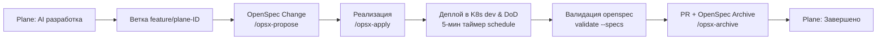

# Правила для AI-ассистентов — Проект SmartBet.guru (igaming backend)

Этот документ содержит операционные правила и стандарты разработки для AI-ассистентов в бэкенд-репозитории **SmartBet.guru**.

---

## 📌 OpenSpec & Архитектурные спецификации

Проект функционирует по стандарту **OpenSpec (Spec-Driven Development)**.
Центральный репозиторий спецификаций экосистемы: [`datawikipro/igaming-openspec`](https://github.com/datawikipro/igaming-openspec.git).

### Живые спецификации возможностей:
- [`crawler-engine`](../openspec/specs/crawler-engine/spec.md) — краулеры/лоадеры, stealth-профили (`BASIC`, `HEADLESS_STEALTH`, `XVFB_HEADED`), Kafka stream.
- [`aggregator-core`](../openspec/specs/aggregator-core/spec.md) — приём котировок, нормализация, поиск вилок / +EV / коридоров в памяти, PostgreSQL.
- [`portal-gateway`](../openspec/specs/portal-gateway/spec.md) — API Gateway, JWT, тарифы (Free до 5.0%, Premium без лимитов), REST/WS.
- [`k8s-infrastructure`](../openspec/specs/k8s-infrastructure/spec.md) — расстановка нод, K8s DNS (запрет IP), HikariCP, сборка Jib.
- [`verification-and-dod`](../openspec/specs/verification-and-dod/spec.md) — Definition of Done, 5-минутный таймер, Repair Protocol.
- [`plane-ai-workflow`](../openspec/specs/plane-ai-workflow/spec.md) — интеграция с Plane, K8s Job, обратные вызовы и артефакты.
- [`social-media-bot`](../openspec/specs/social-media-bot/spec.md) — Telegram-бот сигналов, расписание контента, обязательные дисклеймеры.

---

## ✈️ Жизненный цикл задачи (Plane + OpenSpec Workflow)



1. **Инициализация**: AI-агент стартует в ветке `feature/plane-<TASK_ID>` и создает OpenSpec-предложение (`openspec/changes/plane-<TASK_ID>/`).
2. **Разработка**: Реализация строго по дельта-спецификациям и чеклисту `tasks.md` (`/opsx-apply`).
3. **Верификация**: Проверка Definition of Done в K8s namespace `igaming-dev`.
4. **Валидация спецификаций**: Обязательный запуск `openspec validate --specs`.
5. **Закрытие**: Создание GitHub PR, архивация (`/opsx-archive`) и перевод задачи в Plane в статус **`Завершено`**.

---

## 🏆 Непреложные правила (Golden Rules)

### 1. 🛡️ Definition of Done & 5-минутный таймер (`schedule`)
- Под задеплоен в Kubernetes namespace `igaming-dev` в статусе `Running 1/1`.
- Actuator пробы `/actuator/health/readiness` и `/actuator/health/liveness` возвращают HTTP 200 `UP`.
- **СТРОГИЙ ЗАПРЕТ**: Запрещено закрывать задачу, пока под не отработает **5 ПОЛНЫХ МИНУТ** без единой ошибки.
- Если нужно подождать, агент **ОБЯЗАН установить таймер через `schedule`** на оставшееся время.

### 2. 🚫 Запрет IP-адресов — Только K8s DNS Service Names!
- **Категорически запрещено** хардкодить IP-адреса в коде, K8s-манифестах, initContainers или конфигах.
- Использовать только имена сервисов (например: `igaming-source-winline-db`).
- В initContainers ожидать базы через цикл DNS-подключения (`until psql -h "$SERVICE_DNS_NAME" ...; do sleep 2; done`).

### 3. 🛠️ Протокол авторемонта (Repair Protocol)
- Если базовый модуль сломан (`CrashLoopBackOff`, битая БД), **запрещено** писать фичу поверх него.
- Текущая задача приостанавливается, создается задача `[REPAIR] Восстановление модуля <module>` на ветке `fix/<module>`.
- Сначала восстанавливается работоспособность базы до зеленого статуса в K8s, затем возобновляется фича.

### 4. ⚡ Неблокирующий старт HikariCP / JPA
Во всех микросервисах в `application.properties` обязательны параметры:
```properties
spring.datasource.hikari.initialization-fail-timeout=0
spring.datasource.hikari.connection-timeout=5000
spring.datasource.hikari.validation-timeout=3000
spring.jpa.properties.hibernate.temp.use_jdbc_metadata_defaults=false
```

### 5. 🐳 Сборка Maven Jib в PowerShell (Windows)
Все `-D` параметры с точками обязаны окаймляться в двойные кавычки:
```powershell
mvn.cmd -pl <module> jib:build "-Djib.to.image=ghcr.io/datawikipro/<module>:latest" "-Djib.to.auth.username=datawikipro" "-Djib.to.auth.password=<token>" -DskipTests
```

### 6. 🌐 Сетевая топология и умная маршрутизация краулеров
Нода `xeon-srv` физически расположена в квартире в Санкт-Петербурге на домашнем провайдере РФ (под фильтрацией РКН/ТСПУ).
Для краулеров настроена централизованная маршрутизация на уровне роутера `ru-proxy` (`100.83.113.50`):
- **Кластерный HTTP-прокси**: `http://100.83.113.50:3128` (без аутентификации для подов k8s).
- **Роутер `sing-box` прозрачно делит исходящий трафик по доменам**:
  - **РФ-букмекеры (ЦУПИС/ЕРАИ)** (Фонбет, Винлайн, Пари, Бетсити, Балтбет, Олимпбет, Тенниси, Леон и др.) $\rightarrow$ `direct` (чистый домашний IP СПб `188.242.33.93` без блокировок).
  - **Американские сервисы** (OpenAI, Google, Meta и др.) $\rightarrow$ `outline-us` (`100.66.190.4`).
  - **Европейские и оффшорные букмекеры** (Pinnacle, Sbobet, Bet365, Bwin, Betsson, Betsafe, Nordicbet, MrGreen, 888starz, LeoVegas и 1x-клоны) $\rightarrow$ `outline-vpn-eu-nl` в Eemshaven, Нидерланды (`34.158.66.184:443`, Tailscale `100.79.1.73`, Shadowsocks chacha20-ietf-poly1305, RKN TLS Client Hello prefix `%16%03%01%00%00`, GCP project `outline-eu-vpn-1`, account `lawerance600@gmail.com`).
- **Запрет переключения на Direct в сервисах**: Если букмекер оффшорный, `VpnManagerService` обязан держать проксирование включенным и не сбрасывать системные свойства прокси.

### 7. 🗄️ Управление схемой БД (DDL Auto)
- Управление структурой таблиц передано в саму Java: `spring.jpa.hibernate.ddl-auto=${SPRING_JPA_HIBERNATE_DDL_AUTO:update}`.
- Таблица `match_factor` во всех БД стандартизирована под JPA-сущность:
  ```sql
  CREATE TABLE match_factor (
      id BIGSERIAL PRIMARY KEY,
      match_id BIGINT NOT NULL,
      factor_id INT,
      name VARCHAR(255),
      value NUMERIC(10, 3)
  );
  ```
- Для предотвращения перегрузки дисковой подсистемы Xeon при высокой частоте котировок в базах данных PostgreSQL используется `synchronous_commit = off`.

### 8. 📊 Критерий наполнения линии (Threshold >= 500 матчей)
- Задача по любому букмекеру считается выполненной **ТОЛЬКО** при наполнении линии от **500 активных матчей** (`SELECT count(*) FROM match_cache >= 500`).
- Статус `Running 1/1` у пода при 0 матчей в БД считается **незавершённым дефектом**.

---

## 🧭 Навигация по сервисам

| Сервис | Назначение |
|---|---|
| `igaming-aggregator` | Ядро матчинга вилок, коридоров и +EV в памяти |
| `igaming-portal` | API-шлюз, JWT-авторизация, тарифные лимиты |
| `igaming-bot` | Telegram-бот и публикация контента в соцсети |
| `igaming-source-core` | Базовые абстрактные классы (`AbstractBaseBookmakerService`, `AbstractBetTypeMapper`) |
| `igaming-source-*` | Краулеры/лоадеры БК (Winline, Fonbet, Pinnacle, Betcity, 1xbet и др.) |
| `igaming-k8s` | K8s YAML-манифесты всех компонентов |

