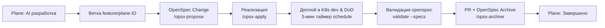

# Правила для AI-ассистентов — Проект SmartBet.guru (igaming backend)

Этот документ содержит операционные правила и стандарты разработки для AI-ассистентов в бэкенд-репозитории **SmartBet.guru**.

---

## 📌 OpenSpec & Архитектурные спецификации

Проект функционирует по стандарту **OpenSpec (Spec-Driven Development)**.
Центральный репозиторий спецификаций экосистемы: [`datawikipro/igaming-openspec`](https://github.com/datawikipro/igaming-openspec.git).

### Живые спецификации возможностей:
- [`crawler-engine`](../openspec/specs/crawler-engine/spec.md) — краулеры/лоадеры, stealth-профили (`BASIC`, `HEADLESS_STEALTH`, `XVFB_HEADED`), Kafka stream.
- [`aggregator-core`](../openspec/specs/aggregator-core/spec.md) — приём котировок, нормализация, поиск вилок / +EV / коридоров в памяти, PostgreSQL.
- [`portal-gateway`](../openspec/specs/portal-gateway/spec.md) — API Gateway, JWT, тарифы (Free до 5.0%, Premium без лимитов), REST/WS.
- [`k8s-infrastructure`](../openspec/specs/k8s-infrastructure/spec.md) — расстановка нод, K8s DNS (запрет IP), HikariCP, сборка Jib.
- [`verification-and-dod`](../openspec/specs/verification-and-dod/spec.md) — Definition of Done, 5-минутный таймер, Repair Protocol.
- [`plane-ai-workflow`](../openspec/specs/plane-ai-workflow/spec.md) — интеграция с Plane, K8s Job, обратные вызовы и артефакты.
- [`social-media-bot`](../openspec/specs/social-media-bot/spec.md) — Telegram-бот сигналов, расписание контента, обязательные дисклеймеры.

---

## ✈️ Жизненный цикл задачи (Plane + OpenSpec Workflow)


```mermaid
graph LR
    A[Plane: AI разработка] --> B[Ветка feature/plane-ID]
    B --> C[OpenSpec Change<br>/opsx-propose]
    C --> D[Реализация<br>/opsx-apply]
    D --> E[Деплой в K8s dev & DoD<br>5-мин таймер schedule]
    E --> F[Валидация openspec<br>validate --specs]
    F --> G[PR + OpenSpec Archive<br>/opsx-archive]
    G --> H[Plane: Завершено]
```

1. **Инициализация**: AI-агент стартует в ветке `feature/plane-<TASK_ID>` и создает OpenSpec-предложение (`openspec/changes/plane-<TASK_ID>/`).
2. **Разработка**: Реализация строго по дельта-спецификациям и чеклисту `tasks.md` (`/opsx-apply`).
3. **Верификация**: Проверка Definition of Done в K8s namespace `igaming-dev`.
4. **Валидация спецификаций**: Обязательный запуск `openspec validate --specs`.
5. **Закрытие**: Создание GitHub PR, архивация (`/opsx-archive`) и перевод задачи в Plane в статус **`Завершено`**.

---

## 🏆 Непреложные правила (Golden Rules)

### 1. 🛡️ Definition of Done & 5-минутный таймер (`schedule`)
- Под задеплоен в Kubernetes namespace `igaming-dev` в статусе `Running 1/1`.
- Actuator пробы `/actuator/health/readiness` и `/actuator/health/liveness` возвращают HTTP 200 `UP`.
- **СТРОГИЙ ЗАПРЕТ**: Запрещено закрывать задачу, пока под не отработает **5 ПОЛНЫХ МИНУТ** без единой ошибки.
- Если нужно подождать, агент **ОБЯЗАН установить таймер через `schedule`** на оставшееся время.

### 2. 🚫 Запрет IP-адресов — Только K8s DNS Service Names!
- **Категорически запрещено** хардкодить IP-адреса в коде, K8s-манифестах, initContainers или конфигах.
- Использовать только имена сервисов (например: `igaming-source-winline-db`).
- В initContainers ожидать базы через цикл DNS-подключения (`until psql -h "$SERVICE_DNS_NAME" ...; do sleep 2; done`).

### 3. 🛠️ Протокол авторемонта (Repair Protocol)
- Если базовый модуль сломан (`CrashLoopBackOff`, битая БД), **запрещено** писать фичу поверх него.
- Текущая задача приостанавливается, создается задача `[REPAIR] Восстановление модуля <module>` на ветке `fix/<module>`.
- Сначала восстанавливается работоспособность базы до зеленого статуса в K8s, затем возобновляется фича.

### 4. ⚡ Неблокирующий старт HikariCP / JPA
Во всех микросервисах в `application.properties` обязательны параметры:
```properties
spring.datasource.hikari.initialization-fail-timeout=0
spring.datasource.hikari.connection-timeout=5000
spring.datasource.hikari.validation-timeout=3000
spring.jpa.properties.hibernate.temp.use_jdbc_metadata_defaults=false
```

### 5. 🐳 Сборка Maven Jib в PowerShell (Windows)
Все `-D` параметры с точками обязаны окаймляться в двойные кавычки:
```powershell
mvn.cmd -pl <module> jib:build "-Djib.to.image=ghcr.io/datawikipro/<module>:latest" "-Djib.to.auth.username=datawikipro" "-Djib.to.auth.password=<token>" -DskipTests
```

### 6. 🌐 Сетевая топология и умная маршрутизация краулеров
Нода `xeon-srv` физически расположена в квартире в Санкт-Петербурге на домашнем провайдере РФ (под фильтрацией РКН/ТСПУ).
Для краулеров настроена централизованная маршрутизация на уровне роутера `ru-proxy` (`100.83.113.50`):
- **Кластерный HTTP-прокси**: `http://100.83.113.50:3128` (без аутентификации для подов k8s).
- **Роутер `sing-box` прозрачно делит исходящий трафик по доменам**:
  - **РФ-букмекеры (ЦУПИС/ЕРАИ)** (Фонбет, Винлайн, Пари, Бетсити, Балтбет, Олимпбет, Тенниси, Леон и др.) $\rightarrow$ `direct` (чистый домашний IP СПб `188.242.33.93` без блокировок).
  - **Американские сервисы** (OpenAI, Google, Meta и др.) $\rightarrow$ `outline-us` (`100.66.190.4`).
  - **Европейские и оффшорные букмекеры** (Pinnacle, Sbobet, Bet365, Bwin, Betsson, Betsafe, Nordicbet, MrGreen, 888starz, LeoVegas и 1x-клоны) $\rightarrow$ `outline-vpn-eu-nl` в Eemshaven, Нидерланды (`34.158.66.184:443`, Tailscale `100.79.1.73`, Shadowsocks chacha20-ietf-poly1305, RKN TLS Client Hello prefix `%16%03%01%00%00`, GCP project `outline-eu-vpn-1`, account `lawerance600@gmail.com`).
- **Запрет переключения на Direct в сервисах**: Если букмекер оффшорный, `VpnManagerService` обязан держать проксирование включенным и не сбрасывать системные свойства прокси.

### 7. 🗄️ Управление схемой БД (DDL Auto)
- Управление структурой таблиц передано в саму Java: `spring.jpa.hibernate.ddl-auto=${SPRING_JPA_HIBERNATE_DDL_AUTO:update}`.
- Таблица `match_factor` во всех БД стандартизирована под JPA-сущность:
  ```sql
  CREATE TABLE match_factor (
      id BIGSERIAL PRIMARY KEY,
      match_id BIGINT NOT NULL,
      factor_id INT,
      name VARCHAR(255),
      value NUMERIC(10, 3)
  );
  ```
- Для предотвращения перегрузки дисковой подсистемы Xeon при высокой частоте котировок в базах данных PostgreSQL используется `synchronous_commit = off`.

### 8. 📊 Критерий наполнения линии (Threshold >= 500 матчей)
- Задача по любому букмекеру считается выполненной **ТОЛЬКО** при наполнении линии от **500 активных матчей** (`SELECT count(*) FROM match_cache >= 500`).
- Статус `Running 1/1` у пода при 0 матчей в БД считается **незавершённым дефектом**.

### 9. 🦊 SMM & Браузерные ИИ-агенты: Firefox / Camoufox, Запрет Инкогнито и Прогрев Кэша (Cache Warmup)
- **СТРОЖАЙШИЙ ЗАПРЕТ на инкогнито (`new_context()`) и "чистый" Chromium для соцсетей**:
  - Meta (Threads, Instagram), Reddit и антифрод-системы мгновенно детектируют CDP (Chrome DevTools Protocol) и банят "чистые" сессии без кэша и истории.
  - Вся браузерная автоматизация соцсетей строится на **Firefox / Camoufox (Gecko engine)** с использованием `firefox.launch_persistent_context()`.
- **Персистентность профилей (Session & Cache Storage)**:
  - Профиль браузера (`cookies.sqlite`, `storage/default` IndexedDB, LocalStorage, Cache API) персистится в Redis / Volume (`smm:profile:<account_id>`).
  - Агент всегда просыпается в "тёплом" контексте, восстанавливая наработанную историю устройства.
- **Обязательный прогрев кэша (Browser Cache Warmup)**:
  - Перед переходом к целевым действиям (публикация, комментирование) агент обязан выполнить предварительный серфинг (2–3 минуты чтения новостей, спортивных порталов, ленты соцсети с естественными задержками и кривыми движения мыши Безье).

### 10. 🎁 Мониторинг фрибетов, акций БК и автоматизация партнерских программ (Affiliate & Promo Radar)
- **Главный математический постулат (Фрибет = 80% гарантированных денег)**:
  - В отличие от попанов, которые сливают бонусы, SmartBet.guru позиционирует любой фрибет (SNR — Stake Not Returned) как **80% гарантированного кэша** через математическое перекрытие (Matched Betting) на высоких коэффициентах ($K_1 \approx 4.5\text{–}6.0$, перекрытие $K_2 \approx 1.20\text{–}1.28$, формула конвертации $\eta = \frac{(K_1 - 1)(K_2 - 1)}{K_2} \approx 0.80$).
  - Во всех постах в соцсетях, на витрине `smartbet.guru/promos` и в калькуляторе каждый фрибет номиналом $F$ **обязан** сопровождаться расчетом гарантированной выплаты: *«Фрибет 3 000 ₽ $\rightarrow$ 2 400 ₽ чистыми деньгами на счёт при любом исходе через вилку»*.
- **Сбор бонусов и фрибетов 52 БК**:
  - Краулер промо-разделов и бонусных лендингов всех 52 подключенных букмекеров (бездепозитные бонусы, фрибеты за регистрацию, страховки, кэшбэк).
  - Актуальные акции сохраняются в базе данных `igaming_portal` (`bookmaker_promos` с полем `guaranteed_cash_80`) и транслируются на страницы `smartbet.guru/promos` и в SMM-посты.
- **Партнерские программы (Affiliate Networks) и конверсионные воронки**:
  - Автоматическая генерация реферальных трекинг-ссылок с UTM-метками для всех подключенных букмекеров.
  - Любой контент (вилка, прогноз, дайджест фрибетов с расчетом 80% кэша) в Telegram, Threads, Instagram или Reddit органично перенаправляет трафик по партнерским ссылкам на сайт SmartBet.guru и в БК.

### 11. 🏢 Архитектурное разделение клиентского сайта и внутренней инфраструктурной админки (Separation of Public Portal & Internal Infrastructure Admin)
- **СТРОЖАЙШИЙ ЗАПРЕТ на размещение внутренних операторских инструментов в клиентском репозитории `smartbet.guru`**:
  - `smartbet.guru` (`datawikipro/smartbet.guru`) — публичный клиентский фронтенд: витрина линий, вилок/коридоров/+EV, калькулятор 80% кэша с фрибета (`/tools/freebet-calculator` и модальные окна в карточках исходов), раздел промо-акций (`/promos`), блог, реферальные редиректы (`/go/[bookmaker]`).
  - В публичном сайте **категорически запрещено** держать стримы браузеров (noVNC), ручные/полуавтоматические капча-солверы, закрытые тикетинги патронов, служебные дашборды инфраструктуры.
- **Единая выделенная внутренняя админка `igaming-admin-frontend` (`datawikipro/igaming-admin-frontend`, K8s namespace `accounts`)**:
  - Все операторские и административные инструменты размещаются исключительно в этом репозитории:
    - `/accounts` — Управление аккаунтами, облачными ключами и LLM квотами (Antigravity/OpenAI/Claude).
    - `/nodes` — Мониторинг нод bare-metal сервера Xeon и K8s.
    - `/ai-tasks` — Отслеживание и управление задачами пула AI Developer воркеров (`plane-ai-worker-0..17`).
    - `/channels` — Управление каналами вещания Telegram.
    - `/browsers` — noVNC Интерактивная консоль стелс-браузеров (Firefox Camoufox), CapSolver API, шаблонный поиск выреза OpenCV для слайдер-капч, прогрев кэша (Browser Cache Warmup), ротация прокси-адресов.
    - `/feedback` — Patron CRM & Feedback Desk: агрегация обращений с разделением на платных спонсоров (Boosty PRO, Patreon VIP, VK Donut, TG VIP) и бесплатных пользователей, контроль 15-минутного SLA, AI-генератор ответов и экспорт тикетов в Plane в 1 клик.

### 12. 🛡️ Выделенные статические прокси 1:1 для соцсетей и чувствительных БК (Dedicated Static Proxies & Multi-Account PureVPN Pool)
- **СТРОЖАЙШИЙ ЗАПРЕТ на динамическую ротацию прокси для соцсетей и антифрода**:
  - Слепая ротация IP-адресов гарантированно вызывает флаги безопасности в Meta (Threads, Instagram), Reddit и у чувствительных к геолокации букмекеров.
  - Каждая учетная запись соцсети и профиль браузера Camoufox жестко закрепляется за своей постоянной выделенной нодой (1:1 static mapping) через K8s Service DNS (например: `http://purevpn-us-ca.proxy:3128`, `http://purevpn-nl.proxy:3128`).
- **Мульти-аккаунты PureVPN и квота 8/10 устройств**:
  - PureVPN разрешает до 10 одновременных подключений на аккаунт.
  - Система резервирует ровно **8 нод на аккаунт** (80% квоты), оставляя 2 слота в запасе под буфер безопасности и защиту от случайного перелимита.
  - Поддерживается подключение нескольких аккаунтов PureVPN через админку и REST API (`/api/v1/proxy/accounts`).
- **Стратегический географический пресет (8 нод на аккаунт)**:
  - 1 в США (West Coast, Los Angeles, CA: `purevpn-us-ca` $\rightarrow$ Reddit / US Social Media)
  - 3 в Европе (Amsterdam, NL: `purevpn-nl` $\rightarrow$ Meta Threads/IG #1; Frankfurt, DE: `purevpn-de` $\rightarrow$ Patreon VIP/Boosty Desk; London, UK: `purevpn-uk` $\rightarrow$ Sports Betting & UK SMM)
  - 3 в Азии (Singapore, SG: `purevpn-sg` $\rightarrow$ Asian Hub/SBOBET; Tokyo, JP: `purevpn-jp` $\rightarrow$ Far East Gateway; Hong Kong, HK: `purevpn-hk` $\rightarrow$ Financial Traffic Hub)
  - 1 в Южной Америке (São Paulo, BR: `purevpn-br` $\rightarrow$ Latin America / Betano / IG)
- **Сетевой обход блокировок ТСПУ/РКН для OpenVPN**:
  - Нода `xeon-srv` находится под фильтрацией ТСПУ, который дропает трафик OpenVPN к серверам PureVPN при прямом соединении.
  - Исходящий трафик к доменам `*.ptoserver.com` и `*.purevpn.com` на кластерном роутере `ru-proxy` (`sing-box`) маршрутизируется в обход ТСПУ через зашифрованный Shadowsocks туннель в Финляндии (`outline-fi`).
- **Веб-панель управления и мониторинг**:
  - Админка доступна по адресу `http://100.78.183.101:30180` (NodePort 30180, сервис `proxy-frontend` в namespace `proxy`).
  - Вкладка `Accounts & Dedicated`: мониторинг квот аккаунтов (8/10), таблица нод с внешними IP и целевым назначением, браузер полного каталога PureVPN (165+ локаций) для ручной активации.

---

## 🧭 Навигация по сервисам

| Сервис | Назначение |
|---|---|
| `igaming-aggregator` | Ядро матчинга вилок, коридоров и +EV в памяти |
| `igaming-portal` | API-шлюз, JWT-авторизация, тарифные лимиты |
| `igaming-bot` | Telegram-бот и публикация контента в соцсети |
| `igaming-source-core` | Базовые абстрактные классы (`AbstractBaseBookmakerService`, `AbstractBetTypeMapper`) |
| `igaming-source-*` | Краулеры/лоадеры БК (Winline, Fonbet, Pinnacle, Betcity, 1xbet и др.) |
| `igaming-k8s` | K8s YAML-манифесты всех компонентов |
| `smartbet.guru` | Публичный клиентский портал Next.js 14 App Router (витрина, сканер, калькулятор фрибетов, блог, рефералы) |
| `igaming-admin-frontend` | Внутренний операторский веб-интерфейс Next.js (noVNC консоль, Patron CRM, LLM аккаунты, AI воркеры, ноды) |
| `service-proxy-backend` | Бэкенд пула прокси, SmartDNS, управление мульти-аккаунтами PureVPN и лизингом нод (namespace `proxy`) |
| `service-proxy-frontend` | Веб-интерфейс админки прокси-пула и мульти-аккаунтов PureVPN (Next.js 14, NodePort `30180`) |


