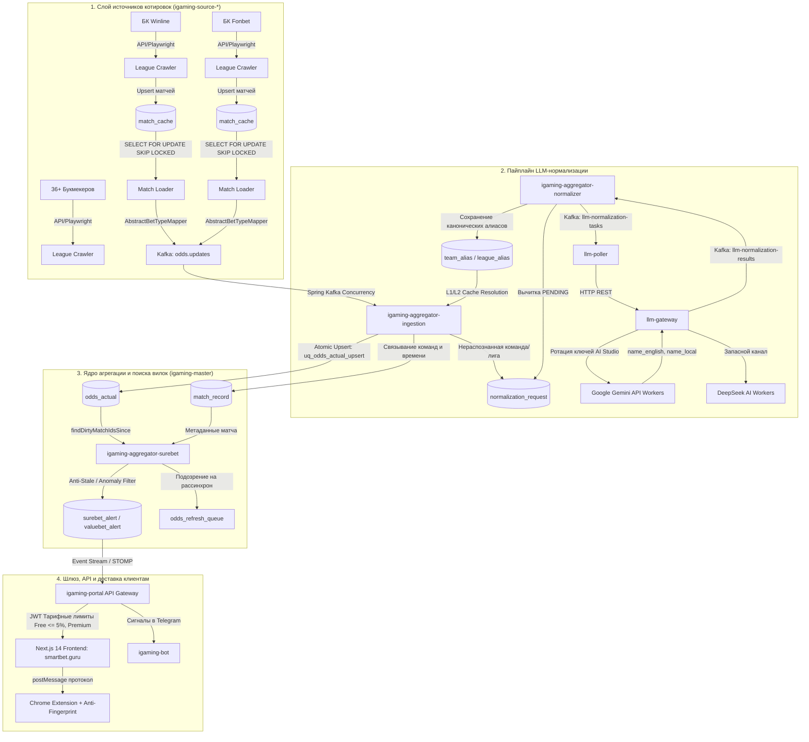

# Архитектура и полный пайплайн экосистемы SmartBet.guru

## 📌 Введение

**SmartBet.guru** — распределенная высоконагруженная платформа для сбора спортивных котировок в режиме реального времени (Live и Prematch), нормализации данных на базе искусственного интеллекта (LLM), мгновенного выявления арбитражных ситуаций (вилок / Surebets), ставок с положительным математическим ожиданием (+EV / ValueBets), коридоров (Middles) и автоматизации проставления ставок через защищенное браузерное расширение.

---

## 🏗️ 1. Общая архитектурная схема экосистемы



---

## 🔍 2. Слой сбора данных (Data Collection Layer — `igaming-source-*`)

Каждый модуль букмекера строится на базе `igaming-source-core` и реализует две ключевые роли:

### 2.1. Dual Execution Roles (Роли исполнения)

1. **`league-crawler`** (`app.role=league-crawler`):
   * Автономный фоновый сервис, сканирующий дерево лиг, турниров и предстоящих событий.
   * Находит новые `external_id` матчей и сохраняет их в локальную таблицу `match_cache` со статусом `NEW`.
2. **`match-loader`** (`app.role=match-loader`):
   * Выполняет высокочастотный параллельный опрос карточек матчей.
   * Использует конкурентный механизм базы данных PostgreSQL:
     ```sql
     SELECT * FROM match_cache 
     WHERE status IN ('NEW', 'PROCESSED') 
     ORDER BY next_check_at ASC 
     FOR UPDATE SKIP LOCKED 
     LIMIT 30;
     ```
   * Это позволяет запускать любое количество реплик лоадера без риска повторной обработки одних и тех же матчей.

### 2.2. Профили защиты от ботов (Stealth Profiles)

* **`BASIC`**: Прямые быстрые HTTP/JSON запросы через пул прокси (`service-proxy-backend`). Используется для БК с открытыми API (Leon, Baltbet, Pinnacle, Sbobet).
* **`HEADLESS_STEALTH`**: Headless Chrome с подменой `navigator.webdriver`, canvas, WebGL, аудио-отпечатков.
* **`XVFB_HEADED`**: Полноценный виртуальный X-сервер (Xvfb) с эмуляцией движений мыши и задержек ввода для обхода жесткого Cloudflare / Incapsula (Fonbet, 1xBet, Tennisi).

### 2.3. Маппинг рынков (`AbstractBetTypeMapper`)

Сырые исходы букмекера конвертируются в строго типизированные объекты `BetType`:
* **`MatchResultBet`**: `WIN1`, `DRAW`, `WIN2`, `DC_1X`, `DC_12`, `DC_X2`.
* **`TotalBet`**: `TOTAL_OVER`, `TOTAL_UNDER` с параметром (`param = 2.5`, `3.5` и т.д.).
* **`HandicapBet`**: `HANDICAP_1`, `HANDICAP_2` с форой (`param = -1.5`, `+1.5`).
* **Азиатские четвертные сплиты**: Автоматический расчет составных исходов (например, `Total 2.25` разделяется на плечи `Total 2.0` и `Total 2.5`).

Результат упаковывается в DTO `OddsUpdateRequest` и публикуется в топик Kafka **`odds.updates`**.

---

## 🔄 3. Слой приёма и нормализации (Ingestion & Resolution)

Микросервис **`igaming-aggregator-ingestion`** обеспечивает высокоскоростной приём потока котировок из Kafka:

1. **Десериализация и фильтрация**: Валидация структуры `OddsUpdateRequest`, отсечение котировок $\le 1.0$.
2. **Многоуровневое сопоставление (Entity Resolution)**:
   * **L1 (Redis)**: Локальный быстрый кэш алиасов команд и лиг (`hash(bookmaker_name + raw_name)`).
   * **L2 (PostgreSQL)**: Поиск по таблицам `team_alias` и `league_alias`.
   * **L3 (Fallback)**: Если название команды встречается впервые, в таблицу `normalization_request` создается запись со статусом `PENDING`, а в Kafka публикуется событие в топик `llm-normalization-tasks`.
3. **Бесконфликтное сохранение котировок (`odds_actual`)**:
   * Для поддержки одновременных параллельных вставок от сотен потоков в PostgreSQL создан функциональный индекс:
     ```sql
     CREATE UNIQUE INDEX uq_odds_actual_upsert ON odds_actual (
         match_id, bet_source_id, odds_type_id,
         COALESCE(param, -10000.0),
         COALESCE(outright_selection_id, -1)
     );
     ```
   * Вставка выполняется через атомарный нативный запрос с `ON CONFLICT DO UPDATE SET value = EXCLUDED.value, updated_at = NOW()`.

---

## 🧠 4. Подсистема LLM-нормализации (AI Normalization Subsystem)

Когда в систему поступают новые названия команд (например, *"МЮ"*, *"Man Utd"*, *"Манчестер Юнайтед"*):

1. **`igaming-aggregator-normalizer`**:
   * `NormalizationScheduler` каждые 5 секунд выбирает пачки `PENDING` сущностей через `findPendingFairSampling`.
   * Формирует контекстный запрос с указанием вида спорта, страны и турнира.
2. **Маршрутизация через `llm-gateway`**:
   * Шлюз балансирует нагрузку по пулу зарегистрированных API-ключей Google AI Studio (Gemini 3 Flash / 2.0 Flash / 1.5 Pro).
   * В случае исчерпания квоты автоматически переключается на резервные воркеры DeepSeek AI.
3. **Промпт и извлечение сущности**:
   ```json
   {
     "name_english": "Manchester United FC",
     "name_local": "Manchester United FC",
     "name_bookmaker": "Man Utd"
   }
   ```
4. **Фиксация в базе данных**:
   * В таблице `team` создается или находится каноническая сущность.
   * В таблице `team_alias` регистрируется привязка `(bookmaker_source_id, raw_name) -> team_id`.
   * Все последующие котировки от этого букмекера мгновенно маппятся к единому матчу без обращения к ИИ.

---

## 📐 5. Математическое ядро и детекция вилок (`igaming-aggregator-surebet`)

Сканер запускается циклически каждые 60 секунд (или по событию изменения котировок):

### 5.1. Алгоритм инкрементального сканирования

* Выбираются только те матчи, у которых обновлялись котировки с момента последнего сканирования:
  ```java
  matchRepository.findDirtyMatchIdsSince(previousScanTimestamp, pastThreshold);
  ```
* Загружаются все актуальные исходы матча (`findFlatOddsByMatchId`).
* Проверяется наличие котировок минимум от **2 различных букмекеров**.

### 5.2. Группировка исходов и сопоставление взаимоисключающих плеч

Исходы группируются по `coverageGroup` (например, `TOTAL_MATCH:2.5`, `HANDICAP_MATCH:-1.5`).

Для каждой группы выбирается максимальный коэффициент среди всех доступных БК:
$$O_k^{\max} = \max_{b \in \text{Bookmakers}} O_k(b)$$

Движок проверяет правила `SUREBET_COMBINATIONS`:
* **2-Way вилки**: `[OVER, UNDER]`, `[TEAM1, TEAM2]`, `[ODD, EVEN]`, `[WIN1, WIN2]`.
* **3-Way вилки**: `[WIN1, DRAW, WIN2]`.
* **Двойные шансы (Double Chance)**: `[DC_1X, WIN2]`, `[DC_12, DRAW]`, `[DC_X2, WIN1]`.
* **Азиатские четвертные сплиты**: Комбинации четвертных тоталов и фор ($\pm 0.25, \pm 0.75$).

### 5.3. Математика расчета доходности и распределения банка

#### 1. Условие арбитража:
$$\text{Инверсная сумма (Inverse Sum)} = I = \sum_{i=1}^n \frac{1}{O_i} < 1.0$$

#### 2. Процент чистой прибыли:
$$\text{Profit \%} = \left(\frac{1}{I} - 1\right) \times 100\% = \left(\frac{1}{\sum_{i=1}^n \frac{1}{O_i}} - 1\right) \times 100\%$$

#### 3. Оптимальное распределение ставки (для общего банка $V$):
$$S_i = \frac{V}{O_i \cdot I}$$
При таком распределении выплата на любом из исходов гарантированно равна:
$$W_i = S_i \cdot O_i = \frac{V}{I} > V$$

---

### 5.4. Математика ValueBet (+EV)

Ставки с перевесом вычисляются против эталонного sharp-букмекера (**Pinnacle**):
1. Котировки Pinnacle $P_1, P_2$ очищаются от букмекерской маржи:
   $$\text{Margin}_P = \frac{1}{P_1} + \frac{1}{P_2} - 1$$
   $$\text{Истинная вероятность (True Probability)} \quad p_1 = \frac{1 / P_1}{1 + \text{Margin}_P}$$
2. Если у мягкого (soft) букмекера коэффициент $O_{\text{soft}}$ дает положительное ожидание:
   $$\text{Expected Value (EV)} = (p_1 \cdot O_{\text{soft}} - 1) \times 100\% > 0$$
   создается алерт в таблице `valuebet_alert`.

---

### 5.5. Защита от фантомных вилок (Anti-Stale & Anomaly Protection)

1. **Контроль возраста котировки (Timestamp Discrepancy Check)**:
   * Если разница между временем обновления плеч превышает допустимый порог (> 5 мин для Prematch, > 15 сек для Live), вилка помечается как `outdated` и отправляется в `odds_refresh_queue`.
2. **Потолок доходности (Max Profit Cap)**:
   * Вилки с доходностью $> 10\%$ (Prematch) или $> 15\%$ (Live) классифицируются как явная ошибка букмекера (Palpable Error) или рассинхронизация и не публикуются без дополнительной верификации.

---

## 🌐 6. Слой доставки и клиентского интерфейса

1. **`igaming-portal` (API Gateway)**:
   * Предоставляет REST API и WebSocket STOMP подписки на каналы `/topic/surebets`, `/topic/valuebets`.
   * Контролирует тарифные ограничения пользователя:
     * **Тариф Free**: отображение вилок с доходностью до `5.0%` с искусственной задержкой 60 секунд.
     * **Тариф Premium**: доступ ко всем вилкам в режиме реального времени без ограничений по проценту.
2. **`smartbet-guru` (Next.js 14 Web UI)**:
   * Серверный рендеринг (SSR) + оптимистичные обновления SWR.
   * Интерактивный калькулятор ставок с автоматическим округлением плеч.
3. **Chrome Extension (Расширение автопроставления)**:
   * Взаимодействует с порталом через защищенный протокол `postMessage`.
   * Выполняет автозаполнение купона в один клик на сайтах Fonbet, Winline, Marathonbet, Betcity.
   * Внедряет антифрод-защиту (`inject-fingerprint.js`) для маскировки автоматизированных действий.
