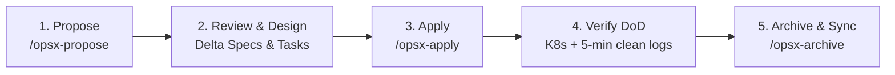

# 📐 Руководство по OpenSpec в проекте SmartBet.guru (igaming)

Проект **SmartBet.guru (igaming)** переведён на стандарт **OpenSpec (Spec-Driven Development)**. 

OpenSpec обеспечивает единый источник правды (Single Source of Truth) для требований, архитектурных решений, изменений и процесса приёмки (Definition of Done) как для людей-разработчиков, так и для автономных AI-агентов.

---

## 🎯 Зачем OpenSpec в проекте

1. **Спецификация вместо хаоса**: Любое изменение начинается с чёткого описания проблемы (`proposal.md`), требований (`spec.md`), архитектуры (`design.md`) и чеклиста задач (`tasks.md`).
2. **Бесшовная работа AI-агентов**: Агенты (Antigravity, Gemini, Claude, Cursor) используют структурированные команды и навыки из `.agent/skills/` и `.agents/skills/`.
3. **Строгий контроль качества (Definition of Done)**: Каждая задача проверяется на соответствие живым спецификациям перед архивацией и мерджем.
4. **Актуальная живая документация**: Завершённые изменения автоматически синхронизируются в базовые спецификации (`openspec/specs/`), предотвращая устаревание документации.

---

## 📂 Структура OpenSpec в репозитории

```
igaming/
├── openspec/
│   ├── config.yaml           # Конфигурация OpenSpec (схема spec-driven)
│   ├── specs/                # Живые спецификации возможностей системы
│   │   ├── crawler-engine/spec.md       # Движок краулеров/лоадеров и stealth-профили
│   │   ├── aggregator-core/spec.md      # Нормализация и детектор вилок/EV/коридоров
│   │   ├── portal-gateway/spec.md       # API-шлюз, тарифы и авторизация
│   │   ├── k8s-infrastructure/spec.md   # K8s DNS, расстановка нод, Hikari, Jib
│   │   ├── verification-and-dod/spec.md # Definition of Done и Repair Protocol
│   │   └── social-media-bot/spec.md     # Telegram-бот и публикации контента
│   └── changes/              # Активные предложения изменений
│       └── archive/          # Завершённые и синхронизированные изменения
├── .agent/                   # Команды и навыки для Antigravity (/opsx-*)
│   ├── skills/
│   └── workflows/
└── .agents/                  # Общие навыки для AI-агентов
    └── AGENTS.md             # Краткие операционные правила для AI-ассистентов
```

---

## 🔄 Жизненный цикл изменений (OpenSpec Workflow)

Разработка любой новой функциональности или исправления строится по 4 шагам:



### 1. Предложение изменения (`/opsx-propose`)
Инициализирует новое изменение в папке `openspec/changes/<change-id>/`:
```bash
# В чате AI-ассистента:
/opsx-propose "Добавление поддержки азиатского букмекера Nova88"

# Или через CLI:
openspec new change
```
Создаются 4 артефакта:
- `proposal.md` — мотивация, затронутые компоненты и влияние.
- `specs/<capability>/spec.md` — дельта требований (GIVEN / WHEN / THEN).
- `design.md` — архитектура решения, DTO, интерфейсы, K8s-манифесты.
- `tasks.md` — упорядоченный список атомарных шагов выполнения.

### 2. Реализация (`/opsx-apply`)
AI-агент или разработчик последовательно выполняет задачи из `tasks.md`:
```bash
/opsx-apply
```
- Задачи отмечаются чекбоксами `[x]` по мере готовности.
- Код пишется в соответствии с архитектурой из `design.md`.

### 3. Верификация и Definition of Done
Перед завершением изменения **ОБЯЗАТЕЛЬНО** выполнение критериев готовности:
1. Образ собран и задеплоен в K8s namespace `igaming-dev`.
2. Под находится в статусе `Running 1/1`.
3. Actuator пробы `/actuator/health/readiness` и `/actuator/health/liveness` отдают HTTP 200 `UP`.
4. **Мониторинг 5 минут**: В течение 5 полных минут под работает без неперехваченных исключений. Если под поднялся недавно, агент выставляет таймер через инструмент `schedule` на оставшееся время.

### 4. Архивация и синхронизация (`/opsx-archive`)
После успешного деплоя и подтверждения DoD изменение переносится в архив, а базовые спецификации обновляются:
```bash
/opsx-archive

# Или через CLI:
openspec archive <change-id>
```

---

## 🛠️ Справочник CLI-команд OpenSpec

| Команда | Описание |
|---|---|
| `openspec list` | Список активных предложений изменений (`changes`) |
| `openspec list --specs` | Список всех живых спецификаций возможностей (`specs`) |
| `openspec status` | Показать статус выполнения задач по текущему изменению |
| `openspec validate --specs` | Проверить синтаксис и структуру всех спецификаций |
| `openspec validate --all` | Полная валидация изменений и спецификаций |
| `openspec show <spec-id>` | Просмотр конкретной спецификации |
| `openspec doctor` | Проверка целостности связей и состояния OpenSpec root |
| `openspec view` | Интерактивный TUI-дашборд спецификаций и задач |

---

## 🧭 Правила создания спецификаций

Каждая спецификация в `openspec/specs/<capability-path>/spec.md` должна содержать:
1. `## Purpose`: Ёмкое описание назначения (минимум 50 символов).
2. `## Requirements`: Секции требований с уникальными заголовками `### Requirement: <Name>`.
3. `#### Scenario: <Name>`: Сценарии в формате **WHEN** ... **THEN** ... (или GIVEN/WHEN/THEN).

Пример:
```markdown
# Crawler Engine Specification

## Purpose
Provides an extensible framework for discovering sports leagues and scraping odds.

## Requirements

### Requirement: Dual Execution Roles
Each module must support `league-crawler` and `match-loader` profiles.

#### Scenario: Crawler role execution
- **WHEN** application starts with `app.role=league-crawler`
- **THEN** the crawler discovers leagues and pushes odds to Kafka topic `odds.updates`.
```

---

## 🔗 Интеграция с репозиториями

- **Бэкенд-монорепо**: `C:\Users\chernousov_a\IdeaProjects\igaming`
  - Спецификации: `crawler-engine`, `aggregator-core`, `portal-gateway`, `k8s-infrastructure`, `verification-and-dod`, `social-media-bot`.
- **Фронтенд-монорепо**: `C:\Users\chernousov_a\WebstormProjects\igaming`
  - Спецификации: `frontend-architecture`, `tariff-and-limits`, `chrome-extension`, `verification-and-dod`.
