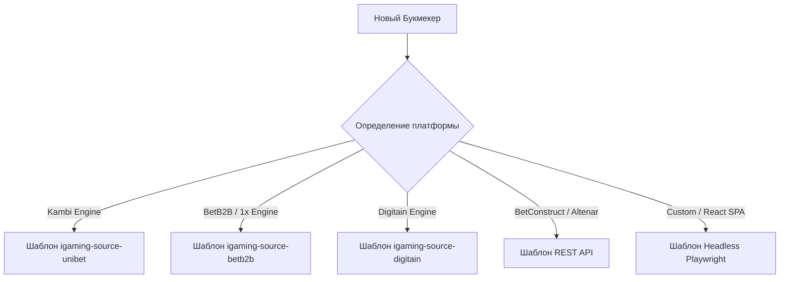

# 🚀 Руководство по быстрому подключению 20 новых букмекеров

## 📌 Цель
Подключить к экосистеме **SmartBet.guru** 20 дополнительных букмекеров с минимальными трудозатратами за счет повторного использования платформенных шаблонов (*Platform Engines*).

---

## 🧭 Таксономия платформ (Куда относятся 20 новых БК)

Большинство мировых букмекеров работают на готовых B2B-движках (*White-label / Odds Feeds*). Зная движок, написание нового краулера занимает от 30 до 60 минут:



### 📋 Список 20 рекомендуемых к подключению БК:

| # | Букмекер | Платформа / Движок | Базовый шаблон | Тип парсинга | Регион / Рынок |
|---|---|---|---|---|---|
| **1** | **Stake.com** | SoftSwiss / Custom | `igaming-source-core` | GraphQL / REST API | Crypto / Global |
| **2** | **Roobet** | Custom REST | `igaming-source-core` | REST API | Crypto / Global |
| **3** | **10bet** | SBTech / Custom | `igaming-source-core` | REST / WebSocket | UK / EU |
| **4** | **Bovada** | Bodog Engine | `igaming-source-core` | REST JSON API | US / LATAM |
| **5** | **BetOnline** | Custom | `igaming-source-core` | REST JSON API | US / Global |
| **6** | **Coral** | Entain CDS | `igaming-source-bwin` | CDS API | UK |
| **7** | **Ladbrokes** | Entain CDS | `igaming-source-bwin` | CDS API | UK / Australia |
| **8** | **SkyBet** | Flutter / Custom | `igaming-source-fanduel`| REST API | UK |
| **9** | **Betclic** | Betclic Group | `igaming-source-core` | REST JSON Feed | France / Portugal / Poland |
| **10** | **Winamax** | Custom | `igaming-source-core` | REST JSON Feed | France / Spain |
| **11** | **Superbet** | Custom REST | `igaming-source-core` | REST JSON API | Romania / Poland / Brazil |
| **12** | **Totalbet** | Altenar Engine | `igaming-source-core` | Altenar REST API | Poland |
| **13** | **Fortuna** | FEG Engine | `igaming-source-core` | REST JSON API | Czech / Slovakia / Poland |
| **14** | **STS** | BetConstruct | `igaming-source-core` | Swarm WebSocket / REST | Poland / UK |
| **15** | **Neds** | Entain Australia | `igaming-source-bwin` | CDS API | Australia |
| **16** | **TAB** | Tabcorp | `igaming-source-core` | REST API | Australia |
| **17** | **BetRight** | Custom | `igaming-source-core` | REST API | Australia |
| **18** | **PointsBet** | Fanatics / Custom | `igaming-source-core` | REST API | US / Australia |
| **19** | **Hard Rock Bet** | Custom | `igaming-source-draftkings` | REST API | US (Florida) |
| **20** | **ESPN BET** | PENN / theScore | `igaming-source-core` | REST API | US |

---

## 🛠️ Пошаговый алгоритм подключения нового БК (15–30 минут)

### Шаг 1: Автогенерация скелета Java-модуля
В корне репозитория запустить скрипт `generate_skeleton.py`:
```python
# Пример для создания igaming-source-stake
generate_skeleton("igaming-source-unibet", "stake", "Stake", "STAKE")
```
Скрипт создаст модуль `igaming-source-stake`, переименует пакеты, классы, конфигурации и DTO.

### Шаг 2: Добавление модуля в корневой `pom.xml`
```xml
<modules>
    ...
    <module>igaming-source-stake</module>
</modules>
```

### Шаг 3: Реализация маппера исходов (`StakeOddsMapper.java`)
Реализовать интерфейс маппинга коэффициентов:
- Исход матча: `MatchResultBet` (1, X, 2, 1X, 12, X2)
- Тоталы: `TotalBet` (Over, Under, Line)
- Форы: `HandicapBet` (Team1, Team2, Line)

### Шаг 4: Сборка Docker-образа через Jib (по правилам AGENTS.md)
```powershell
mvn.cmd -pl igaming-source-stake jib:build "-Djib.to.image=ghcr.io/datawikipro/igaming-source-stake:latest" "-Djib.to.auth.username=datawikipro" "-Djib.to.auth.password=<token>" -DskipTests
```

### Шаг 5: Генерация и применение K8s-манифеста
Сгенерировать манифест:
```python
generate_k8s("digitain", "stake")
```
Применить в кластере:
```bash
kubectl apply -f igaming-k8s/stake.yaml
```

### Шаг 6: Верификация Definition of Done (DoD)
1. Под находится в `Running 2/2` (или `1/1`).
2. Пробы `/actuator/health/liveness` и `/actuator/health/readiness` возвращают HTTP 200 `UP`.
3. Лог чист от ошибок и шлет котировки в `igaming-aggregator`.
