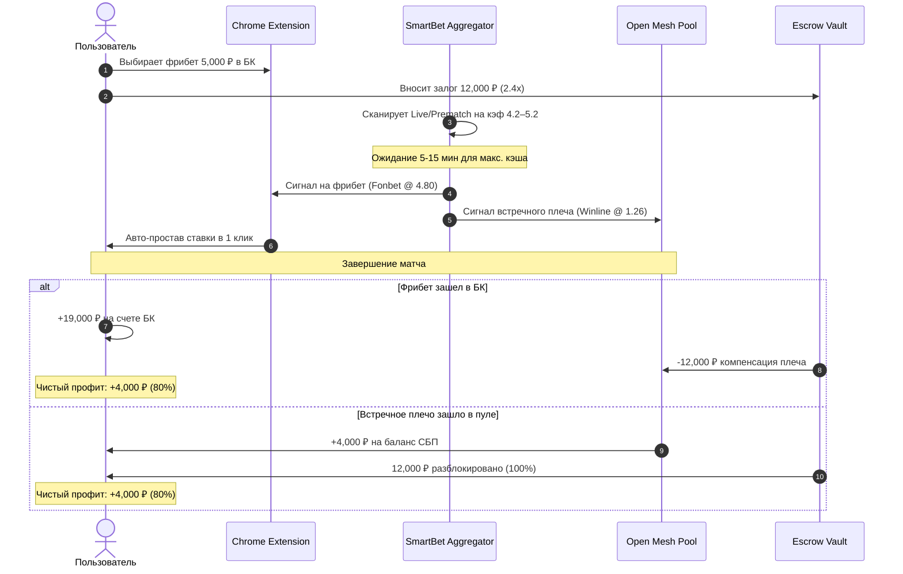

# Архитектура монетизации фрибетов (Smart Freebet Optimizer & Escrow)

## 1. Концепция и проблематика
Букмекерские конторы (Fonbet, Winline, Pari, Betcity, Liga Stavok, Leon и др.) регулярно выдают промо-бонусы в виде **фрибетов (Freebets)** по механике **SNR (Stake Not Returned / Выигрыш за вычетом суммы ставки)**.
Обычные игроки при попытке «отыграть» фрибет наугад теряют его в 70-85% случаев, либо ставят на низкие коэффициенты (1.30-1.50) и забирают менее 30% от номинала.

Экосистема **SmartBet.guru** предоставляет сервис **Smart Freebet Optimizer**, позволяющий превратить любой фрибет в **~80% гарантированных чистых денег** без риска через автоматический арбитраж в общем пуле (Open Mesh Pool).

---

## 2. Математическая модель (SNR Matched Betting Formula)

### 2.1. Формула чистой конверсии
Пусть:
* $F$ — номинал фрибета в БК (своих денег затрачено $0\text{ ₽}$).
* $K_1$ — коэффициент исхода с фрибетом (обычно аутсайдер с кэфом $4.00$–$5.50$).
* $K_2$ — коэффициент встречного плеча в другой БК (фаворит с кэфом $1.22$–$1.28$).
* $S_2$ — размер ставки реальными деньгами на встречном плече.

При наступлении Исхода 1 (выигрыш фрибета):
$$\text{Profit}_1 = F \cdot (K_1 - 1) - S_2$$

При наступлении Исхода 2 (выигрыш встречного плеча):
$$\text{Profit}_2 = S_2 \cdot (K_2 - 1)$$

Приравнивая $\text{Profit}_1 = \text{Profit}_2$, получаем формулу идеального встречного плеча:
$$S_2 = F \cdot \frac{K_1 - 1}{K_2}$$

Чистая гарантированная прибыль при любом исходе:
$$P_{net} = F \cdot \frac{(K_1 - 1)(K_2 - 1)}{K_2}$$

Коэффициент конверсии фрибета в чистый кэш:
$$R = \frac{P_{net}}{F} \approx 1 - \frac{1}{K_1}$$

---

## 3. Обоснование залога Escrow ($2.4 \times F$)

### 3.1. Кредитный риск пула (Zero Default Risk)
Когда фрибет $F = 5{,}000\text{ ₽}$ ставится на кэф $K_1 = 4.20$, размер встречного плеча реальными деньгами пула составляет:
$$S_2 = 5{,}000 \cdot \frac{4.20 - 1}{1.33} \approx 12{,}000\text{ ₽} \quad (2.4 \times F)$$

* **Если фрибет выиграл в БК игрока**: Игрок получает выигрыш $+16{,}000\text{ ₽}$ прямо на счет в своей БК. Встречное плечо пула ($12{,}000\text{ ₽}$) проигрывает. Чтобы игрок не сбежал с деньгами БК, встречное плечо списывается из его Escrow-залога. Игрок остается с $+4{,}000\text{ ₽}$ чистой прибыли ($80\%$).
* **Если выиграло встречное плечо пула**: Пул получает прибыль, начисляет игроку $+4{,}000\text{ ₽}$, а залог Escrow $12{,}000\text{ ₽}$ мгновенно разблокируется в $100\%$ объеме.

---

## 4. Сводная матрица залогов и выплат

| Номинал фрибета ($F$) | Залог Escrow ($2.4 \times F$) | Чистая выплата ($0.80 \times F$) | Оптимальные кэфы ($K_1 / K_2$) | Время подбора |
|---|---|---|---|---|
| **$500\text{ ₽}$** | **$1{,}200\text{ ₽}$** | **$+400\text{ ₽}$** | $4.50$ / $1.25$ | $5$–$10$ мин |
| **$1{,}000\text{ ₽}$** | **$2{,}400\text{ ₽}$** | **$+800\text{ ₽}$** | $4.50$ / $1.25$ | $5$–$10$ мин |
| **$2{,}000\text{ ₽}$** | **$4{,}800\text{ ₽}$** | **$+1{,}600\text{ ₽}$** | $4.50$ / $1.25$ | $5$–$15$ мин |
| **$3{,}000\text{ ₽}$** | **$7{,}200\text{ ₽}$** | **$+2{,}400\text{ ₽}$** | $4.60$ / $1.24$ | $5$–$15$ мин |
| **$5{,}000\text{ ₽}$** | **$12{,}000\text{ ₽}$** | **$+4{,}000\text{ ₽}$** | $4.80$ / $1.24$ | $5$–$15$ мин |
| **$10{,}000\text{ ₽}$** | **$24{,}000\text{ ₽}$** | **$+8{,}000\text{ ₽}$** | $5.00$ / $1.22$ | $10$–$20$ мин |
| **$25{,}000\text{ ₽}$** | **$60{,}000\text{ ₽}$** | **$+20{,}000\text{ ₽}$** | $5.20$ / $1.21$ | $15$–$25$ мин |
| **$50{,}000\text{ ₽}$** | **$120{,}000\text{ ₽}$** | **$+40{,}000\text{ ₽}$** | $5.20$ / $1.21$ | $15$–$30$ мин |

---

## 5. Протокол работы Smart Freebet Optimizer

