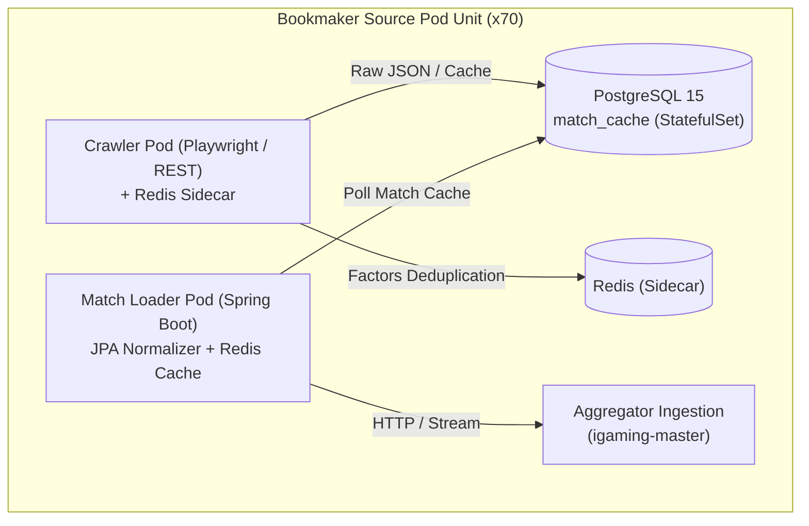

# 🏗️ Capacity Planning & Server Procurement Guide (70+ Bookmakers)

## 📋 Обзор и целевые показатели

Данный документ содержит инженерный расчет вычислительных ресурсов, спецификации серверного оборудования, конфигурацию лимитов Kubernetes и план масштабирования экосистемы **SmartBet.guru** для одновременной работы **70+ букмекеров** в реальном времени.

---

## ⚙️ Архитектурная модель и профилирование ресурсов

Каждый подключенный букмекер функционирует как изолированный микросервисный контур в namespace `igaming-source`:



### 1. Матрица профилей ресурсов контейнеров

| Компонент | Тип нагрузки | CPU Request | CPU Limit | RAM Request | RAM Limit | Обоснование |
|---|---|---|---|---|---|---|
| **Crawler (Playwright / XVFB)** *(~35 БК)* | Chromium Headless, DOM render, WebSockets | `100m` | `1200m` | `512Mi` | `1280Mi` | Chromium V8 движок + буфер вкладок |
| **Crawler (REST API / Stream)** *(~35 БК)* | HTTP RestTemplate, JSON parse | `50m` | `500m` | `256Mi` | `640Mi` | Низкий оверхед, потоковый парсинг |
| **Match Loader (Spring Boot)** *(70 БК)* | JPA ORM, Data mapping, Factor Hash | `30m` | `300m` | `256Mi` | `512Mi` | JVM heap `-Xms128m -Xmx384m` |
| **Redis Sidecar** *(70 БК)* | Дедупликация исходов (TTL 30s) | `5m` | `50m` | `32Mi` | `64Mi` | Key-value кеш последних коэффициентов |
| **PostgreSQL 15 DB** *(70 БК)* | `match_cache`, `sport_cache` | `10m` | `150m` | `32Mi` | `192Mi` | In-memory буфер SQLite/PG для сглаживания пиков |
| **Init Container (`db-schema-check`)** | Проверка схемы и индексов | `10m` | `500m` | `32Mi` | `128Mi` | Отрабатывает 1-2 сек при старте |

---

## 📊 Суммарный расчет кластера на 70 букмекеров

### 1. Вычислительные ресурсы уровня `igaming-source` (70 БК):
- **35 Playwright Crawlers**: `35 * 100m = 3.5 cores CPU (пик 42 cores)`, `35 * 1.25 GB = 43.75 GB RAM`
- **35 REST Crawlers**: `35 * 50m = 1.75 cores CPU (пик 17.5 cores)`, `35 * 0.6 GB = 21.0 GB RAM`
- **70 Match Loaders**: `70 * 30m = 2.1 cores CPU (пик 21 cores)`, `70 * 0.5 GB = 35.0 GB RAM`
- **70 PostgreSQL DBs**: `70 * 10m = 0.7 cores CPU (пик 10.5 cores)`, `70 * 0.15 GB = 10.5 GB RAM`
- **70 Redis Sidecars**: `70 * 5m = 0.35 cores CPU (пик 3.5 cores)`, `70 * 0.05 GB = 3.5 GB RAM`
- **Итого для `igaming-source`**:
  - **Базовый CPU (Requests)**: `~8.4 vCPU` *(Пиковый Burst Limit: ~94 vCPU)*
  - **Оперативная память (RAM Limits)**: `~113.75 GB RAM`

### 2. Вычислительные ресурсы уровня `igaming-master` (Ядро и Агрегатор):
- **`igaming-aggregator-ingestion`**: `500m req / 2000m lim`, `1.0 Gi req / 2.5 Gi lim`
- **`igaming-aggregator-normalizer`**: `1000m req / 4000m lim`, `2.0 Gi req / 4.0 Gi lim` (Матчинг 70+ линий в секунду)
- **`igaming-aggregator-surebet`**: `800m req / 3000m lim`, `1.5 Gi req / 3.0 Gi lim` (Поиск арбитража в реальном времени)
- **`igaming-aggregator-api`**: `300m req / 1500m lim`, `512 Mi req / 1.5 Gi lim`
- **`kafka-0`**: `500m req / 2000m lim`, `1.0 Gi req / 2.0 Gi lim`
- **`igaming-redis`**: `200m req / 1000m lim`, `1.0 Gi req / 2.0 Gi lim`
- **`igaming-portal` + `smartbet-guru` (Next.js)**: `400m req / 1500m lim`, `1.0 Gi req / 2.0 Gi lim`
- **Итого для ядра**:
  - **CPU**: `~3.7 vCPU req` *(пик 15 vCPU)*
  - **RAM**: `~17.0 GB RAM`

### 3. Системный оверхед (K8s, Flannel, Tailscale, containerd, OS):
- **RAM**: `~12.0 GB RAM`
- **CPU**: `~2.0 vCPU`

---

## 🛒 Спецификация оборудования для закупки серверов

> [!IMPORTANT]
> **Общая суммарная потребность кластера для 70+ букмекеров**:
> - **RAM**: **144 – 160 GB RAM**
> - **CPU**: **32 – 48 vCPU Cores**
> - **Storage**: **500 GB – 1 TB NVMe SSD**
> - **Network**: **1 Gbps Uplink** с низкой задержкой (low-latency) до европейских датацентров.

### Вариант 1: Dedicated Servers (Hetzner / OVH / Scaleway) — **РЕКОМЕНДУЕМЫЙ (Наилучший по цене/качеству)**
| Сервер | Конфигурация | Назначение |
|---|---|---|
| **Worker Node A (Heavy Crawlers)** | AMD Ryzen 9 7950X (16C/32T), 64 GB DDR5 ECC, 2x 1TB NVMe | Playwright Headless Crawlers (35 БК) |
| **Worker Node B (Loaders & REST)** | AMD Ryzen 9 7950X (16C/32T), 64 GB DDR5 ECC, 2x 1TB NVMe | REST Crawlers + Loaders (70 БК) + DBs |
| **Master Node (Aggregator Core)** | AMD Ryzen 7 7700 (8C/16T), 32 GB DDR5 ECC, 1TB NVMe | Aggregator Ingestion, Normalizer, Surebet, Kafka, Redis |

### Вариант 2: Облачные серверы (GCP / AWS)
- **4x Worker Nodes**: `c2-standard-8` (8 vCPU, 32 GB RAM) или `e2-standard-8`
- **1x Master Node**: `c2-standard-8` (8 vCPU, 32 GB RAM)

---

## 🔒 Сетевая архитектура и прокси-инфраструктура

Для обхода Cloudflare, Akamai, Qrator и геолокационных блокировок требуется 4 гео-пула:

```
                  ┌───────────────────────┐
                  │    K8s Worker Nodes   │
                  └───────────┬───────────┘
                              │
     ┌────────────────┬───────┴────────┬────────────────┐
     ▼                ▼                ▼                ▼
[RU Proxy Pool] [EU Proxy Pool] [US Proxy Pool] [Asia Proxy Pool]
 (Winline,      (Betsson,        (DraftKings,    (Dafabet,
  Fonbet,        Unibet,          FanDuel,        Sbobet)
  Betcity)       Bwin)            BetMGM)
```

1. **RU Pool**: 5+ резидентных/статических IP (Qrator bypass).
2. **EU Pool**: 5+ статических IP в Нидерландах / Германии / Швеции (Kambi, Betsson, Bwin).
3. **US Pool**: 5+ резидентных IP (New Jersey / Pennsylvania) с поддержкой ротации для Akamai/CloudFront.
4. **Asia Pool**: 3+ IP (Сингапур / Малайзия / Филиппины).

---

## 📋 Чеклист запуска серверов на следующей неделе

- [ ] Заказ 2-3 серверов (суммарно >= 144 GB RAM, >= 36 ядер CPU).
- [ ] Установка ОС (Ubuntu 24.04 LTS / Debian 12) + включение `swap` (4-8 GB) и `htop`.
- [ ] Установка K3s agent: `curl -sfL https://get.k3s.io | K3S_URL=https://100.75.13.86:6443 K3S_TOKEN=<token> sh -`.
- [ ] Добавление ноды в Tailscale сеть с ключом из `user_rules`.
- [ ] Присвоение лейблов нод: `kubectl label node <node-name> node-type=standard`.
- [ ] Применение оптимизированных манифестов: `kubectl apply -f igaming-k8s/`.
- [ ] Проверка 5-минутного таймера стабильности (`schedule`).
