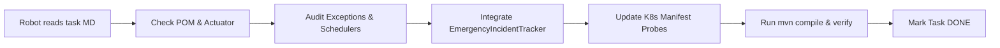

# ✈️ Plane Tasks: Fail-Fast & Liveness Health Standardization

Этот каталог содержит структурированный реестр задач для системы управления проектами **Plane** (https://plane.so) и инструкции для автономного AI-робота/субагентов по внедрению Fail-Fast механизмов, Spring Boot Actuator Liveness/Readiness проверок и аварийных фатальных дампов во все микросервисы и краулеры платформы **SmartBet.guru / iGaming**.

---

## 🗂️ Структура каталога

- `plane_tasks_import.json` — машиночитаемый экспорт всех задач, эпиков и модулей для импорта в Plane через API или Web-интерфейс.
- `tasks/` — индивидуальные спецификации задач в формате Markdown для людей и автономных агентов.
- `scripts/plane_robot_runner.py` — утилита для автоматической диспетчеризации задач, запуска сборки, синтаксической валидации K8s и фиксации статуса задач роботом.

---

## 🤖 Как AI-робот (Subagent) обрабатывает задачи

Каждая задача в папке `tasks/` содержит точные пути к файлам, симптомы сбоев и пошаговый алгоритм:

### Алгоритм из 6 шагов:
1. **Шаг 1 (Зависимости)**: Проверить `pom.xml` на наличие `spring-boot-starter-actuator` и `spring-boot-starter-web`.
2. **Шаг 2 (Аудит сбоев)**: Найти скрытые `try-catch`, проглатывающие критические сетевые, Kafka или DB ошибки.
3. **Шаг 3 (Привязка трекера)**: Подключить `EmergencyIncidentTracker` (или унаследовать `AbstractApiErrorTracker`).
4. **Шаг 4 (Порог аварии)**: Настроить скользящее окно сбоев (3–5 попыток) и принудительный вызов `LivenessState.BROKEN` и `System.exit(137)` при фатальной аварии.
5. **Шаг 5 (Манифест K8s)**: Добавить `livenessProbe` (`/actuator/health/liveness`) и `readinessProbe` (`/actuator/health/readiness`) в соответствующий файл `igaming-k8s/{module}.yaml`.
6. **Шаг 6 (Верификация)**: Запустить `mvn -pl {module} test-compile` и проверить валидность K8s YAML.

---

## 📊 Реестр Эпиков

| Эпик | Название | Кол-во задач | Описание |
|---|---|---|---|
| `[EPIC-CORE]` | Core Infrastructure & Incident Engine | 1 | Базовый фреймворк, Liveness индикаторы, аварийный баннер |
| `[EPIC-AGGREGATOR]` | Aggregator Services | 4 | Ingestion (Kafka), Surebet, Odds Sync, REST API |
| `[EPIC-PORTAL]` | Portal, Bot, Proxy & Infra | 3 | Portal DB, Telegram dead-man switch, Proxy backend |
| `[EPIC-CAPTURE]` | Match Result Capture | 1 | SofaScore & LiveResult live parsers |
| `[EPIC-CRAWLERS]` | Bookmaker Crawlers & Loaders | 27 | Все 27 букмекеров и 54 K8s деплоймента |
