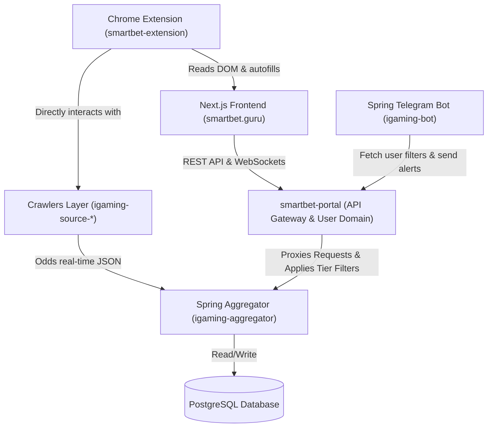

# Архитектура платформы SmartBet.guru

В данном документе приведена актуальная схема интеграции существующих и новых компонентов спортивно-аналитической платформы SmartBet.guru.

---

## 1. Схема взаимодействия компонентов

Интеграция новых аналитических модулей и систем монетизации/ограничений построена по модульному принципу. Центральным шлюзом между пользовательским интерфейсом (Next.js) и расчетным ядром (Spring Aggregator) является микросервис **smartbet-portal**.

---

## 2. Назначение и функции компонентов

### 2.1 Фронтенд: Next.js (`smartbet.guru`)
- **Стек**: Next.js (App Router), TypeScript, Framer Motion, TailwindCSS / Vanilla CSS, next-intl (локализация).
- **Назначение**:
  - Отображение сетки вилок (`/arbs`) и валуйных ставок.
  - Калькулятор вилок и критерия Келли (+EV) для управления размером ставок.
  - Демо-кошелек и панель управления балансами букмекеров в реальном времени.

### 2.2 API-шлюз и бизнес-домен: `smartbet-portal`
- **Стек**: Spring Boot, Spring Security (Stateless JWT via `auth-base`), RestTemplate.
- **Назначение**:
  - Валидация сессий пользователей, управление подписками и реферальной программой.
  - Проксирование запросов к бэкенду агрегатора.
  - **Слой фильтрации по тарифам (Tier Filter)**: На лету ограничивает доступы к вилкам:
    - **Гости (Анонимный доступ)**: Только вилки $\le 1.0\%$ прибыли с искусственной задержкой 300 секунд (5 минут).
    - **Бесплатный тариф (Авторизован)**: Вилки $\le 5.0\%$ прибыли в реальном времени.
    - **Премиум-тариф**: Без лимитов по прибыли и спортивным направлениям.

### 2.3 Сборщик и матчинг коэффициентов: `igaming-aggregator`
- **Стек**: Spring Boot, Spring Kafka, Spring Data JPA, PostgreSQL.
- **Назначение**:
  - Высокочастотный сбор линий от сети краулеров.
  - Парсинг, нормализация названий команд и спортивных событий.
  - Быстрый матчинг вилок (Surebets), валуйных ставок (+EV) и коридоров (Middles) в оперативной памяти с сохранением активных вилок в PostgreSQL.

### 2.4 Слой краулеров: `igaming-source-*`
- **Стек**: Node.js / Python / Java (в зависимости от букмекера).
- **Назначение**:
  - Быстрый поллинг API или WebSocket-соединения с целевыми букмекерами (Fonbet, Winline, Betcity и др.).
  - Доставка сырых котировок в aggregator в формате JSON.
