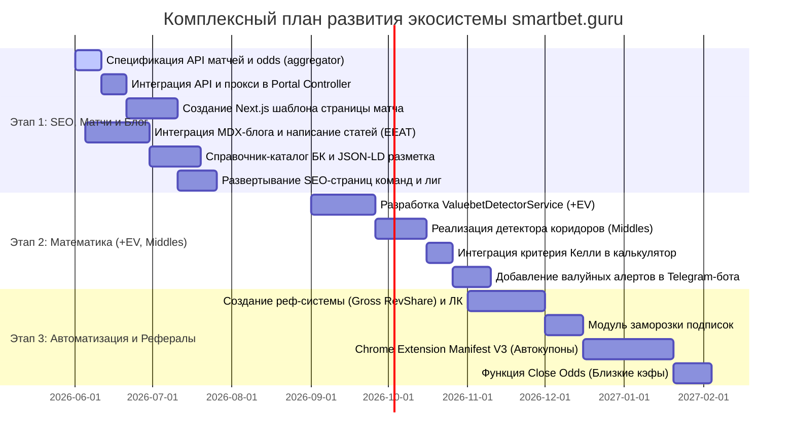

# Комплексный План Развития Экосистемы smartbet.guru

Настоящий документ представляет собой исчерпывающий, технически детализированный план проектирования, разработки и масштабирования платформы спортивного арбитража **smartbet.guru**. План охватывает бэкенд-инфраструктуру, Next.js фронтенд, Telegram-бота, Chrome-расширение, SEO-стратегию и архитектуру лимитов доступа.

---

## Архитектура Системы (Текущая + Целевая)

Целевая экосистема smartbet.guru состоит из следующих взаимосвязанных слоев:

```
[ 14 БК Crawlers / Loaders ] (Live / Prematch)
         │  (VPN / Proxy Pool)
         ▼
[ Ingestion API (igaming-aggregator) ]
         │  (Spring Ingestion layer)
         ▼
[ PostgreSQL / DB Layer ] ◄──► [ Surebet Detector Service ]
         │                     [ Valuebet Detector Service ] (Ref: Pinnacle)
         ▼
[ Portal API (igaming-portal) ] ◄──► [ AI Forecast & Wallet Analytics ]
   │                 │
   ▼                 ▼
[ Next.js Portal ]  [ Telegram Bot (igaming-bot) ] ──► [ Public Telegram Channels ]
   │
   ▼ (postMessage Protocol)
[ Chrome Web Extension ] (Auto-betting / DOM Injection)
```

---

## Единые Правила Бесплатных Лимитов (Лимиты Приложения)

Для максимизации конверсии трафика в платные подписки вводится строгая, прозрачная тарифная сетка, синхронизированная на уровне Базы Данных, Web-интерфейса и Telegram-бота:

| Канал Доступа | Бесплатный Тариф (Free Tier) | Премиум Тариф (Premium Tier) |
| :--- | :--- | :--- |
| **Сайт (smartbet.guru)** | • Отображаются вилки с прибылью **до 5.0%**.<br>• Вилки **выше 5.0% отображаются как LOCKED (заблокированные)**.<br>• Демо-кошелек и ставки доступны только для открытых вилок. | • Доступны вилки любой доходности (включая Live).<br>• Доступ к авторасчету вилок и размещению демо-ставок без ограничений.<br>• Разблокировка ИИ-прогнозов (AI Forecast). |
| **Telegram-бот (Push-алерты)** | • Только **Prematch** сигналы (Live отключен).<br>• Доходность вилок — **до 4.0%**.<br>• Ограничение: **до 100 пуш-оповещений в сутки** на пользователя. | • Live + Prematch вилки любой доходности.<br>• Безлимитное количество пушей.<br>• Тонкая настройка кастомных фильтров БК и рынков. |
| **Telegram-каналы (Публичные)** | • Транслируются вилки с прибылью **до 6.0%**.<br>• Ограничение частоты по шедулеру.<br>• Включена **ротация пар БК** для борьбы со спамом. | *Не применимо (каналы выступают лид-магнитами для привлечения трафика на сайт/в бот).* |

---

# ЭТАП 1. Динамическая SEO-сеть, Контентная Платформа и Сравнение Коэффициентов (Месяцы 1–3)

**Главная цель:** Сгенерировать органический поисковый трафик (трафик больше нуля) за счет индексации тысяч страниц матчей, команд и турниров.

---

## 1.1. Бэкенд-интеграция (igaming-aggregator & igaming-portal)

Для вывода полной таблицы коэффициентов на Next.js фронтенд необходимо добавить и проксировать новые REST API эндпоинты.

### 1.1.1. Изменения в модуле `igaming-aggregator`
*   **Новый контроллер `MatchDetailController.java`:**
    *   `GET /api/matches/{id}` — получение полных метаданных матча (команды, лига, спорт, статус, время начала).
    *   `GET /api/matches/{id}/odds` — получение списка всех актуальных, дедуплицированных коэффициентов букмекеров для конкретного матча.
    *   **Реализация логики извлечения котировок:**
        ```java
        @GetMapping("/matches/{id}/odds")
        public ResponseEntity<List<FlatOddsProjection>> getMatchOdds(@PathVariable Long id) {
            // Метод findFlatOddsByMatchId уже реализован в OddsActualRepository!
            return ResponseEntity.ok(oddsActualRepository.findFlatOddsByMatchId(id));
        }
        ```
*   **Создание `TeamQueryController.java`:**
    *   `GET /api/teams/{id}` — получение информации о команде и ее связях с другими сущностями.
    *   `GET /api/teams/{id}/upcoming` — список предстоящих матчей команды с участием наших лоадеров.

### 1.1.2. Изменения в модуле `igaming-portal` (Шлюз API)
*   **Проксирование эндпоинтов в `PortalController.java`:**
    *   `GET /api/v1/matches/{id}` ──► прокси на `aggregator/api/matches/{id}`.
    *   `GET /api/v1/matches/{id}/odds` ──► прокси на `aggregator/api/matches/{id}/odds` с конвертацией Snake Case в Camel Case.
*   **Применение политик кэширования:** Ответы `/matches/{id}/odds` кэшируются на уровне портала:
    *   Для **Live-матчей** — TTL кэша 2 секунды.
    *   Для **Prematch-матчей** — TTL кэша 15 секунд.

---

## 1.2. Проектирование Фронтенда (smartbet.guru в Next.js 14)

Мы создаем три ключевых типа динамических, индексируемых страниц в папке `src/app/[locale]`.

### 1.2.1. Страница деталей матча (`/[locale]/matches/[id]-[slug]/page.tsx`)
*   **Верхняя панель:** Названия команд, их эмблемы, статус встречи (LIVE с текущим счетом и минутой игры, либо обратный отсчет для предстоящих событий).
*   **ИИ-Рекомендация (AI Forecast Widget):** Интеграция готового модуля `AIForecastModal.tsx` непосредственно в тело страницы. Позволяет бесплатным пользователям увидеть усеченный прогноз, а Premium-пользователям — детальный разбор матча нейросетью.
*   **Матрица сравнения коэффициентов (Odds Comparison Grid):**
    *   Коэффициенты группируются по табам-рынкам: *Основной исход (1X2), Двойной шанс, Тоталы (Over/Under), Форы (Handicap), Обе забьют (BTTS)*.
    *   При клике на вкладку "Тоталы" отображается список тоталов (1.5, 2.5, 3.5...).
    *   Для каждого значения тотала строится кросс-таблица всех БК (Fonbet, Betcity, Marathonbet, Winline и др.) с их актуальными кэфами.
    *   **Максимальный коэффициент на каждый исход автоматически подсвечивается неоновым зеленым цветом** и помечается значком молнии ⚡.
*   **График движения котировок:** При наведении или клике на любой кэф открывается мини-график истории изменения этого коэффициента во времени (`OddsHistoryModal.tsx`).

### 1.2.2. Страница команды (`/[locale]/teams/[id]-[slug]/page.tsx`)
*   **Сводная информация:** Вид спорта, текущая лига, логотип, средняя результативность.
*   **Сетка матчей:** Календарь будущих матчей команды. При клике на матч пользователь переходит на детальную страницу сравнения коэффициентов.
*   **Исторические коэффициенты:** Сводная таблица последних 5 сыгранных матчей с указанием того, какие букмекеры давали лучшие кэфы на победу команды.

### 1.2.3. Страница турнира/лиги (`/[locale]/leagues/[id]-[slug]/page.tsx`)
*   **Турнирная таблица:** Актуальное положение команд в лиге.
*   **Расписание туров:** Список матчей в рамках лиги с быстрыми ссылками на сравнение кэфов.
*   **Аналитика маржи БК:** Сравнение среднего уровня маржинальности различных БК в рамках этой лиги (показывает пользователю, где выгоднее ставить на данный турнир).

---

## 1.3. SEO-оптимизация и Микроразметка (Rich Snippets)

Для захвата топовых позиций в поисковой выдаче Google и Яндекс реализуются следующие стандарты:

1.  **Динамическая генерация мета-данных (`generateMetadata`):**
    *   *Заголовок страницы матча:* `«Коэффициенты на матч [Team 1] – [Team 2] | Сравнение букмекеров на smartbet.guru»`.
    *   *Мета-описание:* `«Сравните кэфы на матч [Team 1] – [Team 2] в реальном времени. Лучшие коэффициенты от Фонбет, Бетсити, Марафонбет и еще 11 БК на smartbet.guru»`.
2.  **Микроразметка Schema.org в формате JSON-LD:**
    *   На страницах матчей автоматически рендерится структурированная разметка `SportsEvent`:
        ```json
        {
          "@context": "https://schema.org",
          "@type": "SportsEvent",
          "name": "Zenit vs Spartak",
          "startDate": "2026-06-15T19:00:00Z",
          "homeTeam": { "@type": "SportsOrganization", "name": "Zenit" },
          "awayTeam": { "@type": "SportsOrganization", "name": "Spartak" },
          "location": { "@type": "Place", "name": "Gazprom Arena" }
        }
        ```
3.  **Автоматическая XML Карта сайта (Sitemap):**
    *   Динамический файл `sitemap.xml` автоматически собирает все ID активных матчей, команд и лиг из Базы Данных, обновляясь каждые 6 часов.

---

## 1.4. Контентная платформа (Блог MDX) и Каталог букмекеров

### 1.4.1. Раздел «Каталог букмекеров» (`/[locale]/bookmakers`)
*   Таблица-справочник всех 14 БК с рейтингом (Надежность, Лимиты, Скорость выплат, Величина маржи).
*   Детальный обзор каждой БК (`/[locale]/bookmakers/[slug]`) с плюсами и минусами для профессионального арбитража.
*   Интеграция реферальных кнопок с уникальными промокодами для монетизации трафика по CPA/RevShare.

### 1.4.2. MDX Блог (`/[locale]/blog`)
*   Интеграция парсера `next-mdx-remote`. Статьи хранятся в виде MDX-файлов (Markdown с поддержкой интерактивных React-компонентов).
*   **Лид-магнит (Free Widget):** Внутри каждой статьи блога встраивается динамический виджет, выводящий 3 активные вилки с доходностью **до 1.0% с задержкой 60 секунд**. Это удерживает пользователя на странице до 5–10 минут, резко улучшая поведенческие факторы SEO.

---

# ЭТАП 2. Математическое Ядро: +EV и Коридоры (Месяцы 4–5)

**Главная цель:** Расширить аналитические возможности платформы за рамки классического арбитража, внедрив поиск валуйных ставок и коридоров.

---

## 2.1. Модуль ставок с перевесом (+EV / Value Betting)

Внедряется новый фоновый процесс в модуле `igaming-aggregator` для расчета ставок с положительным математическим ожиданием.

### 2.1.1. Математическая модель (+EV)
В качестве эталонного («острого») букмекера с минимальной маржой используется **Pinnacle**:
1.  **Вычисление вероятности исхода без маржи (True Probability):**
    Для двух исходов ($K_1, K_2$):
    $$P_1 = \frac{1/K_1}{1/K_1 + 1/K_2}$$
    Для трех исходов ($K_1, K_{draw}, K_2$):
    $$P_1 = \frac{1/K_1}{1/K_1 + 1/K_{draw} + 1/K_2}$$
2.  **Расчет математического ожидания (+EV):**
    Если коэффициент на этот же исход у «мягкого» букмекера ($K_{soft}$) превышает истинную вероятность:
    $$EV = (K_{soft} \times P_true) - 1$$
    Если $EV > 0$, фиксируется валуйная ставка. Оптимальный порог для детекции: $EV \ge 0.02$ (от 2% математического перевеса).

### 2.1.2. Бэкенд архитектура валуйных ставок
*   Создание таблицы `valuebet_alert` в БД:
    ```sql
    CREATE TABLE valuebet_alert (
        id BIGSERIAL PRIMARY KEY,
        match_id BIGINT REFERENCES match_record(id) ON DELETE CASCADE,
        bookmaker VARCHAR(50) NOT NULL,
        bet_type VARCHAR(50) NOT NULL,
        param NUMERIC(10, 2),
        value_odds NUMERIC(10, 2) NOT NULL,
        pinnacle_odds NUMERIC(10, 2) NOT NULL,
        true_probability NUMERIC(5, 4) NOT NULL,
        ev_percent NUMERIC(5, 2) NOT NULL,
        detected_at TIMESTAMP NOT NULL,
        is_live BOOLEAN NOT NULL DEFAULT FALSE
    );
    ```
*   Разработка `ValuebetDetectorService.java` в `aggregator-surebet` для расчета валуйных ставок параллельно с обычными вилками.
*   Expose через `SurebetController` эндпоинта `GET /api/valuebets/active`.

---

## 2.2. Модуль Коридоров (Middles)

Коридор возникает, когда при различных исходах события обе ставки могут выиграть, либо одна выиграет, а по второй произойдет возврат.

### 2.2.1. Алгоритм поиска коридоров по тоталам и форам:
*   **Пример коридора на тотал голов:**
    *   БК 1: Тотал Больше (2.5) за 2.05.
    *   БК 2: Тотал Меньше (3.5) за 1.95.
    *   *Результат:* Если в матче забивают ровно 3 гола, выигрывают **обе** ставки. Если забивают 2 или менее — играет ТМ(3.5), если 4 или более — играет ТБ(2.5). Убыток в худшем случае минимален.
*   **Реализация в `SurebetRuleEvaluator.java`:**
    *   Разработать правила сравнения параметров тоталов $T_{over} < T_{under}$ (разница ровно в 1 шаг, например, 2.5 и 3.5, или 2.25 и 2.75).
    *   Расчет математического ожидания и отображение коридора в отдельной вкладке на сайте.

---

## 2.3. Внедрение Критерия Келли на фронтенд

ВNext.js калькулятор (`SurebetCalculator.tsx`) интегрируется новая вкладка **«Калькулятор Келли»** для автоматического управления размером банка:
*   Формула расчета рекомендуемой доли банкролла:
    $$f^* = \frac{EV}{K_{soft} - 1}$$
*   Интеграция дробного Келли (Fractional Kelly) с коэффициентом усушки 0.25 или 0.5 для снижения дисперсии при просадках.

---

## 2.4. Рассылка +EV и Коридоров в Telegram-боте

*   Добавление новых типов уведомлений (+EV и Коридоры) в `NotificationScheduler.java`.
*   Расширение меню настройки фильтров (`FilterHandler.java`), позволяющее пользователям включать/отключать сигналы по валуйным ставкам и задавать минимальный процент EV.

---

# ЭТАП 3. Расширение Автопростановки, Безопасность и Реферальная Сеть (Месяцы 6–8)

**Главная цель:** Разработать автоматизацию простановки купонов, защитить аккаунты игроков от санкций букмекеров и запустить вирусное масштабирование через партнеров.

---

## 3.1. Разработка Chrome-расширения для автопростановки

Браузерное расширение (Manifest V3) автоматизирует переход к событию и заполнение купонов в БК, сводя человеческий фактор к минимуму.

### 3.1.1. Взаимодействие Next.js ──► Chrome Extension:
```javascript
// На сайте smartbet.guru при клике на ставку
window.postMessage({
  source: 'smartbet-web-portal',
  action: 'FILL_BET_SLIP',
  payload: {
    bookmaker: 'fonbet',
    eventUrl: 'https://www.fon.bet/sports/football/123456',
    outcomeCode: 'TOTAL_OVER',
    param: 2.5,
    stake: 5000
  }
}, '*');
```

### 3.1.2. Алгоритм автопростановки в Content Script расширения:
1.  Открывает вкладку с `eventUrl`.
2.  Content Script анализирует страницу букмекера, ищет блок ставок и кликает на исход:
    *   *Пример селектора Фонбет для ТБ(2.5):* Поиск элемента по атрибутам или тексту `contains("Б 2.5")` или `contains("Больше 2.5")`.
3.  Находит открывшийся купон БК (Bet Slip).
4.  Вводит сумму ставки `stake` через симуляцию поочередных нажатий клавиш клавиатуры (имитируя человеческий ввод со случайной задержкой 50–150 мс на символ).
5.  Игрок видит заполненный купон и нажимает финальную кнопку подтверждения вручную.

---

## 3.2. Функция «Близкие коэффициенты» (Close Odds)

*   **Логика на фронтенде:** Если в момент простановки первого плеча вилки коэффициент на второе плечо просел на целевом букмекере, система моментально предлагает альтернативный вариант.
*   **Реализация:** Фронтенд обращается к специальному API-методу `GET /api/v1/odds/alternatives` для поиска подходящего коэффициента на этот же исход у других букмекеров из базы `flat_odds` с разницей кэфа не более 0.05.

---

## 3.3. Функция «Заморозка подписки» (Subscription Freeze)

Дает пользователям право приостанавливать платную лицензию во время отпусков или технических пауз:
*   **База данных:** Добавить колонки в таблицу пользователей:
    *   `subscription_frozen` BOOLEAN DEFAULT FALSE
    *   `freeze_started_at` TIMESTAMP
    *   `remaining_premium_seconds` BIGINT
*   **Логика:** При заморозке высчитывается оставшееся время подписки, статус аккаунта временно переходит в Free Tier. При разморозке Premium-статус восстанавливается на остаток сохраненного времени. Лимит заморозки — не более 1 раза в месяц на суммарный срок до 14 дней.

---

## 3.4. Двухуровневая Реферальная Система (Gross RevShare)

Инструмент вирусного роста с выплатами от валового объема платежей привлеченных пользователей.

### 3.4.1. Бизнес-логика реферальной системы:
*   **1 уровень:** Партнер получает **20%** от всех оплат напрямую привлеченных им пользователей (рефералов).
*   **2 уровень:** Партнер получает **5%** от оплат пользователей, привлеченных его рефералами 1-го уровня.
*   **Прогрессивная шкала:** При генерации оборота свыше €2000/мес доля отчислений 1-го уровня автоматически возрастает до **30%**.
*   **Lifetime Recurring:** Комиссия выплачивается со всех продлений лицензии пользователем пожизненно. Расчет ведется от полной суммы транзакции (Gross Revenue) до вычета комиссий эквайрингов.

### 3.4.2. Техническая реализация реферальной системы:
*   Создание таблиц `referral_relation` и `partner_payout`:
    ```sql
    CREATE TABLE referral_relation (
        id BIGSERIAL PRIMARY KEY,
        referrer_id BIGINT REFERENCES portal_user(id),
        referred_id BIGINT UNIQUE REFERENCES portal_user(id),
        created_at TIMESTAMP DEFAULT NOW()
    );

    CREATE TABLE partner_transaction (
        id BIGSERIAL PRIMARY KEY,
        partner_id BIGINT REFERENCES portal_user(id),
        amount NUMERIC(10, 2) NOT NULL,
        currency VARCHAR(3) NOT NULL,
        description VARCHAR(255),
        status VARCHAR(20) NOT NULL DEFAULT 'PENDING',
        created_at TIMESTAMP DEFAULT NOW()
    );
    ```
*   **Фронтенд:** Разработка Личного Кабинета партнера в Next.js:
    *   Статистика переходов, регистраций и оплат по реф-ссылкам.
    *   Раздел промо-материалов (баннеры, готовые рекламные тексты).
    *   Интеграция **iframe-виджета** с бесплатной выдачей низкопроцентных вилок для встраивания партнерами на свои блоги о заработке.

---

# ЭТАП 4. Инфраструктура, Мониторинг и DevOps (Постоянно)

---

## 4.1. Dynamic Proxy & VPN Pool

*   Разработка демона автоматического контроля работоспособности прокси-пула на Go или Python.
*   **Ротация:** Автоматический вывод прокси из пула при обнаружении блокировки со стороны любого букмекера и моментальная замена на чистый IP-адрес.

## 4.2. Автоматизированное тестирование парсеров (Playwright E2E)

Букмекеры часто меняют структуру верстки сайтов, что ломает парсеры. Для минимизации простоев внедряется система непрерывного тестирования:
*   Развертывание E2E-тестов на базе **Playwright / Selenium**.
*   Каждые 4 часа тесты эмулируют заходы на все 14 БК, проверяют корректность парсинга линий и доступность DOM-элементов купонов.
*   При обнаружении аномалий или пустых ответов система отправляет критический алерт дежурному инженеру в Telegram.

## 4.3. Оптимизация задержки Live-линий (Низкий приоритет)

*   Провести профилирование модулей `igaming-source-*` и минимизировать накладные расходы при маппинге данных в `igaming-aggregator-ingestion`.
*   Настроить WebSocket-соединения с букмекерами там, где сейчас используется HTTP-поллинг, снижая лаг обновления до < 2.5 сек.

---

## Сводная Дорожная Карта Разработки (Gantt Chart)


