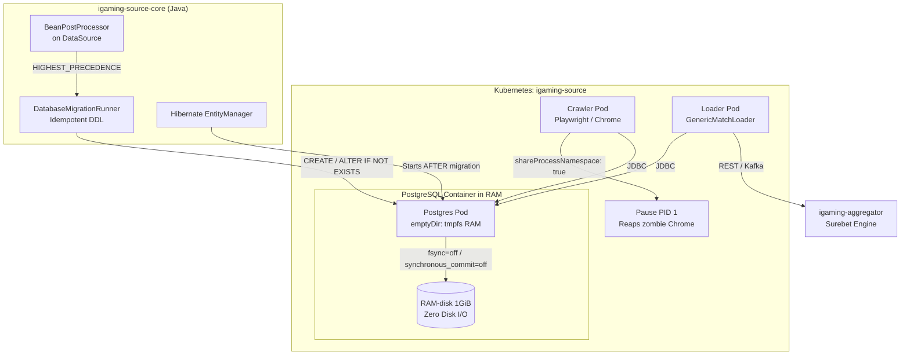

# Design: In-Memory PostgreSQL & Java Auto-Migration Architecture

## Architecture Overview



## 1. Java Auto-Migration Engine (`igaming-source-core`)
- Класс: `pro.datawiki.igaming.source.core.database.DatabaseMigrationRunner`
- Жизненный цикл:
  1. Перехват инициализации бина `DataSource` через `BeanPostProcessor.postProcessAfterInitialization`.
  2. До инициализации JPA Hibernate EntityManagerFactory выполняется подключение к Postgres.
  3. Выполняются идемпотентные DDL-скрипты:
     - `CREATE TABLE IF NOT EXISTS match_cache (...)`
     - `CREATE TABLE IF NOT EXISTS league_cache (...)`
     - `CREATE TABLE IF NOT EXISTS sport_cache (...)`
     - `CREATE TABLE IF NOT EXISTS unmapped_bet (...)`
     - `CREATE TABLE IF NOT EXISTS unmapped_sport (id BIGSERIAL PRIMARY KEY, bookmaker VARCHAR(255) NOT NULL, raw_name VARCHAR(255) NOT NULL, created_at TIMESTAMP DEFAULT CURRENT_TIMESTAMP)`
     - `CREATE TABLE IF NOT EXISTS match_factor (id BIGSERIAL PRIMARY KEY, match_id BIGINT NOT NULL, factor_id VARCHAR(255) NOT NULL, name VARCHAR(255), value DOUBLE PRECISION)`
     - Идемпотентные миграции колонок (`ALTER TABLE match_factor ADD COLUMN IF NOT EXISTS id BIGINT GENERATED BY DEFAULT AS IDENTITY`, etc.).
     - Создание индексов (`idx_mc_status_updated`, `idx_mc_is_live`, etc.).
  4. Fallback-запуск через `ApplicationRunner` при возможных задержках старта БД.

## 2. In-Memory PostgreSQL Parameters (`igaming-k8s`)
Каждый `StatefulSet` БД в `igaming-source` настраивается на работу без дисковых операций:
- **Монтирование:** `emptyDir: { medium: Memory, sizeLimit: 1Gi }`
- **Аргументы PostgreSQL:**
  - `fsync=off` — отключает сброс данных на диск при коммитах.
  - `synchronous_commit=off` — моментальное подтверждение транзакции в RAM.
  - `full_page_writes=off` — предотвращает дублирующую запись страниц.
  - `wal_level=minimal` — минимальная генерация журналов WAL.
  - `max_wal_senders=0` — исключение накладных расходов на репликацию.
  - `shared_buffers=128MB` — эффективный буферный пул для кэша.

## 3. Очистка initContainer `db-schema-check`
Удален весь захардкоженный устаревший bash SQL. Init-контейнер выполняет исключительно проверку готовности сетевого порта:
```bash
until pg_isready -h "$HOST.igaming-source.svc.cluster.local." -p 5432 -U "$USER" >/dev/null 2>&1; do
  sleep 1
done
```

## 4. Защита от утечки процессов Chrome
Во всех подах с браузерным скрапингом (`APP_BROWSER_STEALTH_PROFILE`) активирован `shareProcessNamespace: true`:
- Дочерние процессы Playwright/Chrome связываются с общим пространством процессов пода.
- Контейнер `pause` (PID 1) автоматически утилизирует процессы-зомби при их завершении (`waitpid`), исключая рост Load Average.
