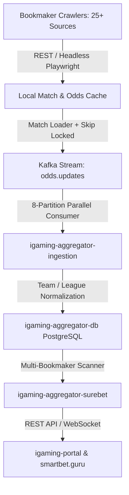

# Design: Bookmaker Line Equalization and Ingestion Pipeline Hardening

## Architecture Overview

## Key Technical Decisions

1. **Zenit Prematch Query Parameters**:
   - The prematch line endpoint `ajax/line/printer/react` requires dynamic timestamping and sport category filtering to avoid heavy single-request payload timeouts.
   - Separate large prematch line fetches into sports batches or use compact query params `ajax/line/printer/react?all=1&onlyview=0&tournaments_mode=0&lang_id=1&timezone=3`.

2. **Pinnacle & Sharp Benchmark**:
   - Pinnacle line parser feeds the true fair probability model in `ValueBetFinderService`.
   - Update guest line request headers to include standard Chrome User-Agent and referer.

3. **Proxy Resiliency & Fallback**:
   - When a proxy exhausts rotation attempts, `VpnManagerService` resets the cooldown interval and attempts direct fallback or secondary proxies rather than terminating JVM with `System.exit(1)`.
