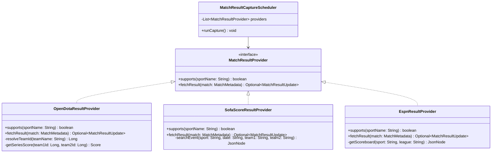

# Technical Design: Independent Multi-Source Match Results & Settlement Engine

## 1. Multi-Source Result Ingestion Providers



---

## 2. API Endpoints & Data Contracts

### 1. OpenDota API Integration
- **Endpoint**: `https://api.opendota.com/api/proMatches` & `https://api.opendota.com/api/teams`
- **Matching Algorithm**:
  - Сопоставляет имена команд (например `Team Spirit`, `BB Team / BetBoom`, `PARIVISION / Team Vision`, `Team Liquid`, `Gaimin Gladiators`, `Team Falcons`).
  - Извлекает счет серии по картам (например `2:1`, `2:0`, `3:0`).
  - Определяет `match_result`:
    - Если `score1 > score2` $\rightarrow$ `WIN1`.
    - Если `score2 > score1` $\rightarrow$ `WIN2`.

### 2. SofaScore Live Results Integration
- **Endpoint**: `https://api.sofascore.com/api/v1/sport/{sport}/scheduled-events/{date}/inverse`
- **Поддерживаемые спорты**: Football, Tennis, Basketball, Ice Hockey, Volleyball, Handball, Esports.
- **Payload**:
  - `homeScore.current` и `awayScore.current`.
  - `status.type == 'finished'`.

### 3. ESPN Developer API (Fallback)
- **Endpoint**: `https://site.api.espn.com/apis/site/v2/sports/{sport}/{league}/scoreboard`
- **Поддерживаемые лиги**: Soccer (EPL, LaLiga, Serie A, UCL), Basketball (NBA), Hockey (NHL), Baseball (MLB).

---

## 3. Aggregator Database Synchronization

1. `igaming-capture-sofascore` (переименованный/расширенный в `igaming-capture-results`) запрашивает:
   `GET http://igaming-aggregator-api:80/api/matches/needing/results`
2. Для каждого матча опрашивает соответствующий `MatchResultProvider`.
3. При обнаружении завершенного матча отправляет результат:
   `POST http://igaming-aggregator-api:80/api/matches/{id}/result`
   ```json
   {
     "score1": "2",
     "score2": "1",
     "matchResult": "WIN1"
   }
   ```
4. `aggregator-domain` исполняет `updateResultExternal`:
   - Записывает `final_score1 = '2'`, `final_score2 = '1'`, `match_result = 'WIN1'`, `result_captured_at = NOW()`.
   - Обновляет все связанные вилки `surebet_alert` в статус `EXPIRED` и `outcome_result = 'WON'`.

---

## 4. Kubernetes Deployment Specification

- **Deployment**: `igaming-capture-results` в namespace `igaming-master`.
- **Resources**: Requests: `50m CPU`, `256Mi RAM`; Limits: `300m CPU`, `512Mi RAM`.
- **Health Checks**: `/actuator/health/liveness` и `/actuator/health/readiness`.
- **Periodic Interval**: каждые 120 секунд (2 минуты).
