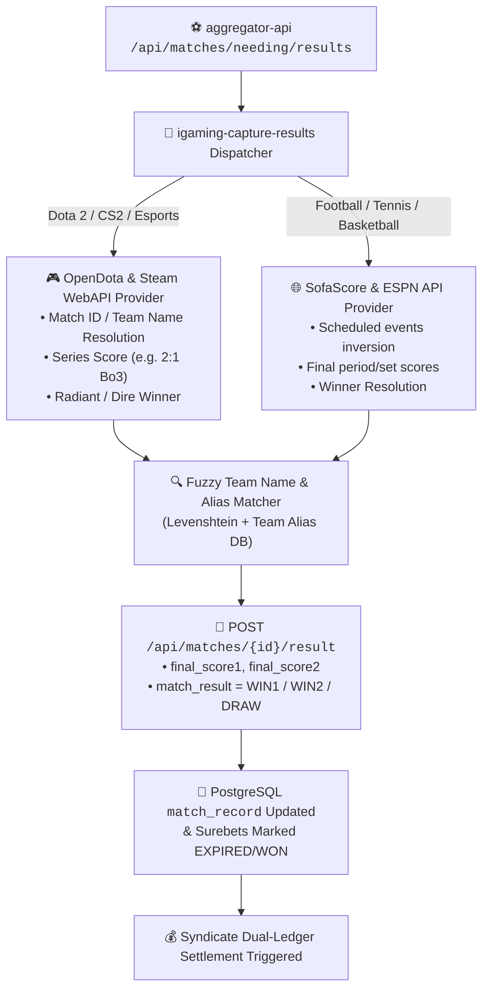

# OpenSpec Proposal: Independent Multi-Source Match Results & Settlement Engine

## 🎯 Summary
Внедрение независимого внешнего контура сбора официальных результатов спортивных и киберспортивных матчей (**Multi-Source Result Ingestion Engine**) на базе **OpenDota API**, **Steam WebAPI**, **SofaScore Live API** и **ESPN Developer API**. Сервис в фоновом режиме опрашивает открытые матчи из `match_record`, извлекает официальные финальные счета и победителей без зависимости от букмекерских контор, обновляет базу данных агрегатора и передает подтвержденные результаты в систему синдикатного расчета (Settlement).

---

## 📌 Problem Statement & Motivation
1. **Проблема зависимости от БК**: Букмекерские конторы спроектированы для приема ставок, а не для предоставления архивных результатов. Большинство БК закрывают или урезают API завершенных событий, задерживают расчет на несколько часов или требуют капчу/авторизацию. В результате поля `final_score1` и `final_score2` в `match_record` остаются пустыми.
2. **Киберспорт (Dota 2 / The International, CS2)**: БК часто не указывают точный счет по картам (Bo3 / Bo5) после закрытия линии. При этом существуют открытые официальные API Valve (OpenDota, Steam WebAPI, Liquipedia), которые содержат 100% точные данные прямо из игрового координатора.
3. **Традиционный спорт (Футбол, Теннис, Баскетбол, Хоккей)**: SofaScore и ESPN предоставляют быстрые, бесплатные и открытые REST endpoints с фиксацией финального свистка через 5–15 секунд после окончания события.

---

## 💡 Proposed Solution

---

## 🔒 Scope & Boundaries
- **In-Scope**:
  - Создание провайдера результатов киберспорта `OpenDotaResultProvider` (Dota 2 The International, Majors, Tier-1/2).
  - Улучшение `SofaScoreCaptureScheduler` и добавление fallback-провайдера `EspnResultProvider`.
  - Интеграция с `aggregator-api` (`/api/matches/needing/results` и `/api/matches/{id}/result`).
  - Деплой микросервиса в Kubernetes namespace `igaming-master`.
  - Автоматическое обновление `match_record` и расчет ставок.
- **Out-of-Scope**:
  - Платные коммерческие фиды (Betradar, Sportradar) — используются только открытые и бесплатные API с высокой скоростью.
