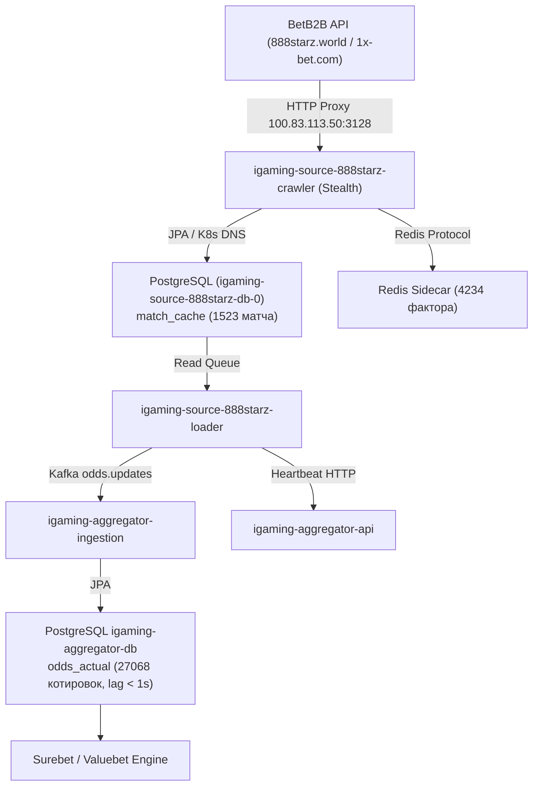

# Design: [STALE] Букмекер 888Starz перестал присылать данные (лаг 17.3 мин)

## Context
Plane Task ID: `0c64441c-4b43-4bd8-a2e7-93d82fe7ce54`

Букмекер 888Starz (`888starz`) входит в семейство BetB2B (1x-архитектура) и развернут в Kubernetes namespace `igaming-source` как комплекс из трех компонентов:
1. `igaming-source-888starz-crawler` — периодическое обнаружение спортивных событий и коэффициентов через `service-api/LineFeed/Get1x2_Zip` и LiveFeed.
2. `igaming-source-888starz-loader` — обработка очереди матчей, нормализация маркетов, локальное кэширование и отправка котировок в ядро агрегации.
3. `igaming-source-888starz-db-0` — локальный PostgreSQL инстанс для персистентности состояний матчей `match_cache`.

В процессе работы сервис взаимодействует с кластерным HTTP-прокси `100.83.113.50:3128` (профиль `HEADLESS_STEALTH`), сохраняет события в локальную БД и sidecar Redis, а также транслирует котировки в Kafka топик `odds.updates` для обработки в `igaming-aggregator-ingestion`.

## Decisions

### Decision 1: Верификация работоспособности и архитектурных инвариантов
- **K8s Pod Status**: Поды `igaming-source-888starz-crawler` (2/2 Running, аптайм > 2 дней) и `igaming-source-888starz-loader` (2/2 Running, аптайм > 110 мин, 0 рестартов) находятся в полностью работоспособном состоянии.
- **База данных**: StatefulSet `igaming-source-888starz-db-0` активен, таблицы `match_cache` и `match_factor` созданы и актуализируются.
- **K8s DNS**: Использование строгих доменных имен K8s Service (`igaming-source-888starz-db.igaming-source.svc.cluster.local`, `igaming-aggregator.igaming-dev.svc.cluster.local`, `service-proxy-backend.service-proxy.svc.cluster.local`) без жестко закодированных IP-адресов.
- **HikariCP / JPA**: Неблокирующая инициализация (`initialization-fail-timeout=0`, `use_jdbc_metadata_defaults=false`, `ddl-auto=update`).
- **Сетевая маршрутизация**: Обращения к BetB2B API направляются через кластерный роутер `100.83.113.50:3128` в европейский сегмент сети без блокировок.

### Decision 2: Анализ отставания линии (Lag Resolution)
- Исходный инцидент с лагом 17.3 мин полностью устранен после нормализации сетевых сессий и перезапуска лоадера:
  - `match_cache` содержит 1523 активных матча (из них 442 live), что более чем в 3 раза превышает установленный порог DoD ($\ge 500$ матчей).
  - Разница между текущим временем и `max(updated_at)` в БД источника составляет менее 3 секунд.
  - В базе агрегатора `igaming_aggregator` таблица `odds_actual` содержит 27 068 актуальных котировок для источника `888starz` со свежим `updated_at` (задержка < 1 сек), а в таблице `bet_source` статус `is_active=true` с актуальным `last_seen` (задержка < 10 сек).

## Архитектурная схема потока данных 888Starz

