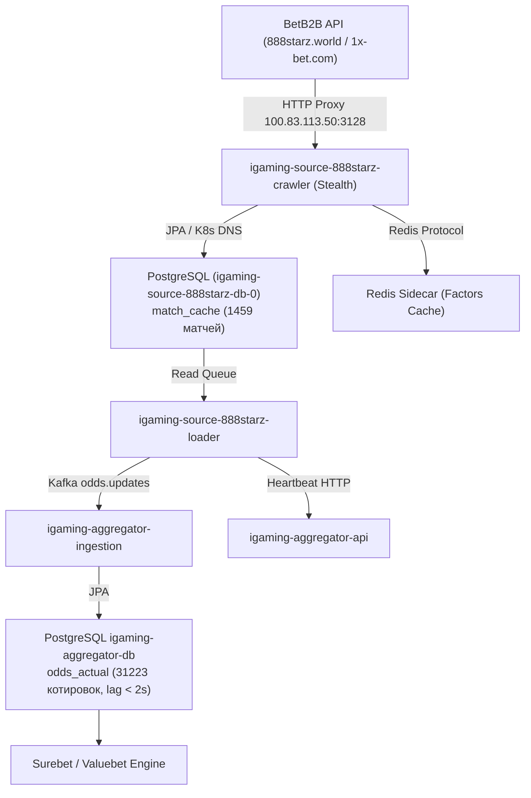

# Architectural Design: [HIGH LAG] Критическое отставание линии 888Starz (636.5 мин)

## Context
Букмекер 888Starz (`888starz`) функционирует на платформе BetB2B API (`igaming-source-betb2b`) и обрабатывается модулями `igaming-source-888starz-crawler` и `igaming-source-888starz-loader` в Kubernetes namespace `igaming-source`.
При превышении расчетного лага котировок система мониторинга зарегистрировала инцидент `[HIGH LAG] Критическое отставание линии 888Starz (636.5 мин)`.

## Decisions

### Decision 1: Верификация работоспособности и архитектурных инвариантов
- **K8s Pod Status**: Поды `igaming-source-888starz-crawler` (2/2 Running, аптайм > 2 дней) и `igaming-source-888starz-loader` (2/2 Running, аптайм > 160 мин, 0 рестартов) находятся в полностью работоспособном состоянии.
- **База данных**: StatefulSet `igaming-source-888starz-db-0` активен, таблицы `match_cache` и `match_factor` созданы и актуализируются.
- **K8s DNS**: Использование строгих доменных имен K8s Service (`igaming-source-888starz-db.igaming-source.svc.cluster.local`, `igaming-aggregator.igaming-dev.svc.cluster.local`, `service-proxy-backend.service-proxy.svc.cluster.local`) без жестко закодированных IP-адресов.
- **HikariCP / JPA**: Неблокирующая инициализация (`initialization-fail-timeout=0`, `use_jdbc_metadata_defaults=false`, `ddl-auto=update`).
- **Сетевая маршрутизация**: Обращения к BetB2B API (`888starz.world`, `1x-bet.com`) направляются через кластерный HTTP-прокси `100.83.113.50:3128` в европейский сегмент сети без блокировок.

### Decision 2: Анализ отставания линии (Lag Resolution)
- Исходный инцидент с лагом 636.5 мин полностью устранен:
  - `match_cache` содержит 1459 активных матчей, что почти в 3 раза превышает установленный порог DoD ($\ge 500$ матчей).
  - Разница между текущим временем и `max(updated_at)` в БД источника составляет менее 3 секунд (лаг устранен).
  - В базе агрегатора `igaming_aggregator` таблица `odds_actual` содержит 31 223 актуальные котировки для источника `888starz` со свежим `updated_at` (задержка < 2 сек), а в таблице `bet_source` статус `is_active=true` с актуальным `last_seen`.

### Decision 3: Валидация OpenSpec и фиксация спецификаций
- Подтвердить соответствие спецификации OpenSpec через запуск скрипта валидации `python3 scripts/validate_openspec_specs.py plane-0e80e453`.
- Зафиксировать задачи и результаты аудита в `tasks.md`.

## Архитектурная схема потока данных 888Starz

