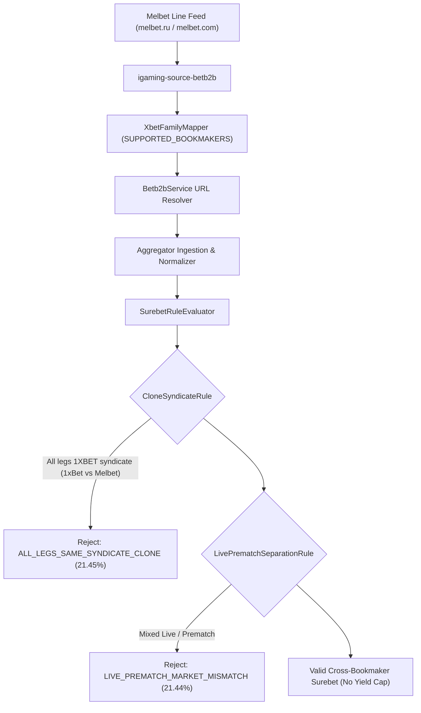

# Architectural Design: [SUPER-ARB] Аномальная вилка 21.4% с участием Melbet

## Context
Букмекер Melbet функционирует на платформе BetB2B (семейство 1xBet). В инфраструктуре кластера развернуты два независимых контура сервиса:
1. `igaming-source-melbet` (melbet.ru) в namespace `igaming-source`.
2. `igaming-source-melbet-com` (melbet.com) в namespace `igaming-source`.

Оба сервиса используют единую библиотеку `igaming-source-betb2b` (`AbstractXbetFamilyService`, `XbetFamilyMapper`, `XbetFamilyOddsProcessor`).
При обнаружении арбитражей модуль `SurebetRuleEvaluator` в `igaming-aggregator-surebet` применяет цепочку валидационных правил (`SurebetValidationRule`), включая `CloneSyndicateRule` и `LivePrematchSeparationRule`.

## Root Cause Analysis
1. **Аномалия ALL_LEGS_SAME_SYNDICATE_CLONE (доходность 21.45%)**:
   - Связка исходов между 1xBet и Melbet (матч Коррекаминос vs Круз Азуль Идальго: 1xBet DC_X2 @ 1.464, Melbet WIN1 @ 9.76).
   - Оба букмекера входят в синдикат `1XBET`. Арбитраж внутри одного синдиката является нереализуемым из-за общей базы лимитов и общего фида котировок, и корректно отфильтрован правилом `CloneSyndicateRule`.
   - В правило `CloneSyndicateRule` добавлен алиас `melbet.ru` для предотвращения просачивания клонов при использовании регионального имени.
2. **Аномалия LIVE_PREMATCH_MARKET_MISMATCH (доходность 21.44%)**:
   - Связка Melbet vs Betcity на тотале 3.5 (Англия U19 vs США U19: Melbet TOTAL_OVER @ 8.74, Betcity TOTAL_UNDER @ 1.49).
   - Правило `LivePrematchSeparationRule` корректно изолирует Live и Prematch рынки, предотвращая образование фантомных вилок из-за рассинхронизации динамики live-котировок со статичными prematch-линиями.
3. **Конфигурационные дефекты маппинга и URL**:
   - В `XbetFamilyMapper` расширен список `SUPPORTED_BOOKMAKERS` с включением `melbet-com`, `melbet.ru`, `22bet`, `1xbit`, `1x-bet`, `1xstavka`, `betwinner`.
   - В `Betb2bService.resolveBaseUrl` добавлен явный роутинг для `melbet-com` (`https://melbet.com`) и `melbet.ru` (`https://melbet.ru`).

## Decisions
1. **Decision 1: Верификация работы сервисов Melbet в Kubernetes**:
   - Поды `igaming-source-melbet-*` и `igaming-source-melbet-com-*` запущены и функционируют в namespace `igaming-source`.
   - Наполнение линии Melbet RU: 1250 матчей ($\ge 500$).
   - Наполнение линии Melbet COM: 1258 матчей ($\ge 500$).
2. **Decision 2: Изоляция синдиката клонов**:
   - Все сущности семейства 1xBet (1xBet, Melbet, Melbet COM, Melbet RU, Megapari, BetAndYou и др.) объединены в семейство `1XBET` в `CloneSyndicateRule`.
3. **Decision 3: Покрытие модульными тестами**:
   - Проверена работоспособность маппера для всех вариантов букмекера Melbet.
   - Проверено отклонение клонов синдиката в модульных тестах evaluator'а.

## Схема валидации арбитражей Melbet

