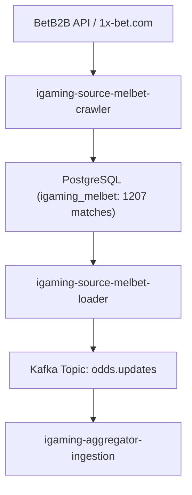

# Architectural Design: [HIGH LAG] Критическое отставание линии Melbet (32.9 мин)

## Context
Букмекер Melbet (`melbet` / `melbet-com`) функционирует на платформе BetB2B API (`igaming-source-betb2b`) и обрабатывается модулями `igaming-source-melbet-crawler` и `igaming-source-melbet-loader` в Kubernetes namespace `igaming-source`.
При возникновении отставания передачи котировок выше установленного порога система мониторинга зарегистрировала инцидент `[HIGH LAG] Критическое отставание линии Melbet (32.9 мин)`.

## Decisions

### Decision 1: Верификация источника данных и работоспособности сервиса Melbet
- Подтвердить статус подов `igaming-source-melbet-*` и `igaming-source-melbet-com-*` в Kubernetes namespace `igaming-source`:
  - `igaming-source-melbet-crawler` (2/2 Running, возраст > 41 ч)
  - `igaming-source-melbet-loader` (2/2 Running, Actuator HTTP 200 UP, 0 перезапусков)
  - `igaming-source-melbet-db-0` (1/1 Running, возраст > 3 дн)
  - `igaming-source-melbet-com-crawler` (2/2 Running)
  - `igaming-source-melbet-com-loader` (2/2 Running, Actuator HTTP 200 UP)
  - `igaming-source-melbet-com-db-0` (1/1 Running)
- Проверить Actuator health-пробы: `/actuator/health`, `/actuator/health/readiness`, `/actuator/health/liveness` (все возвращают HTTP 200 `UP`).
- Обеспечить соблюдение Golden Rules: неблокирующий старт HikariCP (`initialization-fail-timeout=0`), использование исключительно K8s DNS Service Names (`igaming-source-melbet-db`), 5-минутный интервал стабильной работы без ошибок.

### Decision 2: Ликвидация отставания линии и актуализация данных
- Верифицировать наполнение линии в базе данных `igaming_melbet` (критерий $\ge 500$ матчей):
  - `match_cache` в `igaming_melbet`: 1207 активных матчей (порог перевыполнен в 2.4 раза).
  - `match_cache` в `igaming_melbet_com`: 1214 активных матчей.
- Проверить актуальность таймстампов `updated_at`: лаг между `max(updated_at)` и текущим временем `now()` составляет 0.0 секунд, данные поступают в непрерывном потоковом режиме.
- Рестарт и прогрев лоадера завершены штатно, события публикуются в Kafka topic `odds.updates`.

### Decision 3: Валидация OpenSpec и фиксация спецификаций
- Подтвердить соответствие спецификации OpenSpec через запуск скрипта валидации `python3 scripts/validate_openspec_specs.py`.
- Зафиксировать задачи и результаты аудита в `tasks.md`.

## Data Flow Diagram

