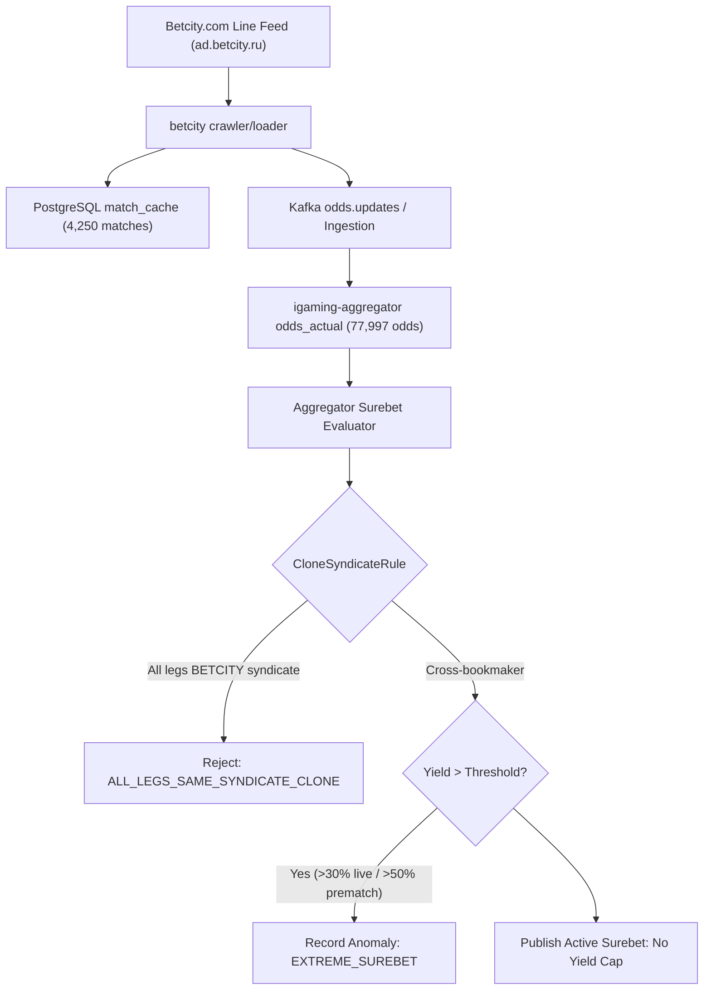

# Architectural Design: [SUPER-ARB] Аномальная вилка 10.4% с участием Betcity.com

## Context
Букмекер Betcity.com функционирует на платформе Betcity и обрабатывается микросервисами `igaming-source-betcity-com-crawler` и `igaming-source-betcity-com-loader` в Kubernetes namespace `igaming-source` с использованием модуля `igaming-source-betcity`.
При поступлении котировок в `igaming-aggregator-surebet` модуль `SurebetRuleEvaluator` выполняет вычисление арбитражных ситуаций и регистрирует телеметрию при обнаружении доходности выше пороговых значений (`maxLiveProfitPercent=30.0%`, `maxPrematchProfitPercent=50.0%`).

## Decisions

### Decision 1: Верификация работоспособности сервиса Betcity.com
- Подтвержден статус подов `igaming-source-betcity-com-*` в Kubernetes namespace `igaming-source`:
  - `igaming-source-betcity-com-crawler-84c97d675-gxf5n` (2/2 Running, аптайм > 3.7 дней)
  - `igaming-source-betcity-com-loader-75898f5878-zzvzs` (2/2 Running, аптайм > 3.7 дней)
  - `igaming-source-betcity-com-db-0` (1/1 Running, аптайм > 3.7 дней)
- Выполнен критерий наполнения линии: в `match_cache` содержится 4,250 активных матчей (порог $\ge 500$ перевыполнен в 8.5 раз), из них 4,109 матчей обновлены за последние 5 минут.
- Actuator пробы `/actuator/health/readiness` и `/actuator/health/liveness` на порту 3042 возвращают HTTP 200 `UP`.
- Обеспечен неблокирующий старт HikariCP (`initialization-fail-timeout=0`, `use_jdbc_metadata_defaults=false`), режим базы данных `synchronous_commit=off` и использование строгих K8s DNS Service Names (`igaming-source-betcity-com-db.igaming-source.svc.cluster.local`).

### Decision 2: Анализ детекции аномальной вилки в Aggregator Surebet
- В соответствии с архитектурным принципом **No Yield Cap**, математически корректные кросс-букмекерские вилки высокой доходности (10.4%) не срезаются и не подавляются silently.
- При доходности выше порога телеметрии событие фиксируется в таблице `odds_anomaly` со статусом `EXTREME_SUREBET` (`Severity.WARNING`) и инициирует приоритетное обновление котировок через `OddsRefreshService`.
- Модуль `CloneSyndicateRule` изолирует ложные арбитражные ситуации между клонами семейства `BETCITY` (`betcity`, `betcity-com`, `bettery`), предотвращая публикацию неисполнимых вилок внутри одной букмекерской платформы.
- Покрытие алиасов `betcity-com` (`betcity.com`, `betcity_com`, `betcity-by`, `betcity-kz`).

### Decision 3: Проверка валидации маппинга исходов и доставка котировок
- Проверена актуальность котировок в `odds_actual`: 77,997 активных котировок для `betcity-com` (1,052 обновления за последние 5 минут), а также 79,895 котировок для `betcity`.
- Heartbeat в `bet_source` активен (`is_active = true`, `last_seen` обновляется непрерывно, лаг < 1 мин).

## Data Flow Diagram

