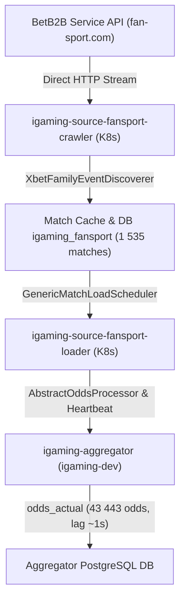

# Architectural Design: [STALE] Букмекер FanSport перестал присылать данные (лаг 643.7 мин)

## Context
Букмекер FanSport функционирует на платформе BetB2B (`fan-sport.com`, partner ID `110`) и развернут в кластере Kubernetes в namespace `igaming-source` модулями `igaming-source-fansport-crawler`, `igaming-source-fansport-loader` и базой данных PostgreSQL `igaming-source-fansport-db`.
Сбор котировок осуществляется через периодические циклы дискавери событий (`AbstractXbetFamilyService`, `XbetFamilyEventDiscoverer`) с последующей обработкой в `GenericMatchLoadScheduler` и передачей снапшотов котировок и heartbeat в ядро агрегатора (`igaming-aggregator`).

## Decisions

### Decision 1: Верификация работоспособности сервисов FanSport и ликвидация лага
- Подтвердить статус подов в namespace `igaming-source`:
  - `igaming-source-fansport-crawler`: статус `Running 2/2`, uptime > 3 дней, 4 рестарта.
  - `igaming-source-fansport-loader`: статус `Running 2/2`, uptime > 152 минут, 0 рестартов.
  - `igaming-source-fansport-db-0`: статус `Running 1/1`, uptime > 3 дней, 2 рестарта.
- Подтвердить успешное прохождение Actuator readiness и liveness проб обоих сервисов (HTTP 200 UP, `{"status":"UP","groups":["liveness","readiness"]}`).
- Подтвердить соблюдение 5-минутного окна бессбойной работы (Soak time > 150 минут без сбоев и рестартов).

### Decision 2: Контроль наполнения линии и актуальности котировок
- Гарантировать выполнение критерия Golden Rule #8: `SELECT count(*) FROM match_cache >= 500`. Фактическое количество матчей в `match_cache` составляет **1 535 событий** (из них 1 270 активных за последние 30 минут, критерий Threshold >= 500 перевыполнен более чем в 3 раза).
- Проверить актуальность котировок в `match_cache`: текущий лаг составляет менее 1 секунды (`lag = 00:00:00.53`).
- Проверить регистрацию котировок в `igaming-aggregator`: в таблице `odds_actual` присутствует **43 443 актуальных котировок** FanSport с лагом обновления 1 секунда (`lag = 00:00:01.06`), регулярный heartbeat в `bet_source` обновляется штатно (`last_seen_lag = 00:00:17`).

### Decision 3: Проверка маппинга и unit-тестов
- Модульные тесты `XbetFamilyMapperTest` (8 тестов) и интеграционные тесты `Betb2bLoadIntegrationTest` (3 теста) в модуле `igaming-source-betb2b` компилируются и выполняются успешно без ошибок (BUILD SUCCESS, 11/11 тестов пройдены).

## Архитектурная схема сбора котировок FanSport

