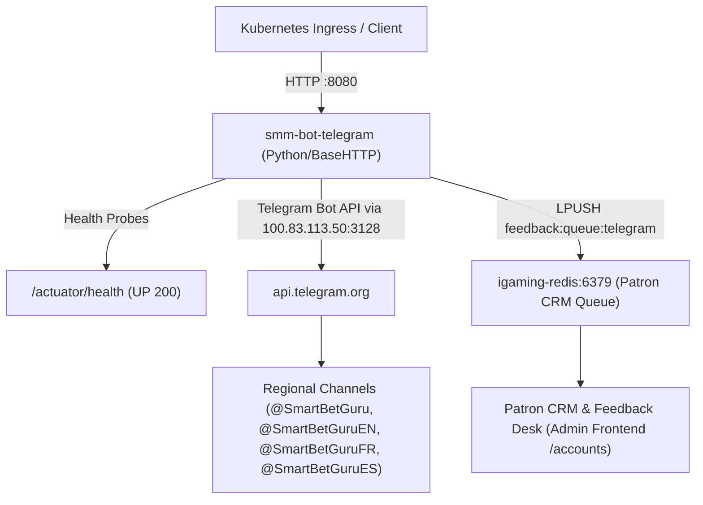

# Design: [SMM OFFLINE] Сервис публикации постов smm-bot-telegram недоступен

## Context
Plane Task ID: `2645b98a`
Feature Branch: `feature/plane-2645b98a`

## Architecture & Invariants

### 1. Сервис smm-bot-telegram в Kubernetes
- **Namespace**: `igaming-dev`
- **Pod**: `smm-bot-telegram` (ReplicaSet `smm-bot-telegram-79cf4995d8`, 1/1 Running, аптайм > 4 ч)
- **Порт HTTP API**: 8080 (ClusterIP сервис `smm-bot-telegram:8080`)
- **DNS зависимости**:
  - `redis://igaming-redis.igaming-dev.svc.cluster.local:6379/0` (строго K8s DNS Service Name)
  - Кластерный прокси: `http://100.83.113.50:3128` для исходящих запросов к Telegram Bot API (`https://api.telegram.org`)
  - `NO_PROXY`: `localhost,127.0.0.1,10.0.0.0/8,igaming-redis,igaming-portal,.svc.cluster.local`

### 2. Поддерживаемые API Endpoints
- `GET /healthz`, `/actuator/health`, `/actuator/health/readiness`, `/actuator/health/liveness`: Actuator health probes (UP, 200 OK)
- `GET /api/v1/telegram/status`: статус флота региональных каналов (ru, en, fr, es)
- `POST /api/v1/telegram/post`: ручная или регламентная публикация арбитражных сигналов с формулой 80% кэша с фрибета
- `POST /api/v1/telegram/webhook`: приём входящих сообщений/комментариев из чатов, генерация AI ответа и постановка задачи в Patron CRM очередь Redis (`feedback:queue:telegram`)

