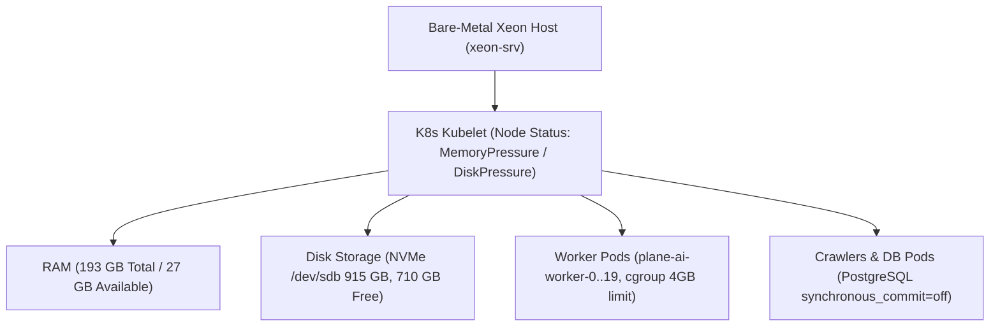

# Technical Design: [NODE PRESSURE] Перегрузка ноды xeon-srv (Memory/Disk pressure)

## Context
Plane Task ID: `2f85ea75-4d8f-4f33-9522-86b7755abca0`
Feature Branch: `feature/plane-2f85ea75`
Target Host: `xeon-srv` (Bare-metal Xeon 192GB RAM, NVMe + SATA Storage)

## Architecture & Resource Invariants

### 1. Архитектура ресурсов узла xeon-srv
- **Процессор / Ядра**: Мульти-ядерный Intel Xeon, обслуживающий 20 воркеров Plane AI, краулеры и агрегатор.
- **Оперативная память (RAM)**:
  - Всего: ~193 GB (193 353 MB)
  - Лимит контейнера воркера (`cgroup memory.max`): 4.0 GB (4 294 967 296 байт)
  - Безопасный порог свободной/доступной памяти: > 25 GB Available RAM
  - Порог срабатывания MemoryPressure в kubelet: `imagefs.available<15%` или `memory.available<100Mi`
- **Дисковая подсистема**:
  - Корневой раздел и кэш `/dev/sdb`: 915 GB (159 GB занято, 710 GB свободно, 19% Use)
  - Системный раздел `/dev/sda1`: 109 GB (32 GB занято, 72 GB свободно, 31% Use)
  - Временные директории: `/tmp` (4.0 GB tmpfs), `/workspace` (4.0 GB tmpfs)
- **Базы данных и дисковый ввод-вывод**:
  - Для защиты от деградации I/O на ноде все базы данных PostgreSQL сконфигурированы с `synchronous_commit = off` (согласно Golden Rule 7 в AGENTS.md).

### 2. Ночной регламент вычислительной тишины (22:00 — 10:00)
- В ночной период кулер физического сервера в Санкт-Петербурге должен сохранять тихий акустический профиль.
- Ограничение параллельных тяжелых компиляций Maven / Webpack и предотвращение спин-лупов CPU.

### 3. Диаграмма архитектуры изоляции ресурсов

