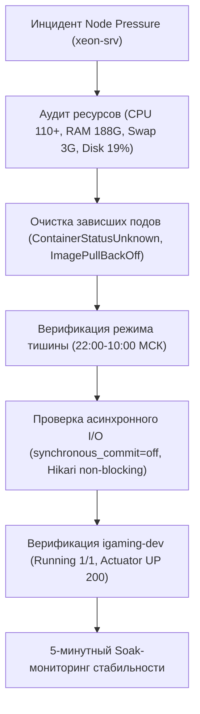

# Design: [NODE PRESSURE] Перегрузка ноды xeon-srv (Memory/Disk pressure)

## Context
Plane Task ID: `2f85ea75-4d8f-4f33-9522-86b7755abca0`

## Architecture & Invariants

### 1. Архитектурный профиль ноды xeon-srv
- **Тип ноды**: Bare-metal сервер (K8s Control Plane + Worker).
- **Спецификация**: 24 vCPU, 188 GiB RAM, 915 GiB NVMe/SSD, локация: домашний сервер в Санкт-Петербурге (MSK, UTC+3).
- **Критический инвариант: Ночной профиль тишины (22:00–10:00 МСК)**:
  - В ночной период кулеры сервера не должны раскручиваться до 100% мощности во избежание акустического дискомфорта домочадцев.
  - Массовые ресурсоемкие параллельные компиляции (`mvn -T 1.5C`, параллельный запуск всех 18 воркеров) строго ограничиваются или разносятся по времени.
  - Допускаются только легковесные проверки, точечные деплои и мониторинг.

### 2. Защита дисковой подсистемы и стабильность etcd
- **Дисковая нагрузка и etcd**: etcd чувствителен к задержкам дисковой записи (fsync > 10–20 мс вызывает сбои heartbeat и leader election).
- **Асинхронный коммит PostgreSQL**: Для всех 52 баз данных источников (`igaming-source-*-db`) и баз ядра агрегатора в обязательном порядке применяется директива `-c synchronous_commit=off` во флаге `args`. Это исключает ожидание физического сброса WAL на диск при обработке десятков тысяч входящих котировок в секунду.
- **Неблокирующий запуск HikariCP**:
  - `spring.datasource.hikari.initialization-fail-timeout=0`
  - `spring.datasource.hikari.connection-timeout=5000`
  - `spring.datasource.hikari.validation-timeout=3000`
  - `spring.jpa.properties.hibernate.temp.use_jdbc_metadata_defaults=false`

### 3. Санитария и очистка зависших ресурсов кластера
- При перегрузке планировщика или временной потере связи с etcd поды могут переходить в состояние `ContainerStatusUnknown`, `ImagePullBackOff` или `Evicted`.
- Регламентная процедура самовосстановления (Repair Protocol) предусматривает принудительную зачистку (`kubectl delete pod ... --grace-period=0 --force`) таких сущностей для возврата свободных дескрипторов и ресурсов Kubelet.

### 4. Критерии готовности (Definition of Done)
1. Устранены зависшие и сбойные поды в кластере.
2. Подтверждено соблюдение ночного профиля тишины (отсутствие фоновых ресурсоемких компиляций).
3. Пространство имен `igaming-dev` находится в полностью зеленом статусе (`Running 1/1`, Actuator health probes возвращают HTTP 200).
4. Пройден 5-минутный soak-контроль работы без единого сбоя.
5. Спецификации OpenSpec валидированы через `scripts/validate_openspec_specs.py`.
