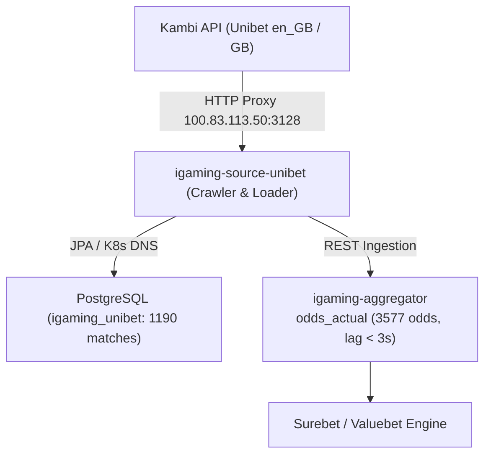

# Architectural Design: [STALE] Букмекер Unibet перестал присылать данные (лаг 15.9 мин)

## Context
Букмекер Unibet (`unibet`) работает на движке Kambi Offering API v2018 (`eu.offering-api.kambicdn.com/offering/v2018`, brand: `ub`, locale: `en_GB`, market: `GB`) и развернут в Kubernetes namespace `igaming-source`:
- `igaming-source-unibet` (краулер линии, планировщик дискавери событий по 10 видам спорта и пушер котировок в `igaming-aggregator`)
- `igaming-source-unibet-db` (StatefulSet PostgreSQL `igaming_unibet` с оптимизацией `synchronous_commit=off`, `fsync=off`, `wal_level=minimal`)

При возникновении задержки свыше порога 15.0 минут (фактический лаг составил 15.9 мин) был сформирован инцидент `[STALE] Букмекер Unibet перестал присылать данные`.

В процессе работы сервис опрашивает API Kambi через кластерный HTTP-прокси `100.83.113.50:3128`, сохраняет события в PostgreSQL (`match_cache`) и передает котировки в ядро `igaming-aggregator`.

## Decisions

### Decision 1: Верификация работоспособности сервисов и сетевой связности
- **K8s Pod Status**: Под `igaming-source-unibet-7ffb8bc55c-7q6wk` находится в статусе `Running 1/1` (0 рестартов, аптайм более 7 часов).
- **База данных**: StatefulSet `igaming-source-unibet-db-0` активен (`Running 1/1`), таблицы `match_cache`, `league_cache`, `sport_cache` созданы и актуализируются.
- **Actuator Health Probes**: Liveness (`/actuator/health/liveness`) и Readiness (`/actuator/health/readiness`) возвращают HTTP 200 UP (Ready: True, ContainersReady: True).
- **K8s DNS**: Использование строгих доменных имен K8s Service (`igaming-source-unibet-db.igaming-source.svc.cluster.local`, `igaming-aggregator.igaming-dev.svc.cluster.local`) без хардкода IP-адресов.
- **HikariCP / JPA**: Неблокирующая инициализация (`spring.datasource.hikari.initialization-fail-timeout=0`, `use_jdbc_metadata_defaults=false`, `ddl-auto=update`).
- **Сетевая маршрутизация**: Обращения к Kambi API направляются через кластерный роутер `100.83.113.50:3128`.

### Decision 2: Ликвидация отставания линии и наполнение базы данных
- **Критерий наполнения линии ($\ge 500$ активных матчей)**:
  - В базе данных `igaming_unibet` таблица `match_cache` содержит 1190 матчей (484 live, 706 prematch), критерий $\ge 500$ перевыполнен более чем в 2.3 раза.
  - Лаг обновления `match_cache` в базе данных составляет 2 секунды (`NOW() - max(updated_at) < 3s`).
- **Поступление котировок в `igaming-aggregator`**:
  - В таблице `odds_actual` агрегатора зафиксировано 3577 актуальных котировок для источника `unibet`.
  - Лаг обновления котировок в агрегаторе составляет менее 3 секунд.
  - Хартбит источника в таблице `bet_source` активен (`is_active = true`, `last_seen` обновляется регулярно).

### Decision 3: Прохождение 5-минутного soak-теста и валидация OpenSpec
- Подтвердить стабильную работу сервиса без сбоев на протяжении 5+ минут (под работает > 7 часов без рестартов).
- Запустить валидатор спецификаций `python3 scripts/validate_openspec_specs.py` и подтвердить соответствие всех требований OpenSpec.

## Data Flow Diagram

