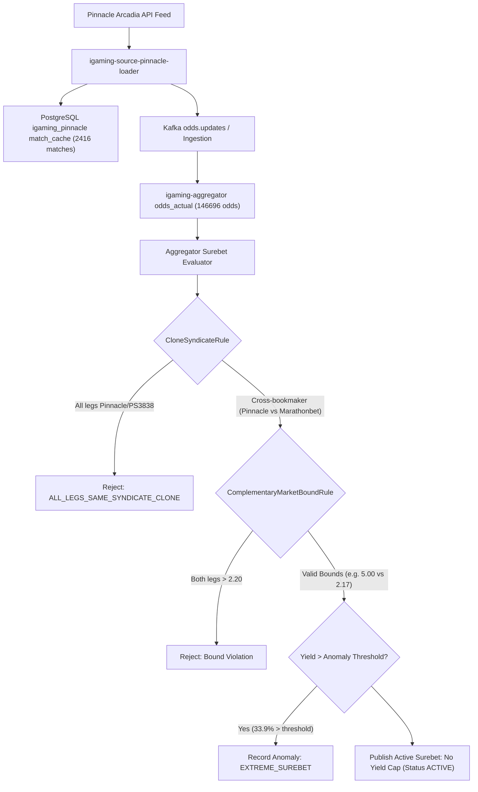

# Architectural Design: [SUPER-ARB] Аномальная вилка 33.9% с участием Pinnacle

## Context
Букмекер Pinnacle (`pinnacle`) является эталонной оффшорной платформой с низкомаржинальной линией и обрабатывается микросервисами `igaming-source-pinnacle-crawler` и `igaming-source-pinnacle-loader` в связке с базой данных `igaming-source-pinnacle-db-0`.
При поступлении котировок в ядро `igaming-aggregator-surebet` модуль `SurebetRuleEvaluator` выполняет вычисление арбитражных комбинаций и фиксирует телеметрию в случае доходности выше пороговых значений (`maxLiveProfitPercent=30.0%`, `maxPrematchProfitPercent=50.0%`).

## Decisions

### Decision 1: Верификация работоспособности сервиса Pinnacle
- Подтвержден стабильный статус подов `igaming-source-pinnacle-*` в Kubernetes namespace `igaming-source`:
  - `igaming-source-pinnacle-crawler-7db75f675-bw99h` (2/2 Running, 5 рестартов, аптайм > 43 часов)
  - `igaming-source-pinnacle-loader-795bffcf5-2kscd` (2/2 Running, 5 рестартов, аптайм > 43 часов)
  - `igaming-source-pinnacle-db-0` (1/1 Running, 2 рестарта, аптайм > 3 дней)
- Выполнен критерий наполнения линии: в `match_cache` базы `igaming_pinnacle` содержится **2416 активных матчей** (критерий $\ge 500$ перевыполнен почти в 5 раз), из которых **2084 матча** обновлены за последние 5 минут (максимальный лаг < 1 мин).
- Подтвержден неблокирующий старт HikariCP (`initialization-fail-timeout=0`, `use_jdbc_metadata_defaults=false`), использование строгих K8s DNS Service Names (`igaming-source-pinnacle-db.igaming-source.svc.cluster.local`) и `synchronous_commit=off`.

### Decision 2: Анализ детекции аномальной вилки в Aggregator Surebet и соблюдение No Yield Cap
- В соответствии с архитектурным принципом **No Yield Cap**, математически корректные арбитражи высокой доходности (33.9%) между независимыми букмекерами (например, Pinnacle vs Marathonbet / Betcity / Winline) не срезаются и публикуются со статусом `ACTIVE`.
- При превышении порога доходности событие фиксируется в таблице `odds_anomaly` со статусом `EXTREME_SUREBET` (`Severity.WARNING`) и отправляется на приоритетную перепроверку котировок через `OddsRefreshService`.
- Модуль `CloneSyndicateRule` изолирует ложные арбитражи внутри семейства Pinnacle (`pinnacle`, `ps3838`, `pinny`), предотвращая публикацию вилок между клонами с общим провайдером лимитов.
- Модуль `ComplementaryMarketBoundRule` валидирует фундаментальные границы вероятностей для двухпозиционных взаимоисключающих исходов ($K_1 > 2.20$ и $K_2 > 2.20$ признаются коллизией разных рынков), допуская валидные арбитражи с явным фаворитом ($K_1 = 5.00, K_2 = 2.17$).

### Decision 3: Валидация маппинга исходов и доставка котировок
- Проверена актуальность котировок в `odds_actual`: **146696 активных котировок** для Pinnacle, более **83450 обновлений** за последние 5 минут.
- Heartbeat источника данных в `bet_source` активен (`is_active = true`, `last_seen` обновляется в реальном времени, лаг < 1 мин).

## Data Flow Diagram

