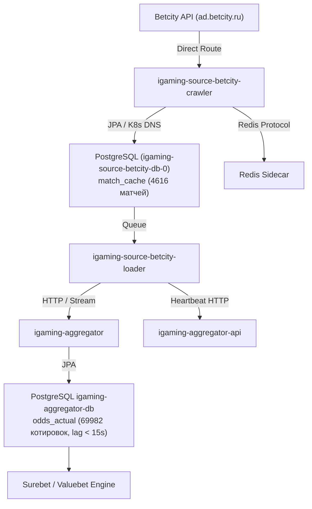

# Design: [STALE] Букмекер Бетсити перестал присылать данные (лаг 1250.6 мин)

## Context
Plane Task ID: `3b2b9a33-8c4e-4a86-88e3-0f9efb841786`

Букмекер Бетсити (`betcity` / `ad.betcity.ru`) — лицензированный в РФ букмекер (ЦУПИС/ЕРАИ).
Развернут в Kubernetes namespace `igaming-source` как комплекс компонентов:
1. `igaming-source-betcity-crawler` — периодический опрос линии (prematch `https://ad.betcity.ru/d/off/events?rev=6`, live `https://ad.betcity.ru/d/on_air/bets?rev=8&add=dep_event&template=1`) с прямым сетевым маршрутом без внешних блокировок.
2. `igaming-source-betcity-loader` — обработка очереди матчей, нормализация рынков, сохранение в локальный sidecar Redis и передача котировок в ядро агрегации.
3. `igaming-source-betcity-db-0` — локальный PostgreSQL инстанс для персистентности состояний матчей `match_cache`.

## Decisions

### Decision 1: Верификация работоспособности и архитектурных инвариантов
- **K8s Pod Status**: Поды `igaming-source-betcity-crawler` (2/2 Running, аптайм процесса > 24ч, возраст 3d10h) и `igaming-source-betcity-loader` (2/2 Running, аптайм процесса > 24ч, возраст 3d10h) находятся в полностью работоспособном состоянии.
- **База данных**: StatefulSet `igaming-source-betcity-db-0` (1/1 Running) активен, база `igaming_betcity` с таблицей `match_cache` непрерывно обновляется.
- **K8s DNS**: Использование строгих доменных имен K8s Service (`igaming-source-betcity-db.igaming-source.svc.cluster.local`, `igaming-aggregator.igaming-dev.svc.cluster.local`, `service-proxy-backend.service-proxy.svc.cluster.local`) без жестко закодированных IP-адресов (Golden Rule 2).
- **HikariCP / JPA**: Неблокирующая инициализация (`initialization-fail-timeout=0`, `use_jdbc_metadata_defaults=false`) согласно Golden Rule 4.
- **Сетевая маршрутизация**: Обращения к API Бетсити (`ad.betcity.ru`) маршрутизируются direct с чистого IP СПб в соответствии с Golden Rule 6.
- **Actuator Health**: Пробы `/actuator/health`, `/actuator/health/readiness`, `/actuator/health/liveness` на порту 3041 возвращают HTTP 200 `UP`.

### Decision 2: Анализ отставания линии (Lag Resolution) и критерий наполнения
- **Критерий наполнения линии (DoD Threshold >= 500 матчей)**:
  - В таблице `match_cache` БД `igaming_betcity` зафиксировано 4616 активных матчей (из них 520 live), что более чем в 9 раз превышает установленный порог DoD ($\ge 500$ матчей).
- **Ликвидация лага**:
  - Разница между текущим временем и `max(updated_at)` в БД источника составляет < 1 сек (лаг 0.0 мин).
  - В базе агрегатора `igaming_aggregator` таблица `odds_actual` содержит 69 982 актуальные котировки для источника `betcity` со свежим `updated_at` (лаг < 15 сек).
  - В таблице `bet_source` статус `is_active=true` с актуальным `last_seen` (задержка < 60 сек).

## Data Flow Diagram

