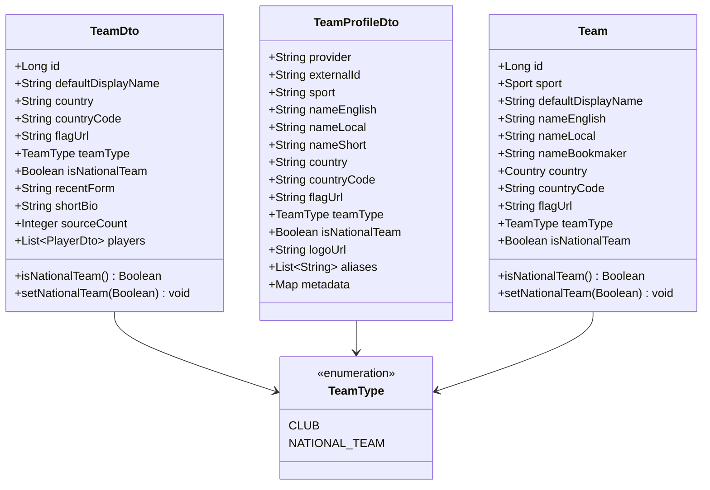

# Technical Design: [team-national-model] Модель данных и API: поддержка национальных сборных

## 1. Архитектура доменной модели и DTO

## 2. Спецификация полей данных

| Поле | Тип | Назначение | Пример |
|---|---|---|---|
| `team_type` | `TeamType` (`VARCHAR(50)`) | Классификатор сущности (клуб vs сборная) | `NATIONAL_TEAM`, `CLUB` |
| `is_national_team` | `Boolean` (`BOOLEAN`) | Флаг национальной сборной для быстрых булевых фильтров | `true`, `false` |
| `country_code` | `String` (`VARCHAR(10)`) | Двухбуквенный ISO 3166-1 alpha-2 код страны | `RU`, `FR`, `BR`, `DE` |
| `flag_url` | `String` (`VARCHAR(512)`) | URL векторного или растрового флага страны | `https://flagcdn.com/w40/fr.png` |

## 3. Спецификация REST API (`aggregator-api`)

### 3.1. `GET /api/teams`
Фильтрация и постраничный вывод команд:
- Query-параметры:
  - `search` (опционально): строка поиска по названию;
  - `team_type` / `teamType` (опционально): `CLUB` или `NATIONAL_TEAM`;
  - `is_national_team` / `isNationalTeam` (опционально): `true` или `false`;
  - `country_code` / `countryCode` (опционально): двухбуквенный код страны (регистронезависимо);
  - `page` (по умолчанию `0`): номер страницы;
  - `size` (по умолчанию `50`): размер страницы.

### 3.2. `GET /api/teams/national`
Выделенный оптимизированный эндпоинт для работы с национальными сборными:
- Query-параметры:
  - `search` (опционально): фильтрация по имени сборной;
  - `country_code` (опционально): фильтрация по ISO коду страны;
  - `sport` (опционально): фильтрация по виду спорта (например `FOOTBALL`, `BASKETBALL`);
  - `page`, `size`: пагинация.

### 3.3. `GET /api/teams/national/stats`
Сводные показатели по сборным в БД:
- Общее количество национальных сборных;
- Распределение по видам спорта;
- Количество уникальных представленных стран.
