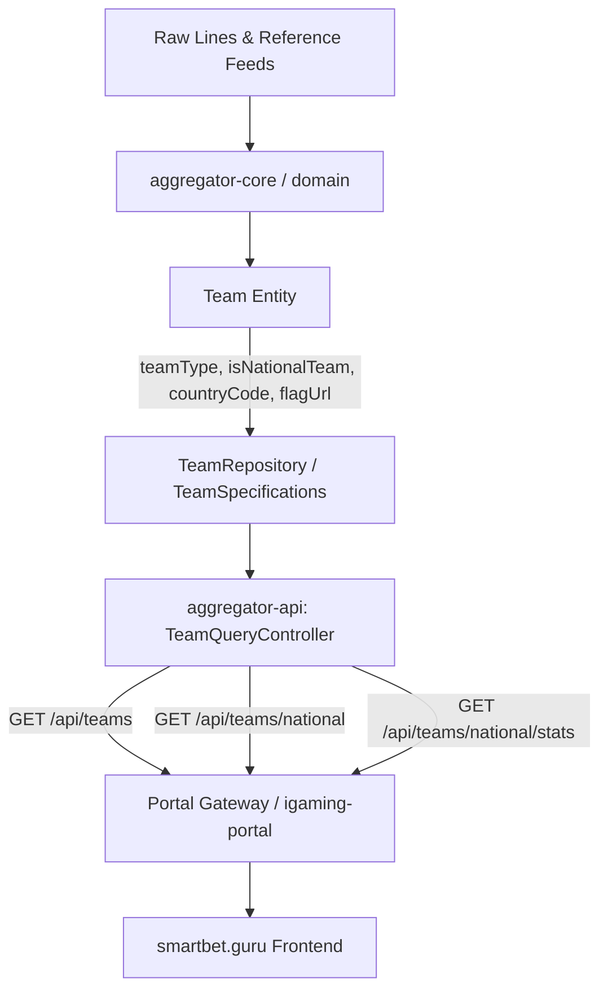

# Design: [team-national-model] Модель данных и API: поддержка национальных сборных (team_type, is_national_team, country_code, flag_url)

## Architecture Overview

## Data Model Specifications

### 1. `TeamType` Enum
- `CLUB`: Стандартные клубные команды (ФК, ХК, БК).
- `NATIONAL_TEAM`: Национальные сборные стран.
- `INDIVIDUAL`: Одиночные спортсмены (теннис, бокс, ММА).
- `PAIR`: Парные составы спортсменов.
- `UNKNOWN`: Неклассифицированные участники.

### 2. DTO Enhancements (`igaming-dto`)
- `team_type`: `TeamType` (default: `CLUB`).
- `is_national_team`: `Boolean` (default: `false`).
- `country_code`: `String` (ISO 3166-1 alpha-2, e.g. "BR", "FR").
- `flag_url`: `String` (URL к SVG/PNG флагу).
- `NationalTeamStatsDto`:
  - `totalCount`: Общее число национальных сборных.
  - `bySport`: Статистика распределения по видам спорта (`Map<String, Long>`).
  - `distinctCountriesCount`: Число уникальных представленных стран.

### 3. JPA Domain Model (`aggregator-domain`)
- Сущность `Team`:
  - Поля `@Column` с поддержкой Jackson snake_case и camelCase (`@JsonProperty`, `@JsonAlias`).
  - Хелперы `isNationalTeam()` и `setNationalTeam(Boolean)`.
- `TeamSpecifications.withFilters`:
  - Полнотекстовый поиск по `defaultDisplayName`, `nameEnglish`, `nameLocal`.
  - Фильтрация по `teamType` и булевому флагу `isNationalTeam`.
  - Фильтрация по коду страны `countryCode` (регистронезависимо).
  - Фильтрация по спорту `sport` (с исключением значения "ALL").
- `TeamRepository`:
  - `countTotalNationalTeams()`
  - `countNationalTeamsBySport()`
  - `countDistinctCountriesForNationalTeams()`

### 4. REST API (`aggregator-api`)
- `GET /api/teams`:
  - Параметры: `search`, `team_type` / `teamType`, `is_national_team` / `isNationalTeam`, `country_code` / `countryCode`, `sport`, `page`, `size`.
- `GET /api/teams/national`:
  - Предустановленный фильтр `TeamType.NATIONAL_TEAM` + `isNationalTeam = true`.
- `GET /api/teams/national/stats`:
  - Агрегированные метрики для дашбордов и аналитики.
