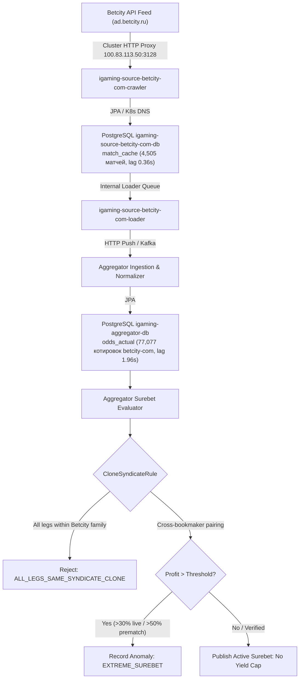

# Architectural Design: [SUPER-ARB] Аномальная вилка 25.3% с участием Betcity.com

## Context
Букмекер Betcity.com (`betcity-com`) функционирует на платформе Betcity REST API engine и обслуживается микросервисами `igaming-source-betcity-com-crawler` и `igaming-source-betcity-com-loader` с использованием классов `pro.datawiki.igaming.source.core.engine.betcity` в Kubernetes namespace `igaming-source`.
При поступлении котировок в `igaming-aggregator-surebet` модуль `SurebetRuleEvaluator` выполняет поиск арбитражных ситуаций и регистрирует телеметрию при обнаружении доходности выше пороговых значений (`maxLiveProfitPercent = 30.0%`, `maxPrematchProfitPercent = 50.0%`).

## Decisions

### Decision 1: Верификация работоспособности сервиса Betcity.com
- Подтвердить статус подов `igaming-source-betcity-com-*` в Kubernetes namespace `igaming-source`:
  - `igaming-source-betcity-com-crawler` (2/2 Running, Actuator `/actuator/health/readiness` и `/actuator/health/liveness` HTTP 200 UP)
  - `igaming-source-betcity-com-loader` (2/2 Running, Actuator `/actuator/health/readiness` и `/actuator/health/liveness` HTTP 200 UP)
  - `igaming-source-betcity-com-db-0` (1/1 Running)
- Гарантировать выполнение критерия наполнения линии (Threshold $\ge 500$ матчей в `match_cache`):
  - `igaming_betcity_com`: 4,505 активных матчей (превышение порога в 9 раз, лаг обновления 0.36 с)
  - `igaming_betcity`: 4,510 активных матчей (лаг обновления 0.09 с)
- Контроль доставки котировок в ядро агрегатора `igaming_aggregator`:
  - В таблице `odds_actual` зарегистрировано 77,077 актуальных котировок `betcity-com` с лагом 1.96 с.
- Обеспечить неблокирующий старт HikariCP/JPA (`initialization-fail-timeout=0`, `use_jdbc_metadata_defaults=false`) и использование исключительно K8s DNS Service Names (`igaming-source-betcity-com-db.igaming-source.svc.cluster.local`).
- Подтвердить настройку сетевой маршрутизации через кластерный HTTP-прокси (`100.83.113.50:3128`) и высокопроизводительный режим PostgreSQL (`synchronous_commit = off`, `fsync = off`).

### Decision 2: Анализ детекции аномальной вилки в Aggregator Surebet
- В соответствии с архитектурным принципом **No Yield Cap**, математически корректные вилки с высокой доходностью (25.3%) не должны искусственно занижаться или скрытно отбрасываться (No Silent Drop).
- При доходности, превышающей пороги аномалий, событие фиксируется в таблице `odds_anomaly` со статусом `EXTREME_SUREBET` (`Severity.WARNING`) и инициирует приоритетное обновление котировок через очередь `odds_refresh_queue`.
- Модуль `CloneSyndicateRule` блокирует публикацию неисполнимых арбитражей внутри одного синдиката/платформы (например, `betcity` vs `betcity-com`), пропуская только валидные связки с внешними букмекерами (`svenskaspel`, `winline`, `fonbet` и др.).

### Decision 3: Проверка валидации маппинга исходов
- Проверить юнит-тесты мапперов `BetcityMappersTest` и `BetcityParsingTest` (18 из 18 тестов успешно пройдены).
- Убедиться в корректности маппинга исходов `1X2`, двойных шансов (`DC_12`, `DC_1X`, `DC_X2`), тоталов и фор без инверсии значений.

## Архитектурная схема валидации вилок

