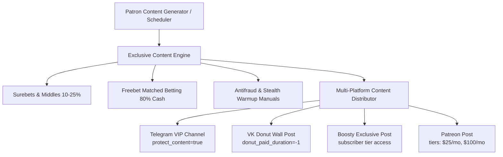

# Design: [patron-content] Пайплайн публикации эксклюзивного контента для платных подписчиков (Boosty, Patreon, VK Donut, TG VIP)

## 1. Overview & Flow

## 2. Content Types & Data Specifications

### 2.1 Surebets & Corridors (Жирные связки 10%-25%)
- Формат: детальный разбор матча, спорт, турнир, две конторы (БК 1 и БК 2), точные маркеты и кэфы.
- Расчет точки безубыточности и коридора (middles).
- Инструкция по лимитам: максимальная сумма ставки в БК, правила отмены/ошибок в линии.
- Обязательный дисклеймер об ответственности.

### 2.2 Freebet & Bonus Matched Betting (80% Guaranteed Cash)
- Реализация математического правила #10 AGENTS.md:
  $$\eta = \frac{(K_1 - 1)(K_2 - 1)}{K_2} \approx 0.80$$
- Пример: *«Фрибет 3 000 ₽ → 2 400 ₽ гарантированного кэша при любом исходе через вилку»*.
- Пошаговые плечи перекрытия и тайминг отыгрыша.

### 2.3 Antifraud & Proxy Manuals
- Инструкции по настройке Gecko/Camoufox, прогреву профилей (кэш, куки, история), ротации мобильных прокси и работе с дропами.

## 3. Platform Adapters

### 3.1 `igaming-vip-bot` (Telegram VIP)
- Эндпоинт `POST /api/v1/vip/publish-post`
- Параметры: `title`, `text`, `protect_content` (default: true).
- Метод `TelegramApiClient.sendMessage(chatId, text, protectContent)`:
  - Добавление параметра `"protect_content": true` в тело запроса Bot API `/sendMessage`.
  - При установке флага Telegram запрещает пересылку сообщений из чата и предотвращает снятие скриншотов на мобильных клиентах.

### 3.2 `igaming-vk-donut-bot` (VK Donut)
- Эндпоинт `POST /admin/donut/posts`
- Метод `VkApiClient.postWall(message, donutPaidDuration)`:
  - Вызов `wall.post` с `owner_id = -communityId`, `from_group = 1`, `donut_paid_duration = -1`.
  - Пост публикуется исключительно для активных донов сообщества.

### 3.3 `igaming-boosty-bot` (Boosty)
- Эндпоинт `POST /admin/boosty/posts`
- Метод `BoostyApiClient.publishPost(title, content, teaser, minTierRub)`:
  - Вызов unofficial/internal Boosty API `/v1/blog/{blogName}/post` с параметрами доступа.
  - Fail-soft симуляция для dev/test окружения при отсутствии боевых токенов.

### 3.4 `smm-agent` (Patreon & Multi-platform Distributor)
- `patreon_agent.py`: существующий `POST /api/v1/patreon/posts` и `publish_premium_post(title, content, min_tier_cents)`.
- `patron_content_distributor.py`:
  - Python-модуль мультиплатформенной дистрибуции.
  - Поддержка шаблонов: `surebet_corridor`, `freebet_80_cash`, `antifraud_guide`.
  - Оркестрация отправки на локальные сервисы K8s / HTTP endpoints.
  - CLI режим: `python patron_content_distributor.py --template freebet --dry-run`.

## 4. Verification & Testing
1. Модульные тесты для каждого сервиса (`VipAdminControllerTest`, `DonutAdminControllerTest`, `BoostyAdminControllerTest`, `test_patron_content_distributor.py`).
2. Проверка форматирования сообщений, наличия дисклеймеров и правильности флагов защиты (`protect_content: true`, `donut_paid_duration: -1`).
