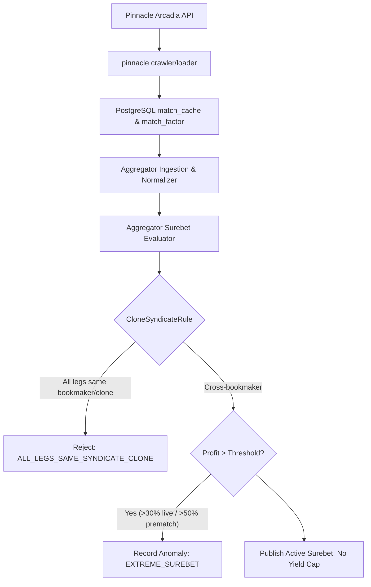

# Architectural Design: [SUPER-ARB] Аномальная вилка 10.7% с участием Pinnacle

## Context
Букмекер Pinnacle (`pinnacle`) функционирует на платформе Arcadia Guest REST API (`guest.api.arcadia.pinnacle.com`) и обрабатывается модулями `igaming-source-pinnacle-crawler` и `igaming-source-pinnacle-loader` с маппингом через `PinnacleOddsMapper`.
При поступлении котировок в `igaming-aggregator-surebet` модуль `SurebetRuleEvaluator` производит поиск арбитражных ситуаций и регистрирует телеметрию при обнаружении доходности выше пороговых значений (`maxLiveProfitPercent=30.0%`, `maxPrematchProfitPercent=50.0%`). Для умеренно высоких вилок (10.7%) вилка публикуется без ограничений в соответствии с политикой No Yield Cap.

## Decisions

### Decision 1: Верификация работоспособности сервиса Pinnacle
- Подтвердить статус подов `igaming-source-pinnacle-*` в Kubernetes namespace `igaming-source`:
  - `igaming-source-pinnacle-crawler` (2/2 Running, Actuator HTTP 200 UP на порту 3040)
  - `igaming-source-pinnacle-loader` (2/2 Running, Actuator HTTP 200 UP на порту 3040)
  - `igaming-source-pinnacle-db-0` (1/1 Running)
- Гарантировать выполнение критерия наполнения линии (Threshold $\ge 500$ матчей в `match_cache`):
  - `igaming_pinnacle`: 1981 активный матч (норма превышена почти в 4 раза)
- Обеспечить неблокирующий старт HikariCP и использование K8s DNS Service Names (`igaming-source-pinnacle-db.igaming-source.svc.cluster.local`).

### Decision 2: Анализ детекции аномальной вилки в Aggregator Surebet
- В соответствии с архитектурным принципом **No Yield Cap**, математически корректные вилки с высокой доходностью (10.7%) не должны искусственно занижаться или отбрасываться без фиксации.
- При доходности, превышающей порог телеметрии, событие фиксируется в таблице `odds_anomaly` со статусом `EXTREME_SUREBET` (`Severity.WARNING`) и инициирует приоритетный запрос обновления котировок (`OddsRefreshService`).
- Правило `CloneSyndicateRule` корректно изолирует арбитражи между клонами одного букмекера/синдиката (включая клоны/зеркала Pinnacle: `ps3838`, `pinny`).

### Decision 3: Проверка валидации маппинга исходов
- Проверить модульные и интеграционные тесты мапперов `PinnacleOddsMapperTest` (4/4 passed).
- Убедиться в отсутствии инверсий коэффициентов и монотонности тоталов и фор.

## Архитектурная схема валидации вилок

