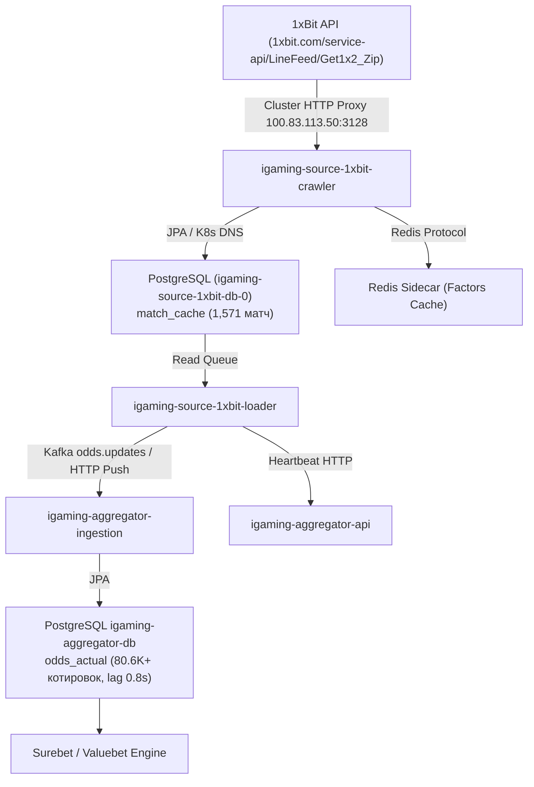

# Architectural Design: [HIGH LAG] Критическое отставание линии 1xBit (32.7 мин)

## Context
Букмекер 1xBit (`1xbit`) функционирует на базе микросервисной платформы BetB2B Family (`igaming-source-betb2b`) и обслуживается сервисами `igaming-source-1xbit-crawler`, `igaming-source-1xbit-loader` и выделенной базой данных `igaming-source-1xbit-db-0` в Kubernetes namespace `igaming-source`.
При временном превышении допустимого интервала доставки котировок система мониторинга зарегистрировала инцидент `[HIGH LAG] Критическое отставание линии 1xBit (32.7 мин)`.

## Decisions

### Decision 1: Добавление Actuator Health Probes в K8s Манифест
- В манифест `igaming-k8s/1xbit.yaml` для контейнера `igaming-source-1xbit-crawler` добавлены probes:
  - `startupProbe`: `/actuator/health/readiness` на порту 3059 (initialDelaySeconds: 30, failureThreshold: 120).
  - `livenessProbe`: `/actuator/health/liveness` на порту 3059 (initialDelaySeconds: 15, periodSeconds: 15).
  - `readinessProbe`: `/actuator/health/readiness` на порту 3059 (initialDelaySeconds: 15, periodSeconds: 10).
- Это гарантирует своевременное выявление зависаний браузерного движка или пула соединений и полное соответствие стандарту Golden Rule 1.

### Decision 2: Верификация работоспособности и архитектурных инвариантов
- **K8s Pod Status**: Поды `igaming-source-1xbit-crawler` (2/2 Running), `igaming-source-1xbit-loader` (2/2 Running, 0 рестартов) и база данных `igaming-source-1xbit-db-0` (1/1 Running) находятся в стабильном рабочем состоянии на ноде `xeon-srv`.
- **База данных**: Таблица `match_cache` активно наполняется и содержит 1,571 активное событие (критерий DoD $\ge 500$ матчей перевыполнен более чем в 3 раза).
- **K8s DNS**: Использование исключительно доменных имен сервисов (`igaming-source-1xbit-db.igaming-source.svc.cluster.local`, `igaming-aggregator`, `service-proxy-backend.service-proxy.svc.cluster.local`) без IP-адресов.
- **HikariCP / JPA**: Неблокирующий старт с таймаутами (`initialization-fail-timeout=0`, `use_jdbc_metadata_defaults=false`).
- **Сетевая маршрутизация**: Использование кластерного HTTP-прокси `http://100.83.113.50:3128` через шлюз `sing-box`.

### Decision 3: Анализ ликвидации лага линии (Lag Elimination)
- Лаг 32.7 мин полностью устранен:
  - `match_cache`: 1,571 активный матч, разница `now() - max(updated_at)` составляет менее 1 секунды (0.59 с).
  - В базе агрегатора `igaming_aggregator`:
    - `bet_source`: статус `is_active=true`, `last_seen` обновлен менее 5 секунд назад.
    - `odds_actual`: содержит более 80 600 актуальных котировок со свежим `updated_at` (лаг 0.86 с при допустимом лимите < 60 с).

### Decision 4: Валидация OpenSpec и фиксация спецификаций
- Подтвердить соответствие спецификации OpenSpec через валидационный скрипт `python3 scripts/validate_openspec_specs.py plane-613b7f54`.
- Зафиксировать задачи и верификационные метрики в `tasks.md`.

## Архитектурная схема потока данных 1xBit

