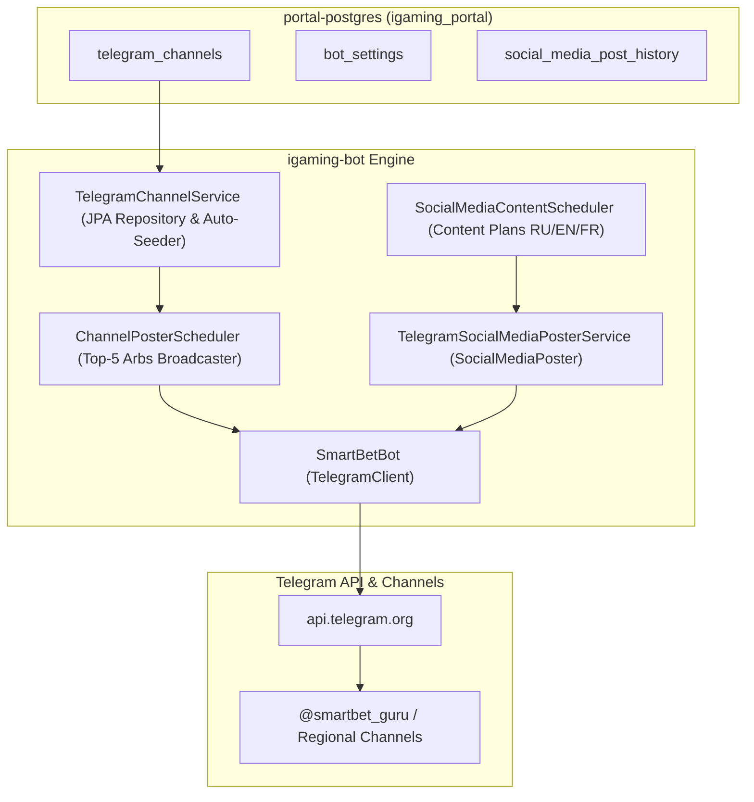

# Design: [smm-tg] Ревитализация и автоматизация Telegram-канала SmartBet.guru

## Architecture Overview



## Key Components

### 1. `TelegramChannel` Entity & `TelegramChannelRepository`
- Tables mapped: `telegram_channels`
- Fields:
  - `id`: BIGSERIAL / IDENTITY
  - `name`: VARCHAR(255)
  - `chatId`: VARCHAR(255) (e.g. `@smartbet_guru` or channel ID)
  - `region`: VARCHAR(64) (`RU`, `EU`, `ALL`, etc.)
  - `enabled`: BOOLEAN
  - `lowProfitThreshold`: DOUBLE (default 5.0)
  - `lowProfitIntervalMinutes`: INT (default 15)
  - `highProfitIntervalMinutes`: INT (default 60)
  - `minFreshnessMinutes`: INT (default 30)

### 2. `TelegramChannelService`
- Injected into `ChannelPosterScheduler`.
- Replaces broken `PortalClient.getActiveChannels()` HTTP dependency.
- On startup, if no channels exist in DB, auto-seeds default channel:
  - Name: `SmartBet.guru Official`
  - Chat ID: `@smartbet_guru`
  - Region: `RU`
  - Enabled: `true`
  - Thresholds: 5.0% low-profit threshold, 15 min low-interval, 60 min high-interval, 30 min freshness.

### 3. `TelegramSocialMediaPosterService`
- Implements `SocialMediaPoster`.
- Listens to scheduled posts generated by `SocialMediaContentScheduler`.
- Formats text for Telegram HTML parse mode.
- Sends message to configured channel for the target language (e.g. RU channel `@smartbet_guru`).
- Appends mandatory responsible gambling disclaimer:
  `⚠️ Ставки на спорт сопряжены с финансовыми рисками. Мы против лудомании и необдуманного беттинга. Играйте ответственно.`

### 4. Configuration & Golden Rules Compliance
- HikariCP non-blocking settings in `application.properties`:
  ```properties
  spring.datasource.hikari.initialization-fail-timeout=0
  spring.datasource.hikari.connection-timeout=5000
  spring.datasource.hikari.validation-timeout=3000
  spring.jpa.properties.hibernate.temp.use_jdbc_metadata_defaults=false
  ```
- No hardcoded IP addresses (only service names: `portal-postgres`, `igaming-aggregator`).
