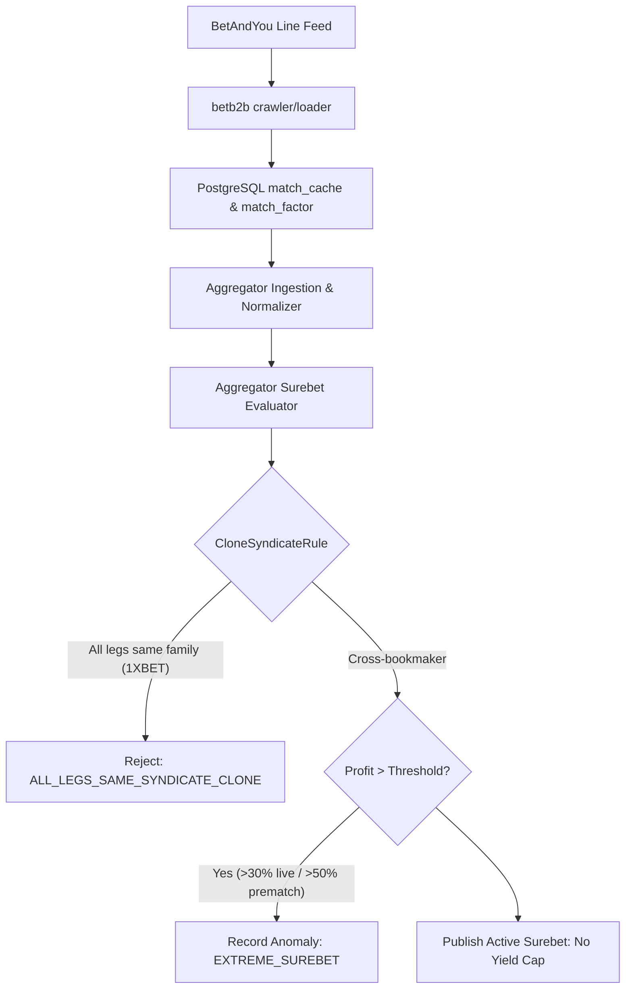

# Architectural Design: [SUPER-ARB] Аномальная вилка 36.7% с участием BetAndYou

## Context
Букмекер BetAndYou функционирует на платформе BetB2B (семейство 1xBet) и обрабатывается модулями `igaming-source-betandyou-crawler` и `igaming-source-betandyou-loader` с использованием базовых классов `igaming-source-core` (`XbetFamilyMapper`, `XbetFamilyEventDiscoverer`).
При поступлении котировок в `igaming-aggregator-surebet` модуль `SurebetRuleEvaluator` производит поиск арбитражных ситуаций и регистрирует телеметрию при обнаружении доходности выше пороговых значений (`maxLiveProfitPercent=30.0%`, `maxPrematchProfitPercent=50.0%`).

## Decisions

### Decision 1: Верификация работоспособности сервиса BetAndYou
- Подтвердить статус подов `igaming-source-betandyou-*` в Kubernetes namespace `igaming-source`.
- Гарантировать выполнение критерия наполнения линии (Threshold $\ge 500$ матчей в `match_cache`).
- Обеспечить неблокирующий старт HikariCP и использование K8s DNS Service Names.

### Decision 2: Анализ детекции аномальной вилки в Aggregator Surebet
- В соответствии с архитектурным принципом **No Yield Cap**, математически корректные вилки с высокой доходностью (36.7%) не должны искусственно занижаться или отбрасываться без фиксации.
- При доходности, превышающей порог телеметрии, событие фиксируется в таблице `odds_anomaly` со статусом `EXTREME_SUREBET` (`Severity.WARNING`) и инициирует приоритетный запрос обновления котировок (`OddsRefreshService`).
- Правило `CloneSyndicateRule` корректно изолирует арбитражи внутри одного синдиката (`1XBET` family: BetAndYou, 1xBet, Melbet, Megapari, SpinBetter, FanSport и др.), если все плечи принадлежат одной платформе.

### Decision 3: Проверка валидации маппинга исходов
- Проверить наличие конфликтов и несмапленных исходов в `unmapped_bet` и `mapping_conflict`.
- Убедиться в отсутствии инверсий коэффициентов и монотонности тоталов и фор.

## Архитектурная схема валидации вилок

