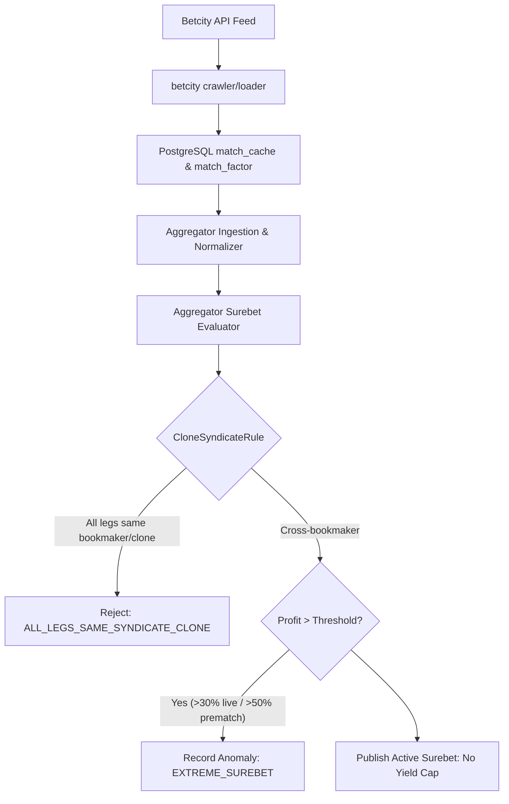

# Architectural Design: [SUPER-ARB] Аномальная вилка 17.6% с участием Бетсити

## Context
Букмекер Бетсити (`betcity` / `betcity-com`) функционирует на платформе Betcity REST API engine и обрабатывается модулями `igaming-source-betcity-crawler` и `igaming-source-betcity-loader` с использованием классов `pro.datawiki.igaming.source.core.engine.betcity`.
При поступлении котировок в `igaming-aggregator-surebet` модуль `SurebetRuleEvaluator` производит поиск арбитражных ситуаций и регистрирует телеметрию при обнаружении доходности выше пороговых значений (`maxLiveProfitPercent=30.0%`, `maxPrematchProfitPercent=50.0%`).

## Decisions

### Decision 1: Верификация работоспособности сервиса Бетсити
- Подтвердить статус подов `igaming-source-betcity-*` в Kubernetes namespace `igaming-source`:
  - `igaming-source-betcity-crawler` (2/2 Running, Actuator HTTP 200 UP)
  - `igaming-source-betcity-loader` (2/2 Running, Actuator HTTP 200 UP)
  - `igaming-source-betcity-db-0` (1/1 Running)
  - `igaming-source-betcity-com-*` (Running, Actuator UP)
- Гарантировать выполнение критерия наполнения линии (Threshold $\ge 500$ матчей в `match_cache`):
  - `igaming_betcity`: 4304 активных матча (норма превышена в 8.6 раз)
  - `igaming_betcity_com`: 4303 активных матча
- Обеспечить неблокирующий старт HikariCP (`initialization-fail-timeout=0`) и использование K8s DNS Service Names (`igaming-source-betcity-db`).

### Decision 2: Анализ детекции аномальной вилки в Aggregator Surebet
- В соответствии с архитектурным принципом **No Yield Cap**, математически корректные вилки с высокой доходностью (17.6%) не должны искусственно занижаться или отбрасываться без фиксации.
- При доходности, превышающей порог телеметрии, событие фиксируется в таблице `odds_anomaly` со статусом `EXTREME_SUREBET` (`Severity.WARNING`) и инициирует приоритетный запрос обновления котировок (`OddsRefreshService`).
- Правило `CloneSyndicateRule` корректно изолирует арбитражи между клонами одного букмекера/синдиката (включая клоны Betcity и BetB2B).

### Decision 3: Проверка валидации маппинга исходов
- Проверить модульные и интеграционные тесты мапперов исходов Бетсити.
- Убедиться в отсутствии инверсий коэффициентов и соблюдении монотонности тоталов и фор (`ComplementaryMarketBoundRule`, `DoubleChanceDominanceRule`).

## Архитектурная схема валидации вилок

