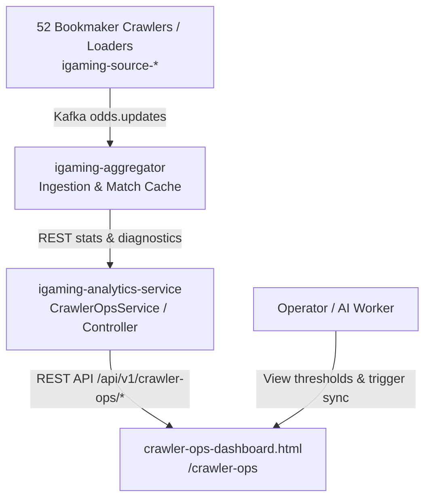

# Design: [UI-CRAWLER-OPS] Ingestion Pipeline Dashboard & Thresholds Monitor

## Architecture & Data Flow

## Component Architecture

### 1. DTO Layer (`pro.datawiki.igaming.analytics.dto.crawler`)
- `CrawlerPipelineDto`: Represents a single bookmaker ingestion pipeline:
  - `bookmakerCode`: e.g. `winline`, `fonbet`, `pinnacle`, `bet365`
  - `bookmakerName`: e.g. "Winline", "Fonbet (RU)", "Pinnacle"
  - `region`: `RU_CUPIS`, `EU_OFFSHORE`, `US`
  - `protocol`: `REST`, `WS`, `HEADED_STEALTH`, `HEADLESS_STEALTH`
  - `activeMatches`: Number of active matches in `match_cache`
  - `minThreshold`: Target minimum matches (default 500)
  - `thresholdStatus`: `PASS` (>= 500), `WARN` (300-499), `FAIL` (< 300)
  - `eventsPerSecond`: Ingestion rate
  - `avgLatencyMs`: Parser / extraction latency
  - `lastIngestTimestamp`: ISO-8601 string of last received quote
  - `status`: `RUNNING`, `DEGRADED`, `STALLED`, `OFFLINE`
- `PipelineStatsDto`: Aggregated overview for header cards:
  - `totalPipelines`: 52
  - `activePipelines`: number of running crawlers
  - `thresholdMetCount`: number of crawlers with >= 500 matches
  - `thresholdWarnCount`: number of crawlers with 300..499 matches
  - `thresholdFailCount`: number of crawlers with < 300 matches
  - `totalActiveMatches`: total cached matches across all bookmakers
  - `overallIngestionRate`: total events/sec
- `ThresholdRuleDto`: Dynamic threshold settings per bookmaker.
- `PipelineAlertDto`: Threshold violation alerts (`SEVERITY_CRITICAL`, `SEVERITY_WARNING`).

### 2. Service Layer (`CrawlerOpsService`)
- Preloaded with the platform registry of all 52 supported bookmakers across RU (Direct), EU (Outline VPN NL), and US (Outline US).
- Queries `aggregator.stats.url` and `aggregator.analytics.url` via `RestTemplate`.
- Computes threshold compliance against Rule 8 (>= 500 matches).
- Provides graceful fallback to cached metrics when upstream aggregator is in-flight or deploying.
- Handles on-demand sync dispatching.

### 3. Controller Layer
- `CrawlerOpsController`:
  - `GET /api/v1/crawler-ops/pipelines`
  - `GET /api/v1/crawler-ops/pipelines/stats`
  - `GET /api/v1/crawler-ops/thresholds`
  - `POST /api/v1/crawler-ops/thresholds`
  - `POST /api/v1/crawler-ops/pipelines/{bookmaker}/sync`
  - `GET /api/v1/crawler-ops/alerts`
- `CrawlerOpsUiController`:
  - `GET /crawler-ops`, `GET /ingestion-pipeline` -> redirects to `/crawler-ops-dashboard.html`

### 4. UI Layer (`crawler-ops-dashboard.html`)
- Dark theme matching `entity-resolution-hub.html` (`#0d1117`, `#161b22`, `#30363d`).
- Auto-refresh polling every 5s / 10s / 30s.
- Progress bar per bookmaker indicating progress toward the 500 matches threshold.
- Instant search by bookmaker name, filter by region and threshold status.
- Trigger Sync modal and threshold editor modal.
