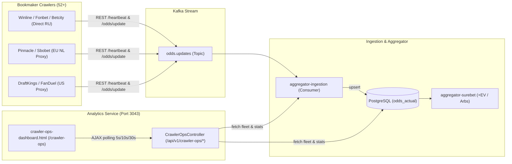

# Design: [UI-CRAWLER-OPS] Ingestion Pipeline Dashboard & Thresholds Monitor

## Architectural Overview

The Ingestion Pipeline Dashboard & Thresholds Monitor provides an operational command center for the 52+ bookmaker scrapers, the Kafka odds streaming pipeline, and PostgreSQL odds storage.

## Backend API Specification (`CrawlerOpsController`)

Base path: `/api/v1/crawler-ops`

1. **`GET /api/v1/crawler-ops/pipeline/stats`**:
   - Aggregates system-wide ingestion stats:
     - Total matches in DB (`matches`)
     - Total teams in DB (`teams`)
     - Pending entity resolution requests (`pendingNormalization`)
     - Unmapped odds count (`unrecognizedOdds`)
     - Total active odds in database
     - Golden Rule #8 summary:
       - `totalBookmakers`
       - `onlineBookmakers`
       - `compliantBookmakers` (matches >= 500)
       - `degradedBookmakers` (matches 1-499 or delay > 5m)
       - `criticalDefectBookmakers` (matches == 0)
       - `complianceRate` (percentage)
     - Pipeline health status: `HEALTHY`, `DEGRADED`, or `DOWN`.

2. **`GET /api/v1/crawler-ops/thresholds`**:
   - Returns a comprehensive evaluation list of all 52+ bookmakers:
     - `id`: Bookmaker identifier (e.g. `betcity`, `winline`, `fon-bet-ru`)
     - `name`: Display name
     - `logoEmoji`: Icon
     - `engine`: Scraper engine (BASIC, HEADLESS_STEALTH, XVFB_HEADED)
     - `proxyRoute`: DIRECT (СПб), OUTLINE_US, OUTLINE_VPN_EU_NL
     - `isOnline`: Heartbeat alive within last 5 minutes
     - `matchesCount`: Current count of active matches
     - `targetThreshold`: Constant 500 (Golden Rule #8)
     - `thresholdProgress`: Percentage (min 0%, capped at 100% or unbounded)
     - `complianceStatus`: `COMPLIANT` (>=500), `DEGRADED` (<500), `DEFECT` (0 matches)
     - `oddsCount`: Number of active odds in DB
     - `delayMinutes`: Delay since last update
     - `freshnessStatus`: `FRESH` (<1m), `NORMAL` (1-5m), `DELAYED` (5-15m), `STALE` (>15m)
     - `sportBreakdown`: Map of sport to match count
     - `topLeagues`: Top 5 leagues by match count

3. **`GET /api/v1/crawler-ops/fleet`**:
   - Directly proxies `/api/bookmakers/fleet` from `igaming-aggregator`.

4. **`POST /api/v1/crawler-ops/fleet/refresh`**:
   - Issues force-refresh to `/api/bookmakers/fleet/refresh` and returns the newly computed snapshot.

5. **`POST /api/v1/crawler-ops/crawlers/{id}/probe`**:
   - Issues an immediate diagnostic probe against the specified crawler or aggregator heartbeat to confirm liveness.

## Frontend UI Architecture (`crawler-ops-dashboard.html`)

1. **Header Navigation Bar**:
   - Logo, Title, Active Environment indicator (`igaming-dev`), Current Time, Live connection indicator.
   - Tabs:
     - "Entity Resolution Hub" (`/mdm`)
     - "Ingestion Pipeline & Thresholds" (`/crawler-ops` — active)
   - "Refresh Now" button and Auto-Refresh dropdown: [Off, 5s, 10s, 30s].

2. **Executive KPI Cards**:
   - **Fleet Coverage**: Active / Total bookmakers with health percentage.
   - **Thresholds Compliance (Golden Rule #8)**: Number of scrapers meeting >= 500 matches with fill bar.
   - **Pipeline Odds Ingestion**: Live odds count and throughput.
   - **Alerts Watchdog**: Count of degraded or defect bookmakers requiring attention.

3. **Interactive Ingestion Pipeline Diagram**:
   - Visual nodes connecting Crawlers -> Kafka -> Ingestion -> PostgreSQL -> Arbitrage Scanner.
   - Live metrics displayed directly on each node.

4. **Thresholds Monitor (Filterable Grid & Table)**:
   - Search bar (instant filter by name or ID).
   - Filter chips: All, Compliant (>=500), Degraded (<500), Defect (0), Delayed (>5m).
   - Proxy chips: All, Direct RU, Outline US, Outline EU/NL.
   - Data columns:
     - Bookmaker (logo, name, engine)
     - Proxy Route badge
     - Matches vs 500 Target (numerical count + graphical bar + compliance tag)
     - Active Odds count
     - Ingestion Delay (badge color: Green <1m, Yellow 1-5m, Red >5m)
     - Liveness / Status badge
     - Actions: Details (opens modal with sport distribution & leagues), Probe
