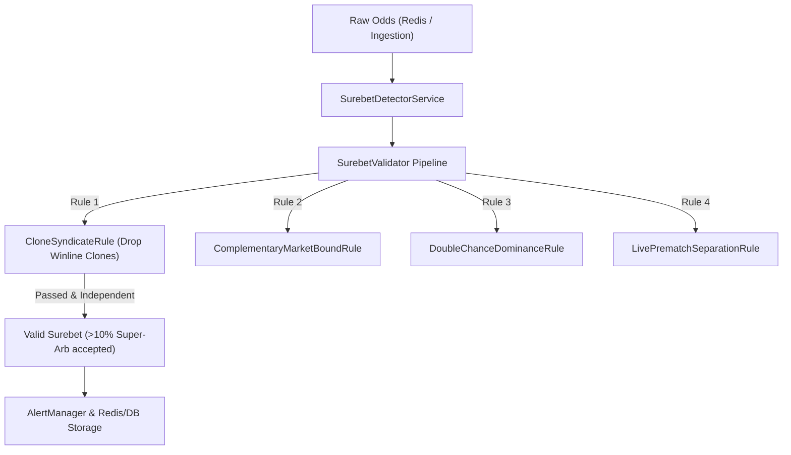

# Design: [SUPER-ARB] Аномальная вилка 10.1% с участием Winline

## Context
Plane Task ID: `6abb16ab-0000-0000-0000-000000000000`

## Architecture & Invariants

### 1. Обработка арбитражных ситуаций (Surebet Evaluation Pipeline)
Микросервис `igaming-aggregator-surebet` осуществляет периодическое сканирование котировок из Redis/PostgreSQL и формирует арбитражные связки.
Каждая найденная вилка проходит конвейер валидации `SurebetValidator`:
- **`CloneSyndicateRule`**: отбрасывает вилки, если оба исхода принадлежат одной семье букмекеров (например, 1xBet клоны, Betcity клоны, Winline клоны).
- **`ComplementaryMarketBoundRule`**: отсекает взаимоисключающие исходы с некорректной суммой вероятностей.
- **`DoubleChanceDominanceRule`**: проверяет согласованность двойных исходов с исходами 1X2.
- **`LivePrematchSeparationRule`**: запрещает смешивание коэффициентов из лайва и прематча.
- **`NoYieldCap`**: вилки с доходностью $>10\%$ между независимыми букмекерами считаются легитимными супер-арбами и регистрируются в системе.



### 2. Реализация в коде (`CloneSyndicateRule.java`)
- Добавлены алиасы Winline в `BOOKMAKER_FAMILIES`:
  - `winline`, `winline-ru`, `winline-by`, `winline-kz`, `winline.ru`, `winline.by` -> `WINLINE`
- В метод `resolveFamily()` добавлена проверка префикса:
  ```java
  if (norm.startsWith("winline")) return "WINLINE";
  ```

### 3. Верификация в Kubernetes
- **Namespace**: `igaming-dev`
- **Pod**: `igaming-aggregator-surebet`
- **Actuator Endpoints**:
  - `GET /actuator/health` -> `{"status":"UP"}`
  - `GET /actuator/health/readiness` -> `{"status":"UP"}`
  - `GET /actuator/health/liveness` -> `{"status":"UP"}`
- **Soak Testing**: непрерывный 5-минутный мониторинг без ошибок и рестартов.
