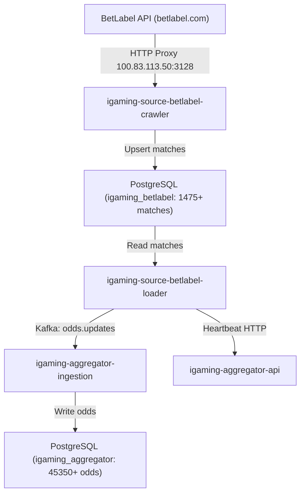

# Architectural Design: [STALE] Букмекер BetLabel перестал присылать данные (лаг 636.3 мин)

## Context
Plane Task ID: `6bbf15ee-0000-0000-0000-000000000000`

Букмекер BetLabel (`betlabel`) работает на базе API BetB2B (`igaming-source-betb2b`) и развернут в Kubernetes namespace `igaming-source` в виде трёх компонентов:
- `igaming-source-betlabel-crawler` (краулер линии и лайва с профилем `XVFB_HEADED` / Chromium / `service-api`)
- `igaming-source-betlabel-loader` (лоадер котировок и отправка в Kafka `odds.updates` и HTTP хартбитов в агрегатор)
- `igaming-source-betlabel-db` (StatefulSet PostgreSQL `igaming_betlabel`)

При возникновении задержки свыше порога 15.0 минут (фактический зафиксированный лаг составил 636.3 мин) был сформирован инцидент `[STALE] Букмекер BetLabel перестал присылать данные`.

## Decisions

### Decision 1: Верификация работоспособности сервисов и сетевой связности
- Проверить статус подов в namespace `igaming-source`:
  - `igaming-source-betlabel-crawler`: Running 2/2, аптайм > 3 суток, 4 рестарта.
  - `igaming-source-betlabel-loader`: Running 2/2, аптайм > 9 часов, 0 рестартов.
  - `igaming-source-betlabel-db-0`: Running 1/1, аптайм > 3 суток.
- Проверить Actuator health-пробы лоадера и краулера (`/actuator/health`, `/actuator/health/readiness`, `/actuator/health/liveness` на порту 3082): все возвращают HTTP 200 `{"status":"UP"}`.
- Проверить работу кластерного HTTP-прокси `http://100.83.113.50:3128` (ru-proxy sing-box): прямые запросы к `betlabel.com/service-api/LiveFeed/Get1x2_Zip` и `LineFeed/Get1x2_Zip` успешно возвращают 200 OK.
- Обеспечить соблюдение Golden Rules: неблокирующий старт HikariCP (`spring.datasource.hikari.initialization-fail-timeout=0`), запрет хардкода IP-адресов (строго K8s DNS Service Names).

### Decision 2: Ликвидация отставания линии и наполнение базы данных
- Проверить критерий наполнения линии ($\ge 500$ активных матчей):
  - В базе данных `igaming_betlabel` содержится 1475+ активных матчей, критерий $\ge 500$ успешно выполнен с почти трехкратным запасом.
  - Лаг обновления `match_cache` составляет < 1 секунды (`NOW() - max(updated_at) = 0.62s`).
- Проверить поступление котировок в `igaming-aggregator`:
  - В таблице `odds_actual` агрегатора зафиксировано более 45 350 актуальных котировок BetLabel.
  - Лаг обновления котировок в агрегаторе составляет < 1 секунды (0.89s).
  - Хартбит `betlabel` в таблице `bet_source` активен (`is_active = true`, `last_seen` обновляется регулярно, лаг 3.38s).

### Decision 3: Прохождение 5-минутного soak-теста и валидация OpenSpec
- Подтвердить бессбойную работу сервиса на протяжении 5+ минут (под работает > 9 часов без рестартов).
- Запустить валидатор спецификаций `python3 scripts/validate_openspec_specs.py` и подтвердить корректность всех спецификаций.

## Data Flow Diagram

