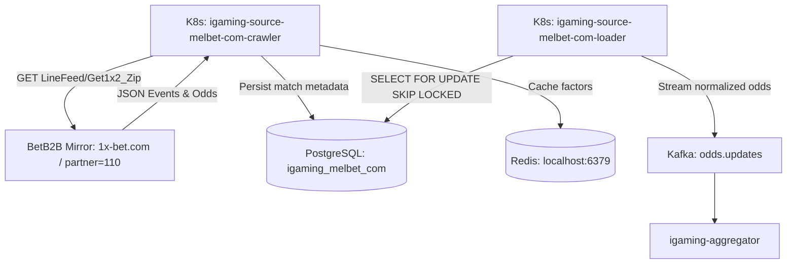

# Architectural Design: [melbet-com] Обновить зеркало BetB2B и запустить сбор линии

## Context
В рамках расширения охвата линий 52 букмекеров модуль `melbet-com` отвечает за сбор прематч и лайв котировок международной букмекерской конторы Melbet с использованием платформы BetB2B.
Архитектура модуля основана на `igaming-source-betb2b` с двумя ролями:
- `league-crawler`: опрашивает API BetB2B (`LineFeed/Get1x2_Zip`, `LiveFeed/Get1x2_Zip`), нормализует спортивные события и сохраняет их в `match_cache` PostgreSQL (`igaming_melbet_com`), а также кэширует коэффициенты в локальный Redis.
- `match-loader`: вычитывает матчи из базы данных через `SELECT FOR UPDATE SKIP LOCKED` и отправляет детальные котировки в Kafka `odds.updates` для агрегатора.

---

## Decisions

### Decision 1: Использование рабочего зеркала BetB2B `1x-bet.com` и актуализация Target Host
- **Решение**: Установить `APP_TARGET_HOST=1x-bet.com` в K8s деплойментах краулера и лоадера `melbet-com`.
- **Обоснование**: Прямой домен `melbet.com` подвергнут сетевой блокировке в РФ, в то время как BetB2B API зеркало `1x-bet.com` полностью доступно с ноды и успешно отдает структурированные котировки с партнерским идентификатором Melbet (`partner=110`). Указание `1x-bet.com` в качестве целевого хоста позволяет `VpnManagerService` валидировать прямое соединение и избежать ложной деградации.

### Decision 2: Принудительное включение прямого режима (Direct Route)
- **Решение**: Явно объявить переменные окружения `APP_VPN_ENABLED="false"` и `APP_PROXY_DIRECT="true"` в `igaming-k8s/melbet-com.yaml`.
- **Обоснование**: Устраняет обращение к несуществующему хосту `proxy-vpn-pool.service-proxy.svc.cluster.local`, из-за которого происходили сбои RestTemplate с `UnknownHostException`. Данный подход стандартизирован в манифестах большинства работающих краулеров репозитория (`melbet.ru`, `winline`, `fon-bet-ru`, `baltbet`, `tennisi`, `pari`).

### Decision 3: Добавление Actuator Health Probes в Crawler Deployment
- **Решение**: Добавить `livenessProbe` и `readinessProbe` в контейнер `igaming-source-melbet-com-crawler` на порт `3058`:
  ```yaml
  livenessProbe:
    httpGet:
      path: /actuator/health/liveness
      port: 3058
    initialDelaySeconds: 45
    periodSeconds: 15
    failureThreshold: 3
  readinessProbe:
    httpGet:
      path: /actuator/health/readiness
      port: 3058
    initialDelaySeconds: 20
    periodSeconds: 10
    failureThreshold: 2
  ```
- **Обоснование**: Обеспечивает выполнение Definition of Done и требований `verification-and-dod` / `IGAMING-SRC-BETB2B`, своевременно переводя под в статус готовности только при UP статусе Spring Boot Actuator.

---

## Архитектурная схема взаимодействия


