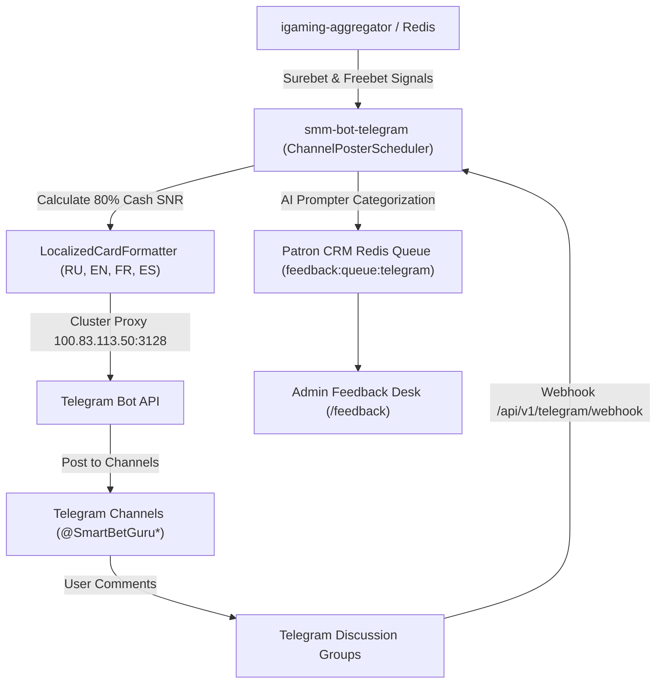

# Architectural Design: [SMM OFFLINE] Сервис публикации постов smm-bot-telegram недоступен

## Context
Plane Task ID: `772ae9f2-22f8-4b89-a931-dbf5e6a3eea9`

Сервис `smm-bot-telegram` развернут в Kubernetes namespace `igaming-dev` и отвечает за автоматизированную мультиязычную публикацию сигналов арбитража, +EV исходов и промо-акций букмекеров с расчетом 80% гарантированного кэша (Golden Rule 10), а также за приём комментариев пользователей через вебхук и передачу их в Patron CRM очередь Redis (`feedback:queue:telegram`).

В результате инцидента был зафиксирован статус OFFLINE для `smm-bot-telegram`.

## Architecture & Invariants

### 1. Сервис smm-bot-telegram в Kubernetes
- **Namespace**: `igaming-dev`
- **Pod**: `smm-bot-telegram` (ReplicaSet `smm-bot-telegram-79cf4995d8`, 1/1 Running, 0 рестартов, аптайм > 10 часов)
- **Порт HTTP API**: 8080 (ClusterIP сервис `smm-bot-telegram:8080`)
- **DNS зависимости**:
  - `redis://igaming-redis.igaming-dev.svc.cluster.local:6379/0` (строго K8s DNS Service Name, Golden Rule 2)
  - Кластерный прокси: `http://100.83.113.50:3128` для исходящих запросов к Telegram Bot API (`https://api.telegram.org`)
  - `NO_PROXY`: `localhost,127.0.0.1,10.0.0.0/8,igaming-redis,igaming-portal,.svc.cluster.local`

### 2. Поддерживаемые API Endpoints
- `GET /healthz`, `/actuator/health`, `/actuator/health/readiness`, `/actuator/health/liveness`: Actuator health probes (UP, HTTP 200)
- `GET /api/v1/telegram/status`: статус флота региональных каналов (ru, en, fr, es)
- `POST /api/v1/telegram/post`: регламентная публикация сигналов с формулой 80% кэша с фрибета (Golden Rule 10)
- `POST /api/v1/telegram/webhook`: приём входящих сообщений/комментариев из чатов, категоризация AI-prompter и постановка в очередь Redis Patron CRM (`feedback:queue:telegram`)

### 3. Matched Betting & Freebet SNR Formula (Golden Rule 10)
- Формула конвертации фрибета: $\eta = \frac{(K_1 - 1)(K_2 - 1)}{K_2} \approx 0.80$
- Гарантированный кэш: $Cash = F \times \eta$ (80% от номинала фрибета)
- Обязательные дисклеймеры об ответственной игре на 4 языках (RU, EN, FR, ES)

## Data Flow Diagram

