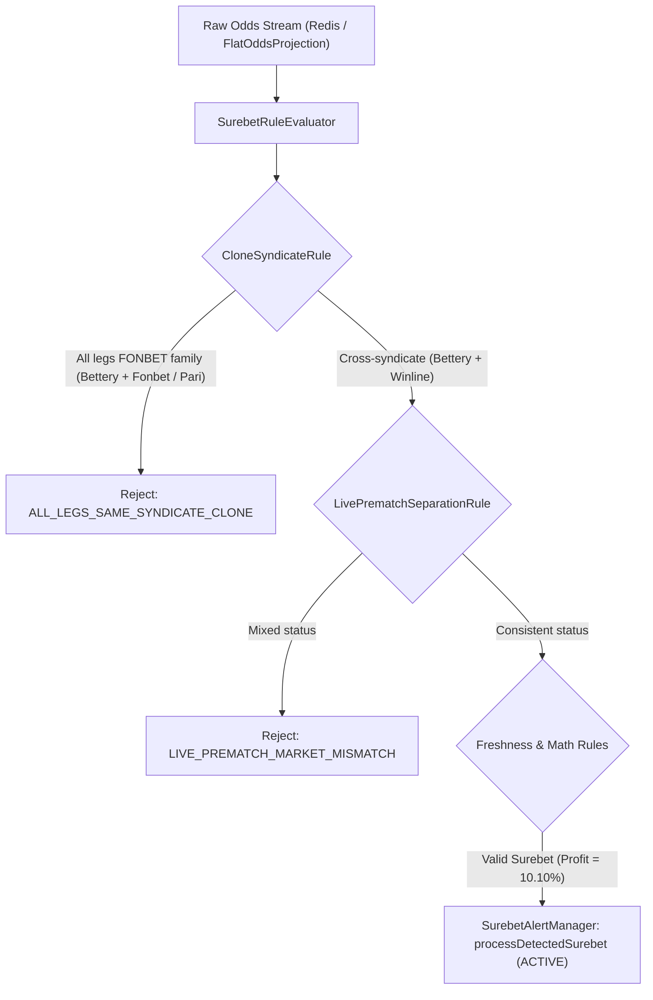

# Technical Design: [SUPER-ARB] Аномальная вилка 10.1% с участием Bettery

## Context
Модуль `igaming-aggregator-surebet` отвечает за непрерывный расчет арбитражных ситуаций (surebets/вилок), коридоров (middles) и валуйных ставок (+EV) в памяти на основе нормализованного потока котировок из Redis.

При обнаружении потенциальной вилки `SurebetRuleEvaluator` выполняет цепочку проверок через реализации интерфейса `SurebetValidationRule`:
1. `CloneSyndicateRule` — отсечение вилок между клонами одного синдиката (букмекерами на общем фиде и едином риск-менеджменте).
2. `LivePrematchSeparationRule` — запрет смешивания Live и Prematch исходов.
3. `DoubleChanceDominanceRule` / `ComplementaryMarketBoundRule` — проверка математической консистентности рынков.
4. `FreshnessRule` — фильтрация устаревших котировок (30 мин для Prematch, 2 мин для Live).

## Analysis & Decisions

### 1. Синдикат FONBET и алиасы Bettery
Букмекер **Bettery** (юридическое лицо ООО «Атлантик-М», входящее в холдинг Fonbet) оперирует на общей букмекерской платформе с **Fonbet** и **Pari**.
Котировки между этими букмекерами синхронизированы. Появление вилки между ними свидетельствует исключительно о временном техническом лаге обновления одной из линий и не несет реальной арбитражной ценности для игроков (лимиты и аккаунты кросс-контролируются синдикатом).

**Решение**:
- В `CloneSyndicateRule.BOOKMAKER_FAMILIES` зарегистрированы все варианты идентификаторов Bettery:
  - `bettery`, `bettery-ru`, `bettery.ru`, `bettery_ru`
  - `bettery-com`, `bettery.com`, `bettery_com`
  - кириллические формы: `беттери`, `беттери-ру`, `беттери.ру`
- В методе `normalizeBookmaker(String bookmaker)` добавлено правило:
  `if (norm.startsWith("bettery") || norm.startsWith("беттери")) return "FONBET";`

### 2. Сохранение легитимных высокодоходных арбитражей (No Yield Cap)
В отличие от клоновых ситуаций, вилки между Bettery и независимыми операторами (такими как Winline, Betcity, 1xBet, Pinnacle) представляют собой реальный рыночный арбитраж. В системе сняты искусственные ограничения максимальной доходности (No Yield Cap), и вилки с доходностью $10.1\%$ и выше обязаны фиксироваться как `ACTIVE` и передаваться подписчикам.

### 3. Верификация данных и наполнения линии
- В БД агрегатора `igaming_aggregator` букмекер `bettery` активен (`is_active = true`), с более чем 220 000 актуальных котировок в `odds_actual` и 5019 уникальными матчами, что с десятикратным запасом удовлетворяет критерию наполнения линии ($\ge 500$ матчей).

## Схема валидации арбитражей Bettery

