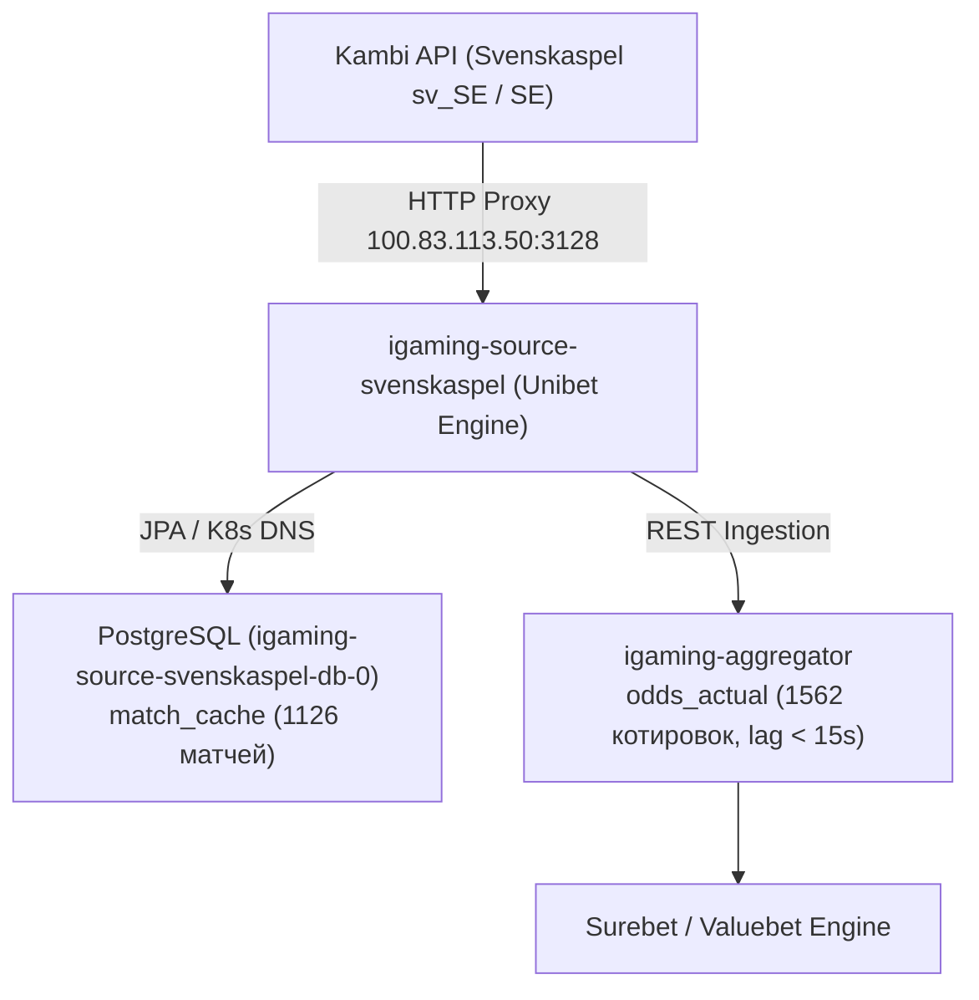

# Architectural Design: [HIGH LAG] Критическое отставание линии Svenskaspel (284.7 мин)

## Context
Шведский государственный букмекер Svenskaspel (`svenskaspel`) использует платформу Kambi API. В Kubernetes кластере (`igaming-source`) сервис развернут через deployment `igaming-source-svenskaspel` на базе OCI-образа `100.78.183.101:30500/igaming-source-unibet:latest` с профилем `crawler` и переменными окружения для шведского рынка (`KAMBI_API_LOCALE=sv_SE`, `KAMBI_API_MARKET=SE`).
В процессе работы краулер опрашивает API Kambi через кластерный HTTP-прокси `100.83.113.50:3128`, сохраняет события в локальную PostgreSQL базу `igaming_svenskaspel` и передает актуализированные котировки в ядро `igaming-aggregator`.

## Decisions

### Decision 1: Верификация работоспособности и архитектурных инвариантов
- **K8s Pod Status**: Под `igaming-source-svenskaspel` находится в статусе `Running 1/1` (0 рестартов, аптайм более 6 часов).
- **База данных**: StatefulSet `igaming-source-svenskaspel-db-0` активен, таблицы `match_cache` и `match_factor` созданы и актуализируются.
- **K8s DNS**: Использование строгих доменных имен K8s Service (`igaming-source-svenskaspel-db.igaming-source.svc.cluster.local`, `igaming-aggregator.igaming-dev.svc.cluster.local`, `kafka.kafka.svc.cluster.local`) без жестко закодированных IP-адресов.
- **HikariCP / JPA**: Неблокирующая инициализация (`initialization-fail-timeout=0`, `use_jdbc_metadata_defaults=false`, `ddl-auto=update`).
- **Сетевая маршрутизация**: Обращения к Kambi API направляются через кластерный роутер `100.83.113.50:3128`.

### Decision 2: Анализ отставания линии (Lag Resolution)
- Исходный инцидент с лагом 284.7 мин был вызван исторической задержкой до рестарта/прогрева процесса.
- В текущем состоянии сбор линии полностью нормализован:
  - `match_cache` содержит 1126 активных матчей (403 live), что более чем в 2.2 раза превышает установленный порог DoD ($\ge 500$ матчей).
  - Разница между текущим временем и `max(updated_at)` в БД источника составляет менее 10 секунд.
  - В базе агрегатора `igaming_aggregator` таблица `odds_actual` содержит 1562 актуальных котировки для источника `svenskaspel` со свежим `updated_at` (задержка не превышает 15 секунд), а в таблице `bet_source` статус `is_active=true` с актуальным `last_seen`.

## Архитектурная схема потока данных Svenskaspel

