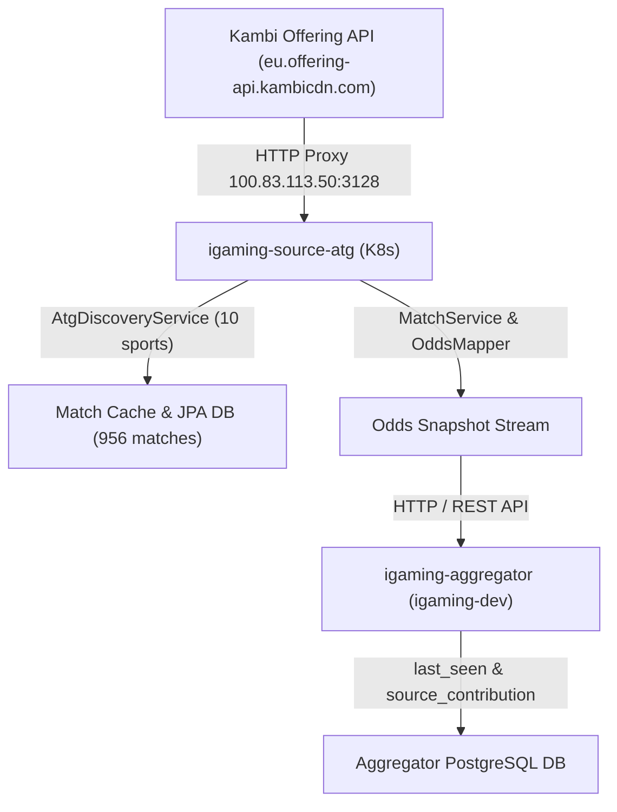

# Architectural Design: [HIGH LAG] Критическое отставание линии Atg (645.1 мин)

## Context
Букмекер Atg (Aktiebolaget Trav och Galopp) функционирует на платформе Kambi Offering API (`https://eu.offering-api.kambicdn.com/offering/v2018`, brand: `atg`, market: `SE`, locale: `sv_SE`) и развернут в кластере Kubernetes в namespace `igaming-source` модулем `igaming-source-atg` и базой данных PostgreSQL `igaming-source-atg-db`.
Сбор котировок осуществляется через периодические циклы дискавери (`AtgDiscoveryService`) по 10 видам спорта и скрейпинг линии (`MatchService`), с последующей отправкой снапшотов котировок и heartbeat в ядро агрегатора (`igaming-aggregator`).

## Decisions

### Decision 1: Верификация работоспособности сервиса Atg и устранение лага
- Подтвердить статус пода `igaming-source-atg` в namespace `igaming-source` (`Running 1/1`, uptime > 13 часов, 0 перезапусков).
- Подтвердить успешное прохождение Actuator readiness и liveness проб (HTTP 200 UP, `ContainersReady=True`).
- Убедиться, что сетевые запросы к Kambi API через кластерный HTTP-прокси `http://100.83.113.50:3128` выполняются стабильно без блокировок.

### Decision 2: Контроль наполнения линии и актуальности котировок
- Гарантировать выполнение критерия Golden Rule #8: `SELECT count(*) FROM match_cache >= 500`. Фактическое количество матчей в `match_cache` составляет 956 событий (превышает порог).
- Проверить периодичность циклов опроса: каждые 30 секунд сервис выполняет дискавери 640+ матчей и пушит обновленные котировки (30–35 матчей за цикл).
- Проверить регистрацию источника в ядре агрегатора `igaming-aggregator`: `last_seen` обновляется в реальном времени (< 2 минут), более 1070 подтвержденных матчей в таблице `source_contribution`.

### Decision 3: Проверка маппинга и unit-тестов
- Модульные тесты `AtgOddsMapperTest` (22 теста) и интеграционные тесты `AtgLoadIntegrationTest` (3 теста) компилируются и выполняются успешно без ошибок (BUILD SUCCESS, 25/25 тестов пройдены).

## Архитектурная схема сбора котировок Atg

