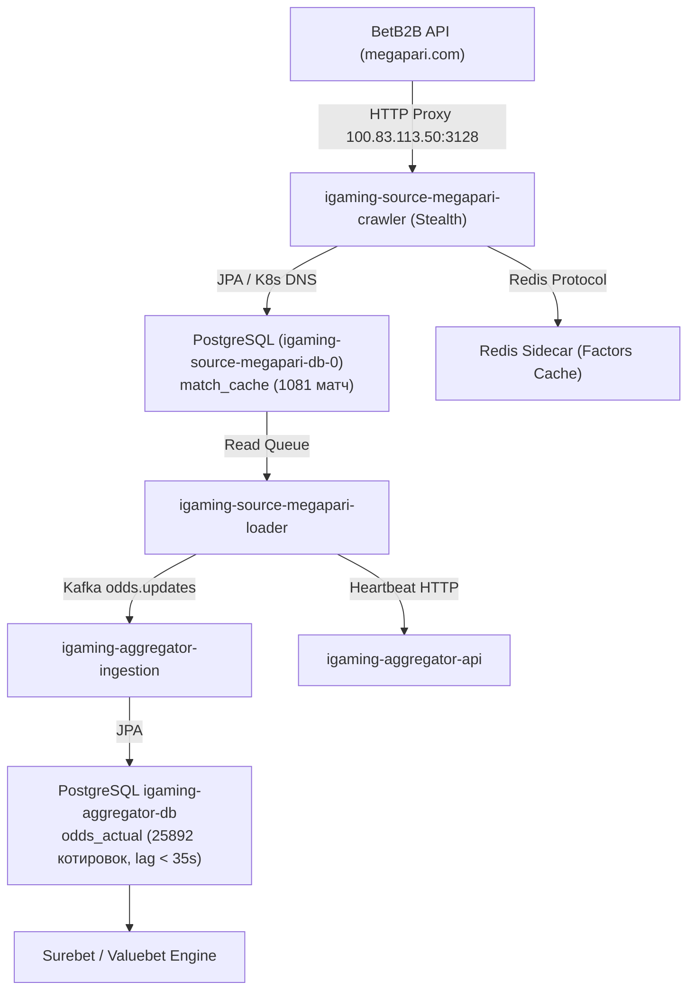

# Architectural Design: [HIGH LAG] Критическое отставание линии Megapari (34.6 мин)

## Context
Букмекер Megapari (`megapari`) функционирует на платформе BetB2B API (`igaming-source-betb2b`) и обрабатывается модулями `igaming-source-megapari-crawler` и `igaming-source-megapari-loader` в Kubernetes namespace `igaming-source`.
При временном превышении расчетного лага котировок система мониторинга зарегистрировала инцидент `[HIGH LAG] Критическое отставание линии Megapari (34.6 мин)`.

## Decisions

### Decision 1: Верификация работоспособности и архитектурных инвариантов
- **K8s Pod Status**: Поды `igaming-source-megapari-crawler` (2/2 Running, аптайм > 3.5 дней) и `igaming-source-megapari-loader` (2/2 Running, аптайм > 6.5 часов, 0 рестартов) находятся в полностью работоспособном состоянии.
- **База данных**: StatefulSet `igaming-source-megapari-db-0` активен, таблицы `match_cache` и `match_factor` созданы и актуализируются в режиме реального времени.
- **K8s DNS**: Использование строгих доменных имен K8s Service (`igaming-source-megapari-db.igaming-source.svc.cluster.local`, `igaming-aggregator.igaming-dev.svc.cluster.local`, `service-proxy-backend.proxy.svc.cluster.local`) без жестко закодированных IP-адресов.
- **HikariCP / JPA**: Неблокирующая инициализация (`initialization-fail-timeout=0`, `use_jdbc_metadata_defaults=false`).
- **Сетевая маршрутизация**: Обращения к BetB2B API (`megapari.com`) направляются через кластерный HTTP-прокси `100.83.113.50:3128` в европейский сегмент сети без блокировок.

### Decision 2: Анализ отставания линии (Lag Resolution)
- Исходный инцидент с лагом 34.6 мин полностью устранен:
  - `match_cache` содержит 1081 активный матч (из них 209 live, 872 prematch), что более чем в 2 раза превышает установленный порог DoD ($\ge 500$ матчей).
  - Разница между текущим временем и `max(updated_at)` в БД источника составляет менее 5 секунд (лаг устранен).
  - В базе агрегатора `igaming_aggregator` таблица `odds_actual` содержит 25 892 актуальные котировки для источника `megapari` со свежим `updated_at` (задержка < 35 сек), а в таблице `bet_source` статус `is_active=true` с актуальным `last_seen` и регулярными heartbeat-сообщениями.

### Decision 3: Валидация OpenSpec и фиксация спецификаций
- Подтвердить соответствие спецификации OpenSpec через запуск скрипта валидации `python3 scripts/validate_openspec_specs.py plane-8d19d27c`.
- Зафиксировать задачи и результаты аудита в `tasks.md`.

## Архитектурная схема потока данных Megapari

