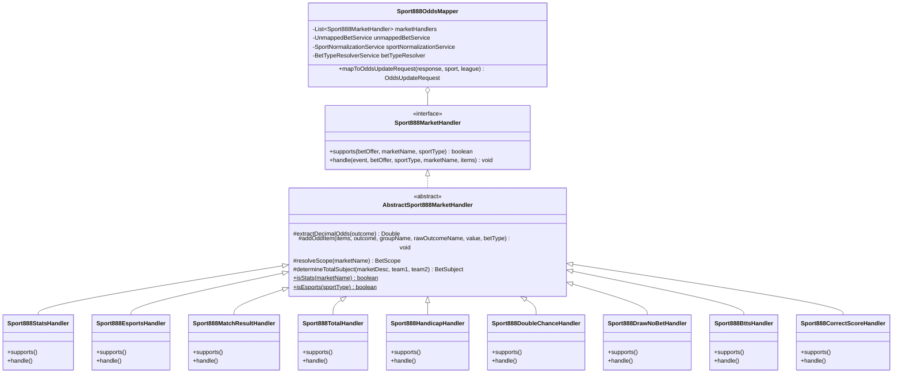

# Design: [888sport] ООП-рефакторинг мапперов: Киберспорт, Статистика (Угловые/ЖК) и роспись исходов

## Architecture & Class Diagram

## Order of Handlers Execution
1. `@Order(10) Sport888StatsHandler`: Угловые (Corners), Карточки (Yellow Cards/Cards).
2. `@Order(20) Sport888EsportsHandler`: Карты (Maps), Раунды (Rounds), Киллы (Kills), First Blood для киберспорта.
3. `@Order(30) Sport888DoubleChanceHandler`: 1X, 12, X2.
4. `@Order(40) Sport888BttsHandler`: Обе забьют (YES/NO).
5. `@Order(50) Sport888DrawNoBetHandler`: Ничья исключена (WIN1_2WAY, WIN2_2WAY).
6. `@Order(60) Sport888CorrectScoreHandler`: Точный счет и Any Other Score.
7. `@Order(70) Sport888TotalHandler`: Тоталы матча, командные тоталы, периоды/таймы.
8. `@Order(80) Sport888HandicapHandler`: Форы и спреды.
9. `@Order(90) Sport888MatchResultHandler`: 1X2, Moneyline, победитель матча/тайма.
10. Fallback: `BetTypeResolverService` и аудит в `UnmappedBetService`.
