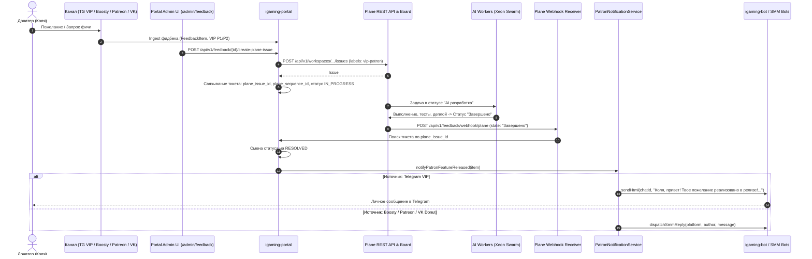

# Design: [plane-sync-loop] Двусторонняя синхронизация с Plane и авто-уведомление донатера о релизе фичи

## Architecture Overview

## Component Architecture

1. **`PlaneClient` & `PlaneProperties` (`igaming-portal`)**:
   - `plane.api.url`: K8s DNS `http://plane-proxy.plane.svc.cluster.local:80`
   - `plane.api.token`: Токен авторизации Plane REST API
   - `plane.workspace.slug`: `dataplatform`
   - `plane.project.id`: `2df124d7-25b0-4145-a63c-aafcb0fe0041`
   - Методы:
     - `createIssue(title, descriptionHtml, priority, labels, stateId)`
     - `getIssue(issueId)`
     - `updateIssueState(issueId, stateId)`

2. **`PlaneSyncService` (`igaming-portal`)**:
   - `createPlaneIssueForFeedback(UUID feedbackItemId, CreatePlaneIssueRequest req)`
     - Формирует шаблонное имя: `[feature/{category}] {Summary} (Запрос от VIP-патрона {Author})`
     - Проставляет теги `vip-patron`, `community-request`
     - Сохраняет `plane_issue_id`, `plane_sequence_id`, `plane_issue_url`
     - Переводит тикет в `IN_PROGRESS`
   - `handlePlaneWebhook(PlaneWebhookPayload payload)`
     - Определяет событие завершения задачи (`Завершено` / `Done`)
     - Находит `FeedbackItem`
     - Переводит в `RESOLVED`
     - Запускает `PatronNotificationService`

3. **`PatronNotificationService` (`igaming-portal`)**:
   - `notifyPatronFeatureReleased(FeedbackItem item)`
   - Формирует персонализированный текст:
     `«{AuthorName}, привет! Твое пожелание реализовано в релизе! Фича уже доступна на smartbet.guru. Огромное спасибо за поддержку!»`
   - В зависимости от `sourcePlatform`:
     - `TELEGRAM_VIP` / `TELEGRAM` $\rightarrow$ отправка через `igaming-bot` или прямой Telegram Bot API по `telegramId`.
     - `BOOSTY` / `PATREON` / `VK_DONUT` $\rightarrow$ отправка через SMM-интеграцию или адаптеры платформ.
   - Фиксирует отправку в `adminReply` и `repliedAt`.

4. **REST Controllers**:
   - `PortalFeedbackController`:
     - `POST /api/v1/feedback/{id}/plane-issue`
     - `POST /api/v1/feedback/webhook/plane`
     - `POST /api/v1/community/webhook/plane`
