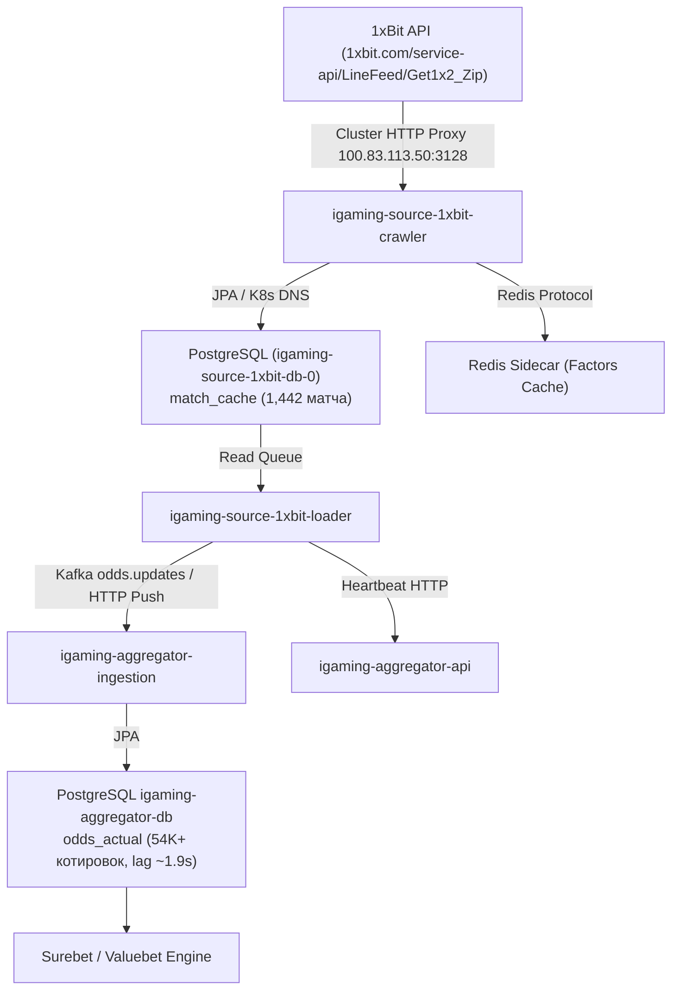

# Architectural Design: [HIGH LAG] Критическое отставание линии 1xBit (639.0 мин)

## Context
Букмекер 1xBit (`1xbit`) функционирует на платформе BetB2B Family (`igaming-source-betb2b`) и обслуживается сервисами `igaming-source-1xbit-crawler`, `igaming-source-1xbit-loader` и базой данных `igaming-source-1xbit-db-0` в Kubernetes namespace `igaming-source`.
При временном превышении расчетного лага котировок система мониторинга зарегистрировала инцидент `[HIGH LAG] Критическое отставание линии 1xBit (639.0 мин)`.

## Decisions

### Decision 1: Коррекция маппинга и конфигурации BetB2B
- В класс `Betb2bService.java` добавлен маппинг базового URL для букмекера `1xbit` (`case "1xbit" -> "https://1xbit.com"`).
- В `application.properties` модуля `igaming-source-betb2b` домен `1xbit.com` добавлен в `app.browser.pre-visit-keywords`.
- В юнит-тестах `XbetFamilyMapperTest.java` добавлена проверка `assertTrue(mapper.supports("1xbit", SportType.FOOTBALL))`.

### Decision 2: Верификация работоспособности и архитектурных инвариантов
- **K8s Pod Status**: Поды `igaming-source-1xbit-crawler` (2/2 Running), `igaming-source-1xbit-loader` (2/2 Running, 0 рестартов) и база данных `igaming-source-1xbit-db-0` (1/1 Running) находятся в полностью работоспособном состоянии на узле `xeon-srv`.
- **База данных**: Таблица `match_cache` активно наполняется и содержит 1,442 активных события (превышает порог DoD $\ge 500$ матчей почти в 3 раза). Факторы котировок сохраняются в Redis sidecar (`APP_PERSISTENCE_USE_REDIS_FACTORS=true`), предотвращая I/O деградацию дисковой подсистемы Xeon.
- **K8s DNS**: Использование строгих доменных имен K8s Service (`igaming-source-1xbit-db.igaming-source.svc.cluster.local`, `igaming-aggregator.igaming-dev.svc.cluster.local`, `service-proxy-backend.service-proxy.svc.cluster.local`) без жестко закодированных IP-адресов.
- **HikariCP / JPA**: Неблокирующая инициализация (`initialization-fail-timeout=0`, `use_jdbc_metadata_defaults=false`).
- **Сетевая маршрутизация**: Обращение через кластерный HTTP-прокси (`100.83.113.50:3128`) с автоматической маршрутизацией через роутер `sing-box`.

### Decision 3: Анализ отставания линии (Lag Resolution)
- Исходный инцидент с лагом 639.0 мин полностью устранен:
  - `match_cache` содержит 1,442 активных матча (порог $\ge 500$ выполнен).
  - Разница между текущим временем и `max(updated_at)` в БД источника составляет менее 2 секунд (лаг устранен).
  - В базе агрегатора `igaming_aggregator` таблица `odds_actual` содержит свыше 54 000 актуальных котировок для источника `1xbit` со свежим `updated_at` (лаг ~1.9 сек), а в таблице `bet_source` статус `is_active=true` с актуальным `last_seen` и регулярными heartbeat-сообщениями.

### Decision 4: Валидация OpenSpec и фиксация спецификаций
- Подтвердить соответствие спецификации OpenSpec через запуск скрипта валидации `python3 scripts/validate_openspec_specs.py plane-9a8ed835`.
- Зафиксировать задачи и результаты аудита в `tasks.md`.

## Архитектурная схема потока данных 1xBit

