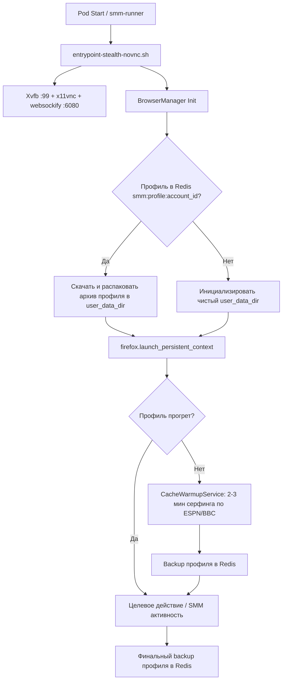

# Design: [smm-runner] Базовый OCI-образ браузерного ИИ-агента (Firefox/Camoufox + Persistent Profile + Cache Warmup + US Proxy)

## Архитектура решения

## Компоненты системы

### 1. `browser_manager.py` (BrowserManager)
- **Инициализация**:
  - Поддержка `playwright.firefox.launch_persistent_context` и `camoufox.AsyncCamoufox`.
  - Запрет `new_context()`.
  - Конфигурация прокси (US proxy `http://100.83.113.50:3128` или `PROXY_SERVER` env).
  - Настройка `user_data_dir` (по умолчанию `/tmp/smm_profiles/{account_id}` или из env).
  - Реалистичный User-Agent, локаль (`en-US`), таймзона (`America/New_York`).
- **Синхронизация профиля с Redis**:
  - `backup_profile_to_redis(account_id: str, redis_client=None) -> bool`:
    - Архивация содержимого `user_data_dir` в `.tar.gz` (исключая временные сокеты и блокировки lockfile).
    - Сохранение бинарного архива в Redis под ключом `smm:profile:{account_id}` с TTL или бессрочно.
  - `restore_profile_from_redis(account_id: str, redis_client=None) -> bool`:
    - Загрузка архива из Redis и распаковка в целевой `user_data_dir`.
- **Кинематика движений мыши (Human Kinematics & Bezier Curves)**:
  - `generate_bezier_curve(p0, p1, p2, p3, steps)` — генерация сглаженной кубической кривой Безье с контрольными точками и шумом.
  - `human_mouse_move(page, target_x, target_y, steps=25)` — перемещение курсора по кривой с микро-дрожанием (джиттер 1-2px) и переменной скоростью.
  - `human_scroll(page, delta_y, steps=10)` — физиологичный скроллинг страницы с замедлением.
  - `human_type(page, selector, text, min_delay_ms=45, max_delay_ms=130)` — посимвольный ввод текста с задержками и опечатками/исправлениями.

### 2. `cache_warmup.py` (CacheWarmupService)
- **Пул нейтральных доверенных ресурсов**:
  - ESPN (`https://www.espn.com`)
  - BBC Sport (`https://www.bbc.com/sport`)
  - Flashscore (`https://www.flashscore.com`)
  - Yahoo Sports (`https://sports.yahoo.com`)
  - Sky Sports (`https://www.skysports.com`)
- **Процесс серфинга**:
  1. Выбор случайных 2-3 сайтов из пула.
  2. Переход на главную страницу с естественным таймаутом загрузки.
  3. Плавный скролл вниз и вверх с перемещением курсора по элементам (чтение заголовков, 5-15 секунд).
  4. Клик по внутренней ссылке (статья, новость или матч).
  5. Просмотр статьи (скроллинг, пауза 10-20 секунд).
  6. Накопление локального кэша, кук и истории.
  7. Сохранение обновленного профиля в Redis.

### 3. `Dockerfile` & `entrypoint-stealth-novnc.sh`
- Легковесный контейнер `python:3.11-slim`.
- Пакеты ОС: `tini`, `xvfb`, `x11vnc`, `websockify`, `novnc`, `openbox`, `ffmpeg`, `procps`.
- Python-пакеты: `playwright`, `camoufox`, `redis`, `requests`, `pyotp`, `opencv-python-headless`, `numpy`.
- Предварительно скачанные бинарники Firefox: `playwright install firefox` и `playwright install-deps firefox`.
- Фоновый запуск Xvfb, noVNC и переход к выполнению скрипта раннера.
