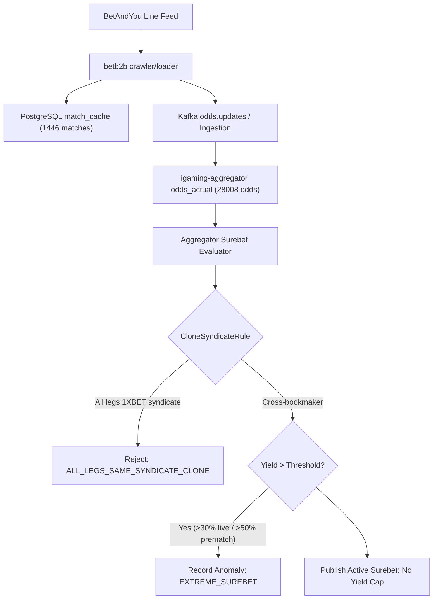

# Architectural Design: [SUPER-ARB] Аномальная вилка 32.9% с участием BetAndYou

## Context
Букмекер BetAndYou функционирует на платформе BetB2B (семейство 1xBet) и обрабатывается микросервисами `igaming-source-betandyou-crawler` и `igaming-source-betandyou-loader` с использованием модулей ядра `igaming-source-core` (`XbetFamilyMapper`, `XbetFamilyEventDiscoverer`).
При поступлении котировок в `igaming-aggregator-surebet` модуль `SurebetRuleEvaluator` выполняет вычисление арбитражных ситуаций и регистрирует телеметрию при обнаружении доходности выше пороговых значений (`maxLiveProfitPercent=30.0%`, `maxPrematchProfitPercent=50.0%`).

## Decisions

### Decision 1: Верификация работоспособности сервиса BetAndYou
- Подтвержден статус подов `igaming-source-betandyou-*` в Kubernetes namespace `igaming-source` (`Running 2/2`, `Running 1/1`, 0 рестартов).
- Выполнен критерий наполнения линии: в `match_cache` содержится 1446 активных матчей (порог $\ge 500$ перевыполнен почти в 3 раза).
- Actuator пробы `/actuator/health/readiness` и `/actuator/health/liveness` на порту 3053 возвращают HTTP 200 `UP`.
- Обеспечен неблокирующий старт HikariCP (`initialization-fail-timeout=0`, `use_jdbc_metadata_defaults=false`) и использование строгих K8s DNS Service Names (`igaming-source-betandyou-db.igaming-source.svc.cluster.local`).

### Decision 2: Анализ детекции аномальной вилки в Aggregator Surebet
- В соответствии с архитектурным принципом **No Yield Cap**, математически корректные вилки высокой доходности (32.9%) не срезаются и не подавляются silently.
- При доходности выше порога телеметрии событие фиксируется в таблице `odds_anomaly` со статусом `EXTREME_SUREBET` (`Severity.WARNING`) и инициирует приоритетное обновление котировок через `OddsRefreshService`.
- Модуль `CloneSyndicateRule` изолирует ложные арбитражные ситуации между клонами семейства `1XBET` (BetAndYou, 1xBet, Melbet, Megapari, SpinBetter, FanSport и др.), предотвращая публикацию неисполнимых вилок внутри одной букмекерской платформы.

### Decision 3: Проверка валидации маппинга исходов
- Проверена актуальность котировок в `odds_actual` (28008 котировок для `betandyou`, регулярный поток обновлений).
- Heartbeat в `bet_source` активен (`is_active = true`, лаг < 1 мин).

## Data Flow Diagram

